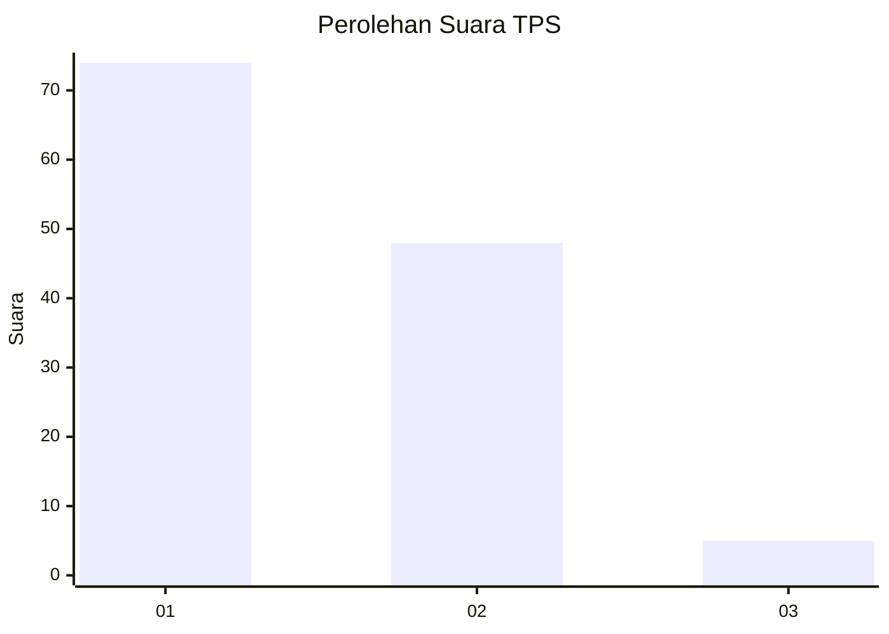
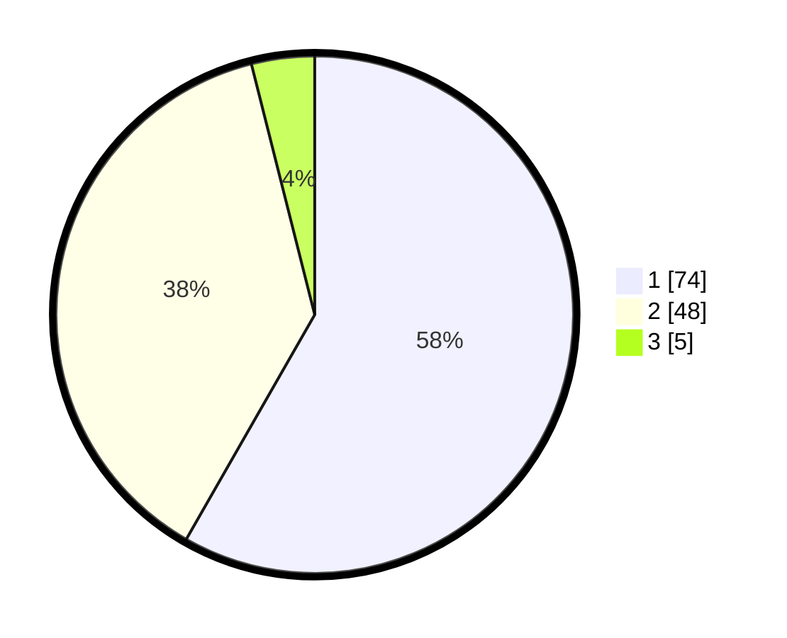

# Hasil

## Grafik

## Tabel

| No. | Nama Paslon    | Suara | Suara (raw) | Persentase |
|:--- |:-------------- | -----:| -----------:| ----------:|
| 1   | ANIES MUHAIMIN | 74    | [74][p-1]   | 58,27      |
| 2   | PRABOWO GIBRAN | 48    | [48][p-2]   | 37,80      |
| 3   | GANJAR MAHFUD  | 5     | [5][p-3]    | 3,94       |

[p-1]: https://github.com/gigit-pemilu/pemilu-2024-73-sulawesi-selatan/blob/main/pilpres/hitung-suara/sub/73-sulawesi-selatan/sub/16-enrekang/sub/11-masalle/sub/2001-masalle/sub/003-tps/sub/paslon-1.txt
[p-2]: https://github.com/gigit-pemilu/pemilu-2024-73-sulawesi-selatan/blob/main/pilpres/hitung-suara/sub/73-sulawesi-selatan/sub/16-enrekang/sub/11-masalle/sub/2001-masalle/sub/003-tps/sub/paslon-2.txt
[p-3]: https://github.com/gigit-pemilu/pemilu-2024-73-sulawesi-selatan/blob/main/pilpres/hitung-suara/sub/73-sulawesi-selatan/sub/16-enrekang/sub/11-masalle/sub/2001-masalle/sub/003-tps/sub/paslon-3.txt

## Foto C Plano

https://sirekap-obj-formc.kpu.go.id/d35e/pemilu/ppwp/73/16/11/20/01/7316112001003-20240214-213508--3f98c9f7-0dc1-4684-a3d7-41908ff87649.jpg

https://sirekap-obj-formc.kpu.go.id/d35e/pemilu/ppwp/73/16/11/20/01/7316112001003-20240214-213648--9b2c169c-c81f-4261-aa91-a10a2709722e.jpg

https://sirekap-obj-formc.kpu.go.id/d35e/pemilu/ppwp/73/16/11/20/01/7316112001003-20240214-214134--9b2994f6-04f3-4300-b7ed-5d968867f84c.jpg

## Metadata

| Key        | Value               |
| ---------- | ------------------- |
| Time Stamp | 2024-02-15 09:00:24 |

