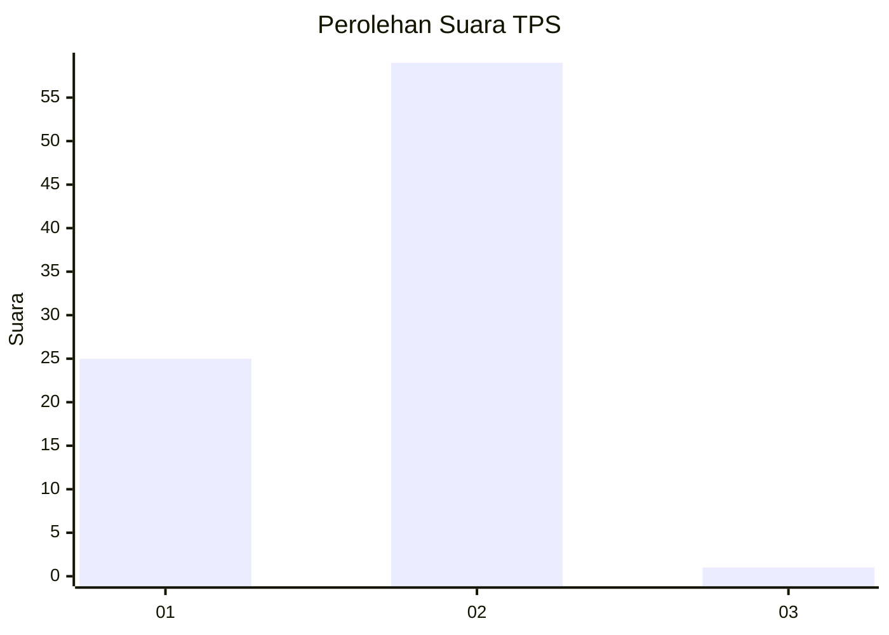
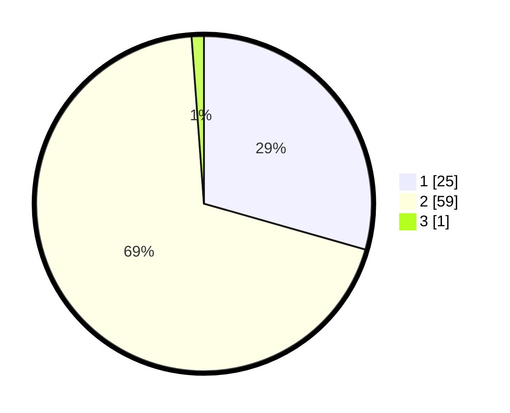

# Hasil

## Grafik

## Tabel

| No. | Nama Paslon    | Suara | Suara (raw) | Persentase |
|:--- |:-------------- | -----:| -----------:| ----------:|
| 1   | ANIES MUHAIMIN | 25    | [25][p-1]   | 29,41      |
| 2   | PRABOWO GIBRAN | 59    | [59][p-2]   | 69,41      |
| 3   | GANJAR MAHFUD  | 1     | [1][p-3]    | 1,18       |

[p-1]: https://github.com/gigit-pemilu/pemilu-2024-73-sulawesi-selatan/blob/main/pilpres/hitung-suara/sub/73-sulawesi-selatan/sub/16-enrekang/sub/11-masalle/sub/2001-masalle/sub/005-tps/sub/paslon-1.txt
[p-2]: https://github.com/gigit-pemilu/pemilu-2024-73-sulawesi-selatan/blob/main/pilpres/hitung-suara/sub/73-sulawesi-selatan/sub/16-enrekang/sub/11-masalle/sub/2001-masalle/sub/005-tps/sub/paslon-2.txt
[p-3]: https://github.com/gigit-pemilu/pemilu-2024-73-sulawesi-selatan/blob/main/pilpres/hitung-suara/sub/73-sulawesi-selatan/sub/16-enrekang/sub/11-masalle/sub/2001-masalle/sub/005-tps/sub/paslon-3.txt

## Foto C Plano

https://sirekap-obj-formc.kpu.go.id/a3fe/pemilu/ppwp/73/16/11/20/01/7316112001005-20240214-222647--860d94d6-c3fa-4955-9995-cd331333f4f9.jpg

https://sirekap-obj-formc.kpu.go.id/a3fe/pemilu/ppwp/73/16/11/20/01/7316112001005-20240214-222930--03308cde-0125-483e-95e8-5c18858ab438.jpg

https://sirekap-obj-formc.kpu.go.id/a3fe/pemilu/ppwp/73/16/11/20/01/7316112001005-20240215-063945--abea0eb9-36d9-4a07-9d44-846e66bb5ba0.jpg

## Metadata

| Key        | Value               |
| ---------- | ------------------- |
| Time Stamp | 2024-02-15 18:00:26 |

