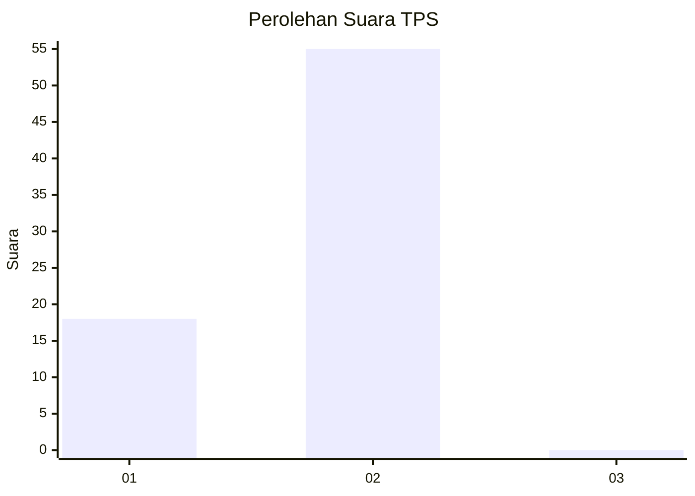
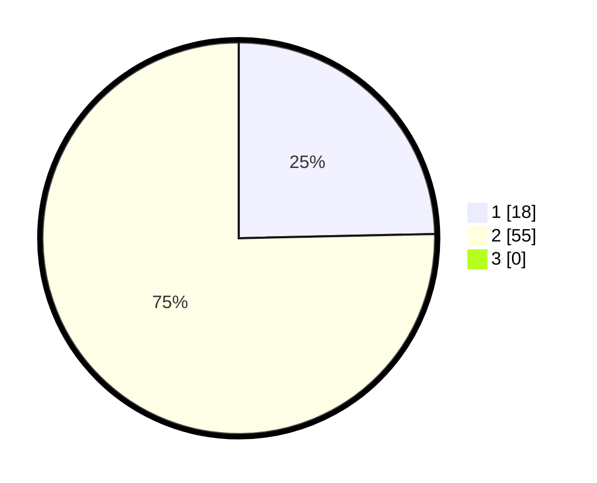

# Hasil

## Grafik

## Tabel

| No. | Nama Paslon    | Suara | Suara (raw) | Persentase |
|:--- |:-------------- | -----:| -----------:| ----------:|
| 1   | ANIES MUHAIMIN | 18    | [18][p-1]   | 24,66      |
| 2   | PRABOWO GIBRAN | 55    | [55][p-2]   | 75,34      |
| 3   | GANJAR MAHFUD  | 0     | [0][p-3]    | 0,00       |

[p-1]: https://github.com/gigit-pemilu/pemilu-2024-73-sulawesi-selatan/blob/main/pilpres/hitung-suara/sub/73-sulawesi-selatan/sub/16-enrekang/sub/12-baroko/sub/2002-benteng-alla/sub/006-tps/sub/paslon-1.txt
[p-2]: https://github.com/gigit-pemilu/pemilu-2024-73-sulawesi-selatan/blob/main/pilpres/hitung-suara/sub/73-sulawesi-selatan/sub/16-enrekang/sub/12-baroko/sub/2002-benteng-alla/sub/006-tps/sub/paslon-2.txt
[p-3]: https://github.com/gigit-pemilu/pemilu-2024-73-sulawesi-selatan/blob/main/pilpres/hitung-suara/sub/73-sulawesi-selatan/sub/16-enrekang/sub/12-baroko/sub/2002-benteng-alla/sub/006-tps/sub/paslon-3.txt

## Foto C Plano

https://sirekap-obj-formc.kpu.go.id/5165/pemilu/ppwp/73/16/12/20/02/7316122002006-20240215-072705--990648f3-fea8-421a-8092-e5e37602802b.jpg

https://sirekap-obj-formc.kpu.go.id/5165/pemilu/ppwp/73/16/12/20/02/7316122002006-20240215-072909--5e7739de-a5c4-410e-b438-2b6b6d81c66e.jpg

https://sirekap-obj-formc.kpu.go.id/5165/pemilu/ppwp/73/16/12/20/02/7316122002006-20240217-201640--c1b722df-d2b2-4ce7-a5b1-52f35e63a1c7.jpg

## Metadata

| Key        | Value               |
| ---------- | ------------------- |
| Time Stamp | 2024-02-19 06:16:00 |

