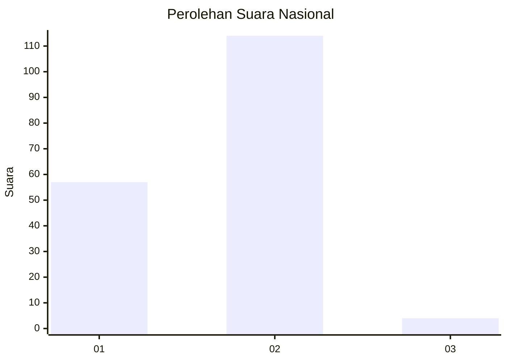
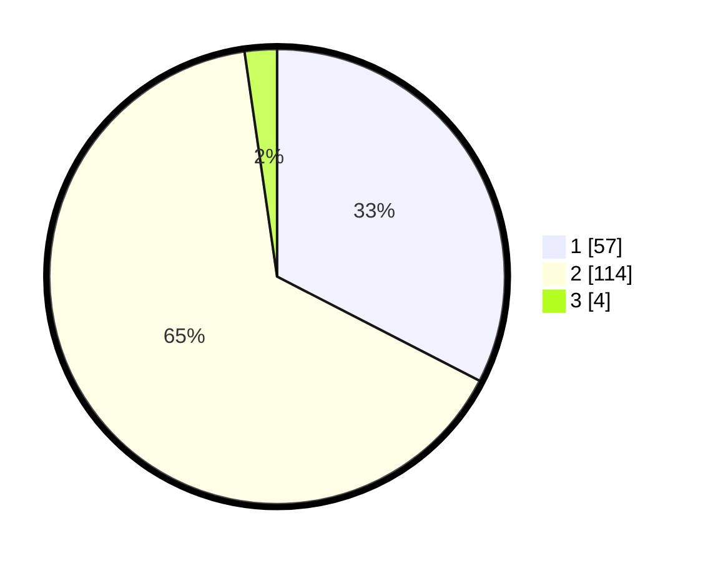

# Hasil

## Grafik

## Tabel

| No. | Nama Paslon    | Suara | Suara (raw) | Persentase |
|:--- |:-------------- | -----:| -----------:| ----------:|
| 1   | ANIES MUHAIMIN | 57    | [57][p-1]   | 32,57      |
| 2   | PRABOWO GIBRAN | 114   | [114][p-2]  | 65,14      |
| 3   | GANJAR MAHFUD  | 4     | [4][p-3]    | 2,29       |

[p-1]: https://github.com/gigit-pemilu/pemilu-2024/blob/main/pilpres/hitung-suara/sub/73-sulawesi-selatan/sub/16-enrekang/sub/12-baroko/sub/2003-benteng-alla-utara/sub/005-tps/sub/paslon-1.txt
[p-2]: https://github.com/gigit-pemilu/pemilu-2024/blob/main/pilpres/hitung-suara/sub/73-sulawesi-selatan/sub/16-enrekang/sub/12-baroko/sub/2003-benteng-alla-utara/sub/005-tps/sub/paslon-2.txt
[p-3]: https://github.com/gigit-pemilu/pemilu-2024/blob/main/pilpres/hitung-suara/sub/73-sulawesi-selatan/sub/16-enrekang/sub/12-baroko/sub/2003-benteng-alla-utara/sub/005-tps/sub/paslon-3.txt

## Foto C Plano

https://sirekap-obj-formc.kpu.go.id/7432/pemilu/ppwp/73/16/12/20/03/7316122003005-20240215-075107--3449af18-c5a2-424c-9735-291339a1e68c.jpg

https://sirekap-obj-formc.kpu.go.id/7432/pemilu/ppwp/73/16/12/20/03/7316122003005-20240215-075312--2f605433-c312-4a74-bb52-fc7e9b3aa78d.jpg

https://sirekap-obj-formc.kpu.go.id/7432/pemilu/ppwp/73/16/12/20/03/7316122003005-20240215-075428--194fe7b5-9f33-4dc7-bf35-4f463e3c9669.jpg

## Metadata

| Key        | Value               |
| ---------- | ------------------- |
| Time Stamp | 2024-02-17 18:30:00 |

