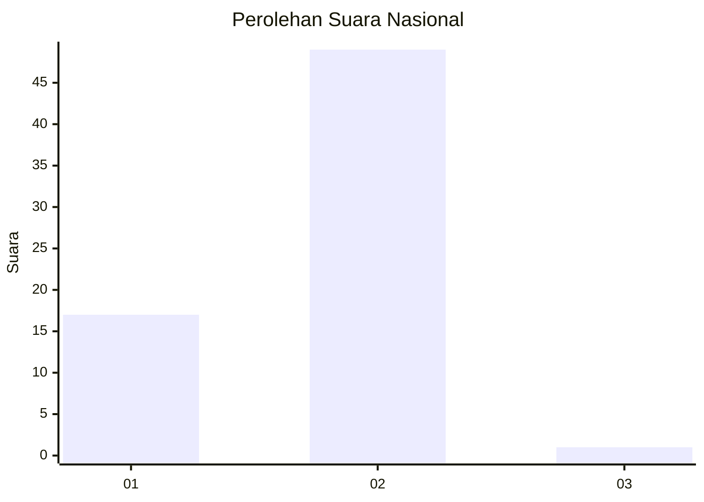
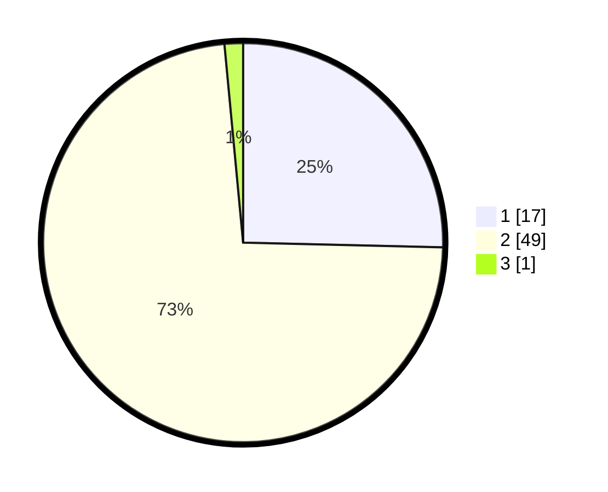

# Hasil

## Grafik

## Tabel

| No. | Nama Paslon    | Suara | Suara (raw) | Persentase |
|:--- |:-------------- | -----:| -----------:| ----------:|
| 1   | ANIES MUHAIMIN | 17    | [17][p-1]   | 25,37      |
| 2   | PRABOWO GIBRAN | 49    | [49][p-2]   | 73,13      |
| 3   | GANJAR MAHFUD  | 1     | [1][p-3]    | 1,49       |

[p-1]: https://github.com/gigit-pemilu/pemilu-2024/blob/main/pilpres/hitung-suara/sub/73-sulawesi-selatan/sub/17-luwu/sub/01-basse-sangtempe/sub/2005-kanna/sub/003-tps/sub/paslon-1.txt
[p-2]: https://github.com/gigit-pemilu/pemilu-2024/blob/main/pilpres/hitung-suara/sub/73-sulawesi-selatan/sub/17-luwu/sub/01-basse-sangtempe/sub/2005-kanna/sub/003-tps/sub/paslon-2.txt
[p-3]: https://github.com/gigit-pemilu/pemilu-2024/blob/main/pilpres/hitung-suara/sub/73-sulawesi-selatan/sub/17-luwu/sub/01-basse-sangtempe/sub/2005-kanna/sub/003-tps/sub/paslon-3.txt

## Foto C Plano

https://sirekap-obj-formc.kpu.go.id/3631/pemilu/ppwp/73/17/01/20/05/7317012005003-20240217-010418--b044b95b-0d7e-47aa-a8e4-aec067281587.jpg

https://sirekap-obj-formc.kpu.go.id/3631/pemilu/ppwp/73/17/01/20/05/7317012005003-20240217-010419--1ef6e563-f59b-414c-a674-d5b6d23a7aa4.jpg

https://sirekap-obj-formc.kpu.go.id/3631/pemilu/ppwp/73/17/01/20/05/7317012005003-20240217-010418--ceba192e-d0b0-4f9f-bb89-fad2cfcb8d89.jpg

## Metadata

| Key        | Value               |
| ---------- | ------------------- |
| Time Stamp | 2024-02-17 14:45:18 |

## DATA PEMILIH TETAP

Jumlah pemilih dalam DPT: **67**.
 * L: **37**.
 * P: **30**.

## DATA PENGGUNA HAK PILIH

Jumlah pengguna hak pilih dalam DPT: **66**.
 * L: **36**.
 * P: **30**.

Jumlah pengguna hak pilih dalam DPTb: **1**.
 * L: **0**.
 * P: **1**.

Jumlah pengguna hak pilih dalam DPK: **0**.
 * L: **0**.
 * P: **0**.

Jumlah pengguna hak pilih: **67**.
 * L: **36**.
 * P: **31**.

## JUMLAH SUARA SAH DAN TIDAK SAH

JUMLAH SELURUH SUARA SAH: **67**.

JUMLAH SUARA TIDAK SAH: **0**.

JUMLAH SELURUH SUARA SAH DAN SUARA TIDAK SAH: **67**.

