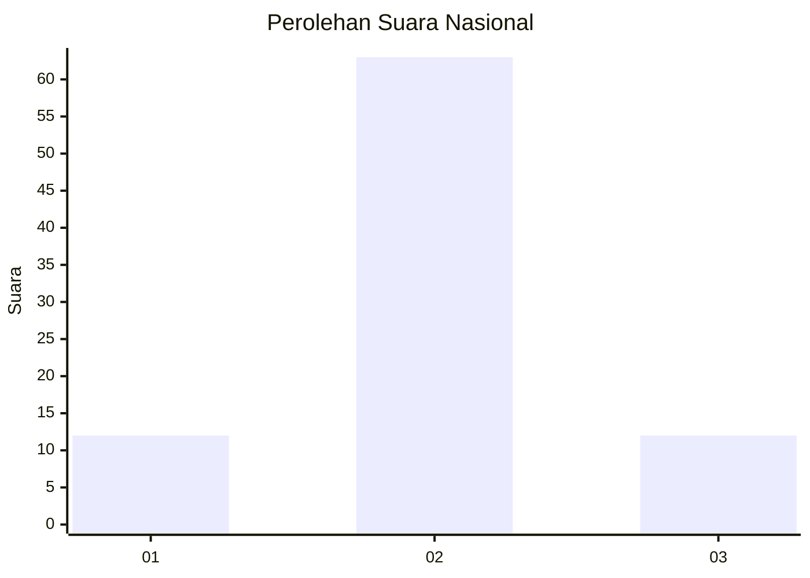
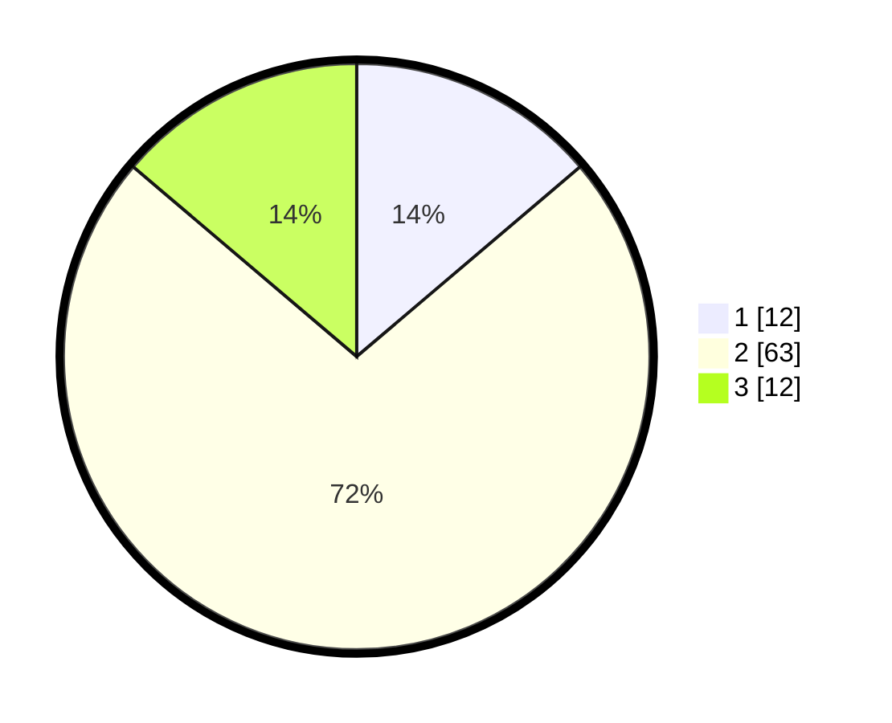

# Hasil

## Grafik

## Tabel

| No. | Nama Paslon    | Suara | Suara (raw) | Persentase |
|:--- |:-------------- | -----:| -----------:| ----------:|
| 1   | ANIES MUHAIMIN | 12    | [12][p-1]   | 13,79      |
| 2   | PRABOWO GIBRAN | 63    | [63][p-2]   | 72,41      |
| 3   | GANJAR MAHFUD  | 12    | [12][p-3]   | 13,79      |

[p-1]: https://github.com/gigit-pemilu/pemilu-2024/blob/main/pilpres/hitung-suara/sub/73-sulawesi-selatan/sub/17-luwu/sub/01-basse-sangtempe/sub/2006-kanna-utara/sub/004-tps/sub/paslon-1.txt
[p-2]: https://github.com/gigit-pemilu/pemilu-2024/blob/main/pilpres/hitung-suara/sub/73-sulawesi-selatan/sub/17-luwu/sub/01-basse-sangtempe/sub/2006-kanna-utara/sub/004-tps/sub/paslon-2.txt
[p-3]: https://github.com/gigit-pemilu/pemilu-2024/blob/main/pilpres/hitung-suara/sub/73-sulawesi-selatan/sub/17-luwu/sub/01-basse-sangtempe/sub/2006-kanna-utara/sub/004-tps/sub/paslon-3.txt

## Foto C Plano

https://sirekap-obj-formc.kpu.go.id/ef49/pemilu/ppwp/73/17/01/20/06/7317012006004-20240215-122918--cb019520-25c2-41d4-b8eb-047d165d950f.jpg

https://sirekap-obj-formc.kpu.go.id/ef49/pemilu/ppwp/73/17/01/20/06/7317012006004-20240215-122934--8ac0c15b-fa58-4207-8806-8356dadf9a54.jpg

https://sirekap-obj-formc.kpu.go.id/ef49/pemilu/ppwp/73/17/01/20/06/7317012006004-20240215-123006--0378a974-33e8-442d-a938-92d4b366a63e.jpg

## Metadata

| Key        | Value               |
| ---------- | ------------------- |
| Time Stamp | 2024-02-15 21:30:27 |

