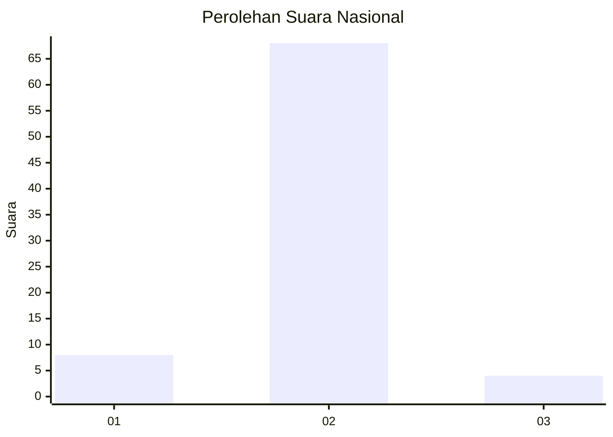
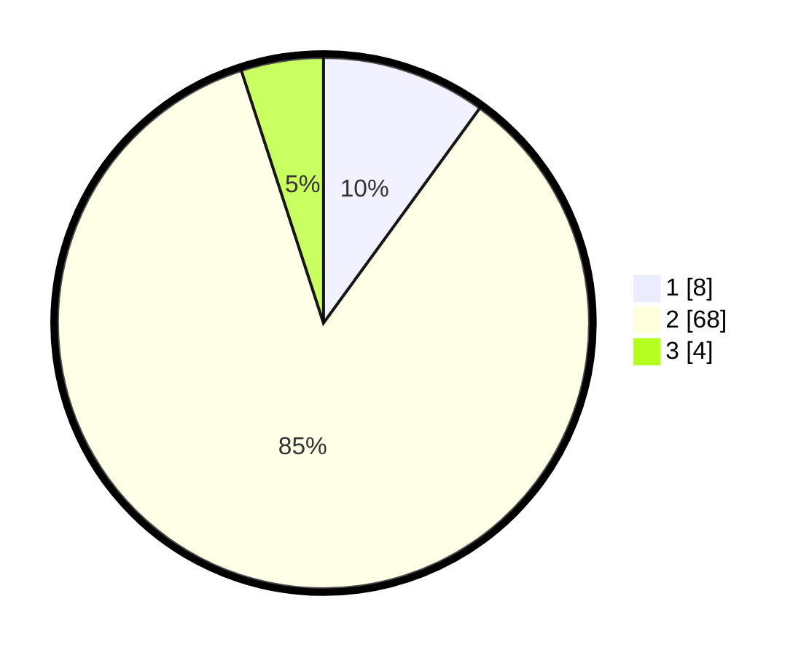

# Hasil

## Grafik

## Tabel

| No. | Nama Paslon    | Suara | Suara (raw) | Persentase |
|:--- |:-------------- | -----:| -----------:| ----------:|
| 1   | ANIES MUHAIMIN | 8     | [8][p-1]    | 10,00      |
| 2   | PRABOWO GIBRAN | 68    | [68][p-2]   | 85,00      |
| 3   | GANJAR MAHFUD  | 4     | [4][p-3]    | 5,00       |

[p-1]: https://github.com/gigit-pemilu/pemilu-2024/blob/main/pilpres/hitung-suara/sub/73-sulawesi-selatan/sub/17-luwu/sub/01-basse-sangtempe/sub/2011-lange/sub/001-tps/sub/paslon-1.txt
[p-2]: https://github.com/gigit-pemilu/pemilu-2024/blob/main/pilpres/hitung-suara/sub/73-sulawesi-selatan/sub/17-luwu/sub/01-basse-sangtempe/sub/2011-lange/sub/001-tps/sub/paslon-2.txt
[p-3]: https://github.com/gigit-pemilu/pemilu-2024/blob/main/pilpres/hitung-suara/sub/73-sulawesi-selatan/sub/17-luwu/sub/01-basse-sangtempe/sub/2011-lange/sub/001-tps/sub/paslon-3.txt

## Foto C Plano

https://sirekap-obj-formc.kpu.go.id/5f50/pemilu/ppwp/73/17/01/20/11/7317012011001-20240215-082153--71008aeb-2a64-4f68-b3f8-1357cd9484d6.jpg

https://sirekap-obj-formc.kpu.go.id/5f50/pemilu/ppwp/73/17/01/20/11/7317012011001-20240214-235808--b2db2d28-ebcf-44a1-b39c-755a9c4acded.jpg

https://sirekap-obj-formc.kpu.go.id/5f50/pemilu/ppwp/73/17/01/20/11/7317012011001-20240214-235723--3234dd1f-d13b-4f16-80c2-96178f643fdc.jpg

## Metadata

| Key        | Value               |
| ---------- | ------------------- |
| Time Stamp | 2024-02-15 20:30:46 |

