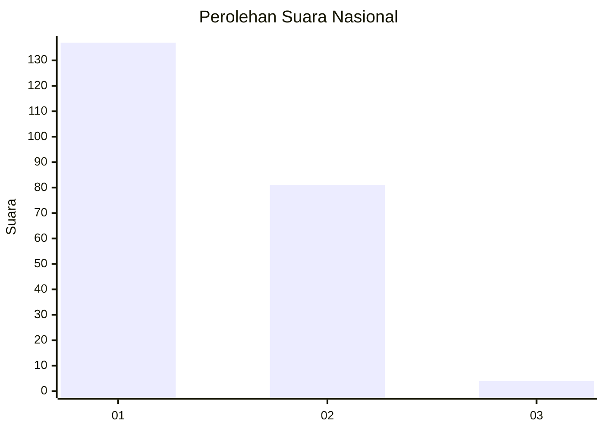
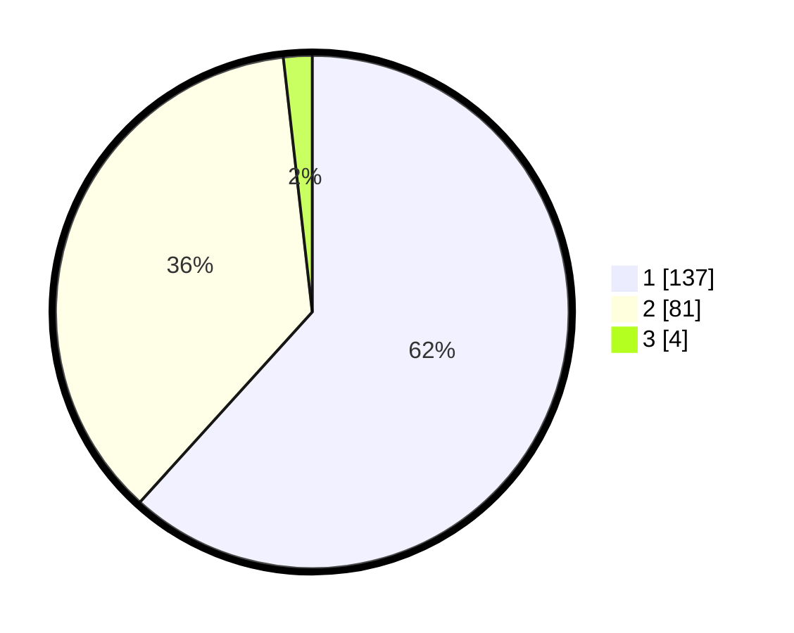

# Hasil

## Grafik

## Tabel

| No. | Nama Paslon    | Suara | Suara (raw) | Persentase |
|:--- |:-------------- | -----:| -----------:| ----------:|
| 1   | ANIES MUHAIMIN | 137   | [137][p-1]  | 61,71      |
| 2   | PRABOWO GIBRAN | 81    | [81][p-2]   | 36,49      |
| 3   | GANJAR MAHFUD  | 4     | [4][p-3]    | 1,80       |

[p-1]: https://github.com/gigit-pemilu/pemilu-2024/blob/main/pilpres/hitung-suara/sub/73-sulawesi-selatan/sub/17-luwu/sub/04-bajo/sub/1005-bajo/sub/002-tps/sub/paslon-1.txt
[p-2]: https://github.com/gigit-pemilu/pemilu-2024/blob/main/pilpres/hitung-suara/sub/73-sulawesi-selatan/sub/17-luwu/sub/04-bajo/sub/1005-bajo/sub/002-tps/sub/paslon-2.txt
[p-3]: https://github.com/gigit-pemilu/pemilu-2024/blob/main/pilpres/hitung-suara/sub/73-sulawesi-selatan/sub/17-luwu/sub/04-bajo/sub/1005-bajo/sub/002-tps/sub/paslon-3.txt

## Foto C Plano

https://sirekap-obj-formc.kpu.go.id/b219/pemilu/ppwp/73/17/04/10/05/7317041005002-20240215-002801--0f204b11-b008-4db4-9341-e1e957d0b43d.jpg

https://sirekap-obj-formc.kpu.go.id/b219/pemilu/ppwp/73/17/04/10/05/7317041005002-20240215-002904--0d053b47-7c39-42c1-a56a-68dbffb218e2.jpg

https://sirekap-obj-formc.kpu.go.id/b219/pemilu/ppwp/73/17/04/10/05/7317041005002-20240215-002953--d7f28ca5-0bdb-4fa9-bd0d-23fb5c6f4246.jpg

## Metadata

| Key        | Value               |
| ---------- | ------------------- |
| Time Stamp | 2024-02-15 15:00:29 |

