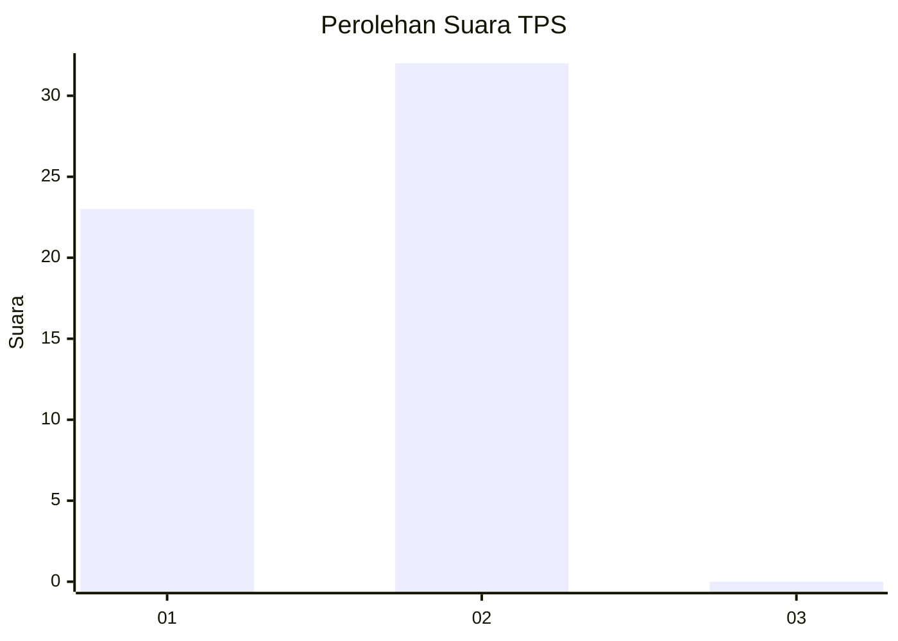
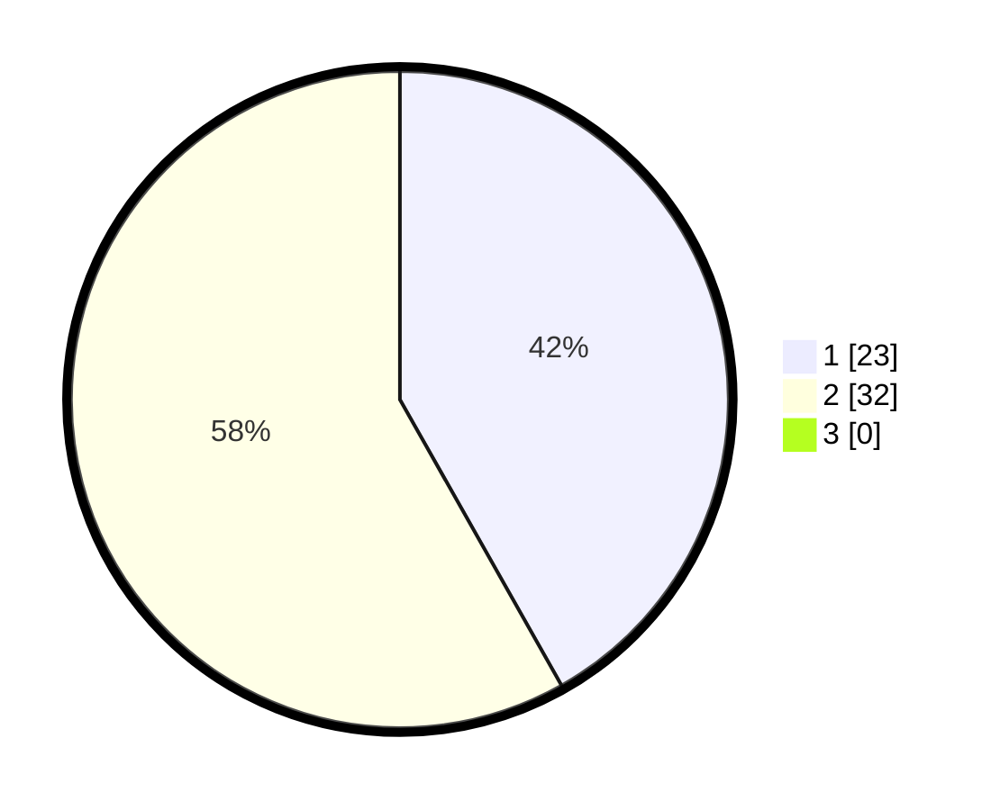

# Hasil

## Grafik

## Tabel

| No. | Nama Paslon    | Suara | Suara (raw) | Persentase |
|:--- |:-------------- | -----:| -----------:| ----------:|
| 1   | ANIES MUHAIMIN | 23    | [23][p-1]   | 41,82      |
| 2   | PRABOWO GIBRAN | 32    | [32][p-2]   | 58,18      |
| 3   | GANJAR MAHFUD  | 0     | [0][p-3]    | 0,00       |

[p-1]: https://github.com/gigit-pemilu/pemilu-2024-73-sulawesi-selatan/blob/main/pilpres/hitung-suara/sub/73-sulawesi-selatan/sub/17-luwu/sub/05-bua-ponrang/sub/2006-padang-kamburi/sub/003-tps/sub/paslon-1.txt
[p-2]: https://github.com/gigit-pemilu/pemilu-2024-73-sulawesi-selatan/blob/main/pilpres/hitung-suara/sub/73-sulawesi-selatan/sub/17-luwu/sub/05-bua-ponrang/sub/2006-padang-kamburi/sub/003-tps/sub/paslon-2.txt
[p-3]: https://github.com/gigit-pemilu/pemilu-2024-73-sulawesi-selatan/blob/main/pilpres/hitung-suara/sub/73-sulawesi-selatan/sub/17-luwu/sub/05-bua-ponrang/sub/2006-padang-kamburi/sub/003-tps/sub/paslon-3.txt

## Foto C Plano

https://sirekap-obj-formc.kpu.go.id/33b3/pemilu/ppwp/73/17/05/20/06/7317052006003-20240215-063015--a6816f29-1cfd-401a-adcf-ef4c83d08006.jpg

https://sirekap-obj-formc.kpu.go.id/33b3/pemilu/ppwp/73/17/05/20/06/7317052006003-20240215-053330--bb6dcf9b-8a93-4faf-9724-baed5661ffb9.jpg

https://sirekap-obj-formc.kpu.go.id/33b3/pemilu/ppwp/73/17/05/20/06/7317052006003-20240215-160820--11d19548-16f4-4760-93ee-611fe15f0cd7.jpg

## Metadata

| Key        | Value               |
| ---------- | ------------------- |
| Time Stamp | 2024-02-15 21:30:27 |

