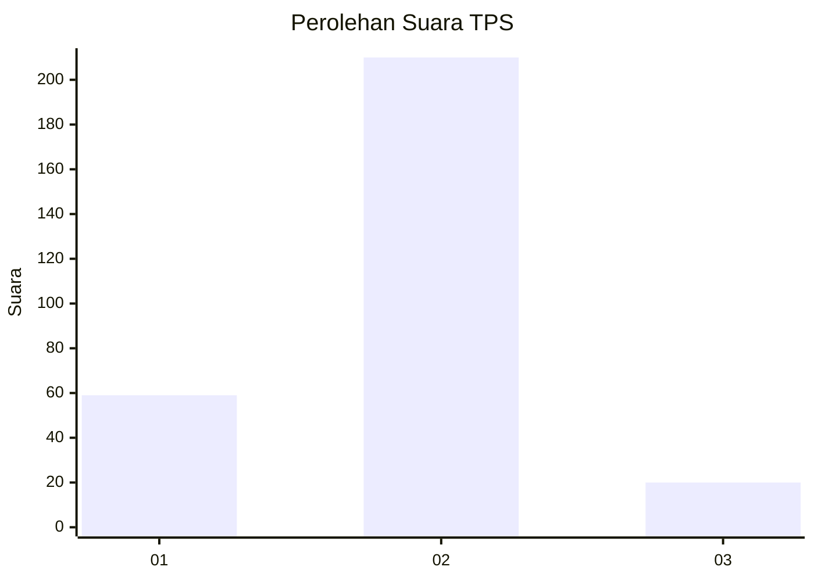

# Hasil

## Grafik

## Tabel

| No. | Nama Paslon    | Suara | Suara (raw) | Persentase |
|:--- |:-------------- | -----:| -----------:| ----------:|
| 1   | ANIES MUHAIMIN | 59    | [59][p-1]   | 20,42      |
| 2   | PRABOWO GIBRAN | 210   | [210][p-2]  | 72,66      |
| 3   | GANJAR MAHFUD  | 20    | [20][p-3]   | 6,92       |

[p-1]: https://github.com/gigit-pemilu/pemilu-2024-73-sulawesi-selatan/blob/main/pilpres/hitung-suara/sub/73-sulawesi-selatan/sub/17-luwu/sub/06-walenrang/sub/2021-batusitanduk/sub/003-tps/sub/paslon-1.txt
[p-2]: https://github.com/gigit-pemilu/pemilu-2024-73-sulawesi-selatan/blob/main/pilpres/hitung-suara/sub/73-sulawesi-selatan/sub/17-luwu/sub/06-walenrang/sub/2021-batusitanduk/sub/003-tps/sub/paslon-2.txt
[p-3]: https://github.com/gigit-pemilu/pemilu-2024-73-sulawesi-selatan/blob/main/pilpres/hitung-suara/sub/73-sulawesi-selatan/sub/17-luwu/sub/06-walenrang/sub/2021-batusitanduk/sub/003-tps/sub/paslon-3.txt

## Foto C Plano

https://sirekap-obj-formc.kpu.go.id/fb5e/pemilu/ppwp/73/17/06/20/21/7317062021003-20240215-030857--605b41ac-6ffc-4049-949a-ccd3a5b76b4d.jpg

https://sirekap-obj-formc.kpu.go.id/fb5e/pemilu/ppwp/73/17/06/20/21/7317062021003-20240215-011318--9e41e5b3-e5b2-458e-ab80-0867eb06c391.jpg

https://sirekap-obj-formc.kpu.go.id/fb5e/pemilu/ppwp/73/17/06/20/21/7317062021003-20240215-031133--d3b565b1-d35d-4ce4-b147-58ca86684aef.jpg

## Metadata

| Key        | Value               |
| ---------- | ------------------- |
| Time Stamp | 2024-02-15 23:29:50 |

