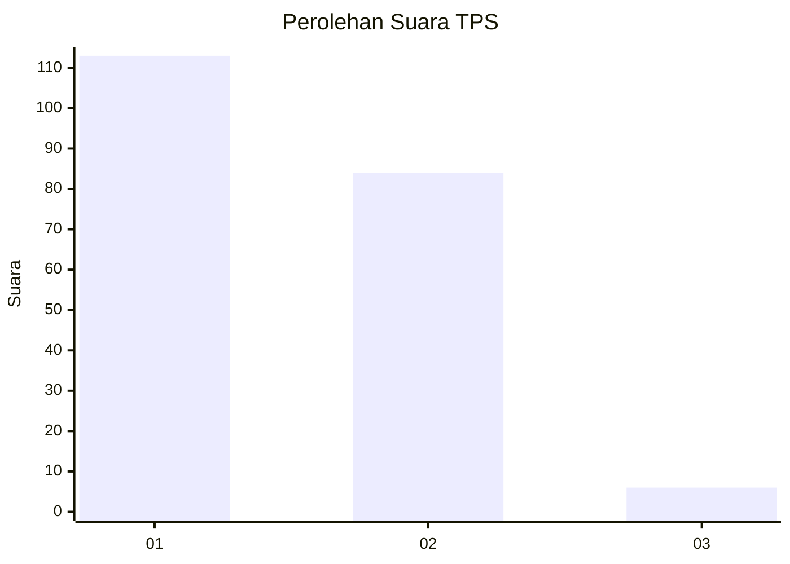
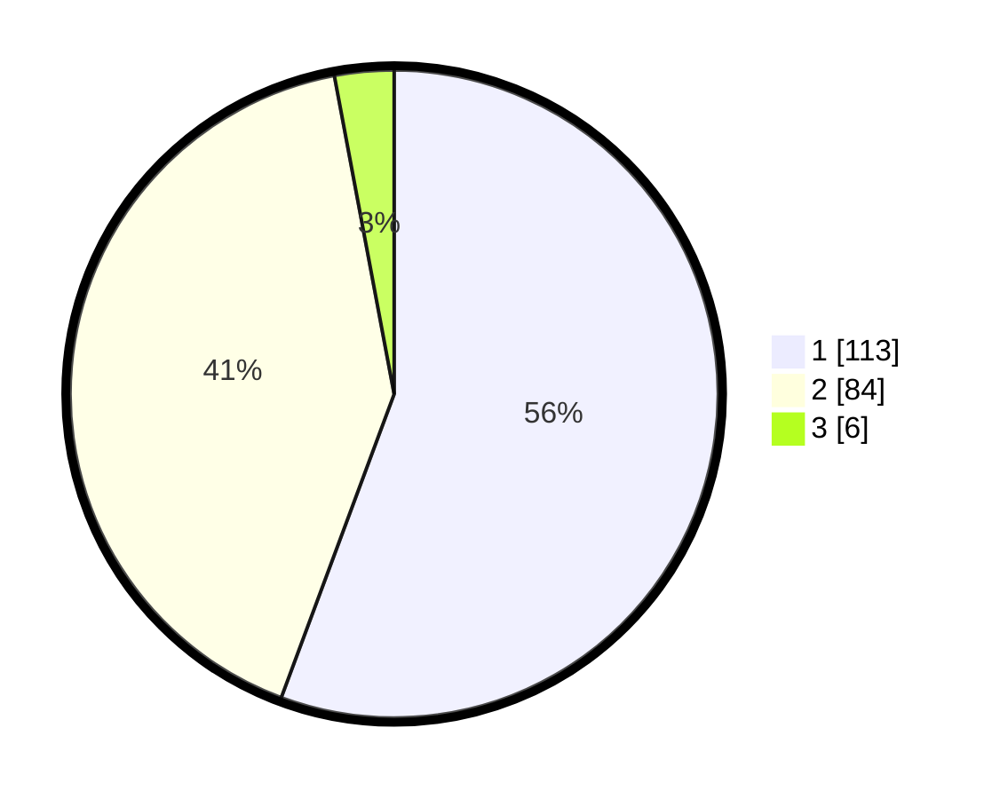

# Hasil

## Grafik

## Tabel

| No. | Nama Paslon    | Suara | Suara (raw) | Persentase |
|:--- |:-------------- | -----:| -----------:| ----------:|
| 1   | ANIES MUHAIMIN | 113   | [113][p-1]  | 55,67      |
| 2   | PRABOWO GIBRAN | 84    | [84][p-2]   | 41,38      |
| 3   | GANJAR MAHFUD  | 6     | [6][p-3]    | 2,96       |

[p-1]: https://github.com/gigit-pemilu/pemilu-2024-73-sulawesi-selatan/blob/main/pilpres/hitung-suara/sub/73-sulawesi-selatan/sub/17-luwu/sub/07-belopa/sub/1001-tampumia-radda/sub/002-tps/sub/paslon-1.txt
[p-2]: https://github.com/gigit-pemilu/pemilu-2024-73-sulawesi-selatan/blob/main/pilpres/hitung-suara/sub/73-sulawesi-selatan/sub/17-luwu/sub/07-belopa/sub/1001-tampumia-radda/sub/002-tps/sub/paslon-2.txt
[p-3]: https://github.com/gigit-pemilu/pemilu-2024-73-sulawesi-selatan/blob/main/pilpres/hitung-suara/sub/73-sulawesi-selatan/sub/17-luwu/sub/07-belopa/sub/1001-tampumia-radda/sub/002-tps/sub/paslon-3.txt

## Foto C Plano

https://sirekap-obj-formc.kpu.go.id/7881/pemilu/ppwp/73/17/07/10/01/7317071001002-20240215-060945--72139a6a-8ba8-40d9-ac5a-a876db4911f2.jpg

https://sirekap-obj-formc.kpu.go.id/7881/pemilu/ppwp/73/17/07/10/01/7317071001002-20240215-061244--433877a1-6a88-436a-8d77-35b025da763b.jpg

https://sirekap-obj-formc.kpu.go.id/7881/pemilu/ppwp/73/17/07/10/01/7317071001002-20240215-061523--ab52a915-612b-4ab5-8f5d-59d60e042645.jpg

## Metadata

| Key        | Value               |
| ---------- | ------------------- |
| Time Stamp | 2024-02-15 16:30:25 |

