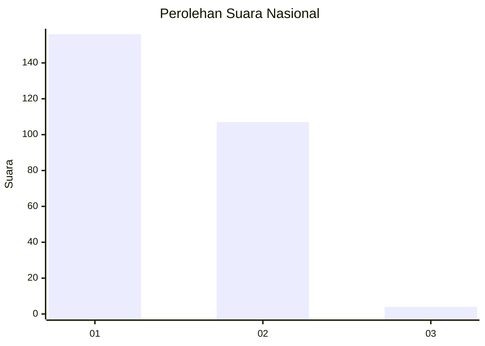
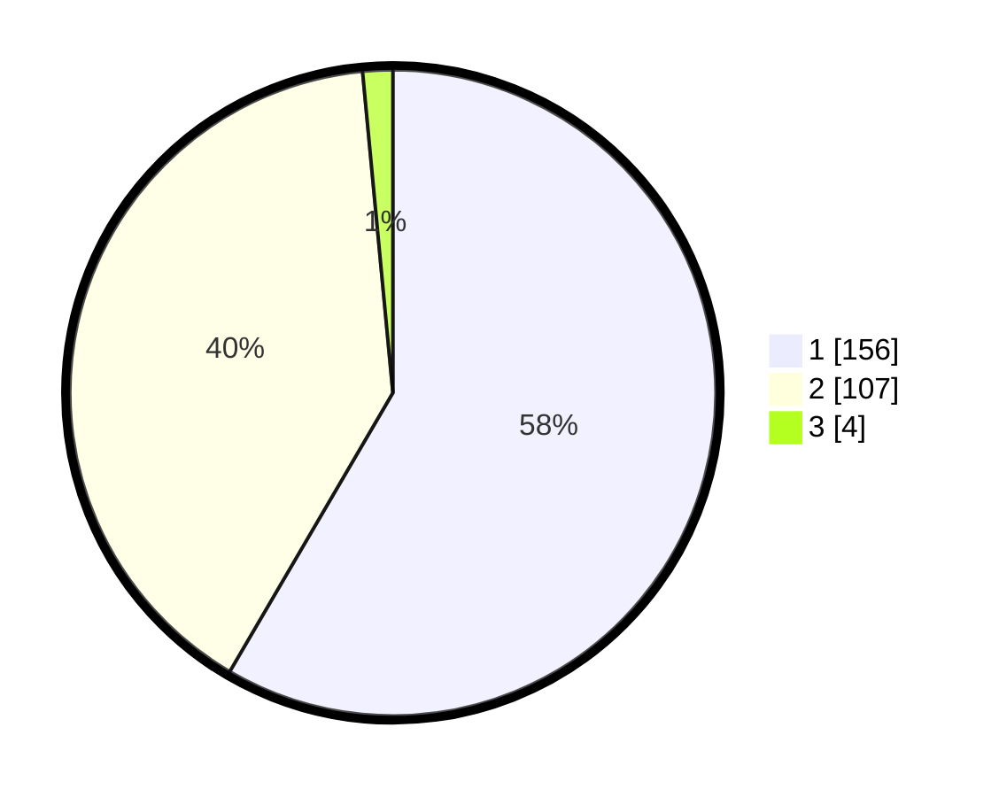

# Hasil

## Grafik

## Tabel

| No. | Nama Paslon    | Suara | Suara (raw) | Persentase |
|:--- |:-------------- | -----:| -----------:| ----------:|
| 1   | ANIES MUHAIMIN | 156   | [156][p-1]  | 58,43      |
| 2   | PRABOWO GIBRAN | 107   | [107][p-2]  | 40,07      |
| 3   | GANJAR MAHFUD  | 4     | [4][p-3]    | 1,50       |

[p-1]: https://github.com/gigit-pemilu/pemilu-2024/blob/main/pilpres/hitung-suara/sub/73-sulawesi-selatan/sub/17-luwu/sub/07-belopa/sub/1001-tampumia-radda/sub/003-tps/sub/paslon-1.txt
[p-2]: https://github.com/gigit-pemilu/pemilu-2024/blob/main/pilpres/hitung-suara/sub/73-sulawesi-selatan/sub/17-luwu/sub/07-belopa/sub/1001-tampumia-radda/sub/003-tps/sub/paslon-2.txt
[p-3]: https://github.com/gigit-pemilu/pemilu-2024/blob/main/pilpres/hitung-suara/sub/73-sulawesi-selatan/sub/17-luwu/sub/07-belopa/sub/1001-tampumia-radda/sub/003-tps/sub/paslon-3.txt

## Foto C Plano

https://sirekap-obj-formc.kpu.go.id/41d3/pemilu/ppwp/73/17/07/10/01/7317071001003-20240215-001003--2eafefd4-70e3-4a1b-a75d-2e36eaecb92c.jpg

https://sirekap-obj-formc.kpu.go.id/41d3/pemilu/ppwp/73/17/07/10/01/7317071001003-20240215-071159--aa9a875e-d5ec-4eff-b8e4-88af7b146be7.jpg

https://sirekap-obj-formc.kpu.go.id/41d3/pemilu/ppwp/73/17/07/10/01/7317071001003-20240215-074226--94ae218e-aa8f-42ee-885a-0e949158b9a2.jpg

## Metadata

| Key        | Value               |
| ---------- | ------------------- |
| Time Stamp | 2024-02-16 00:00:26 |

