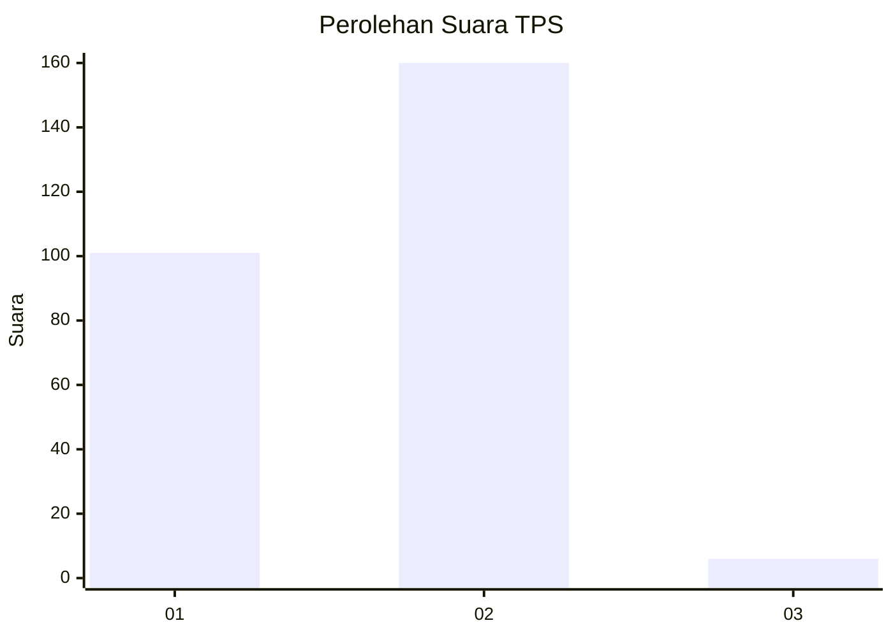
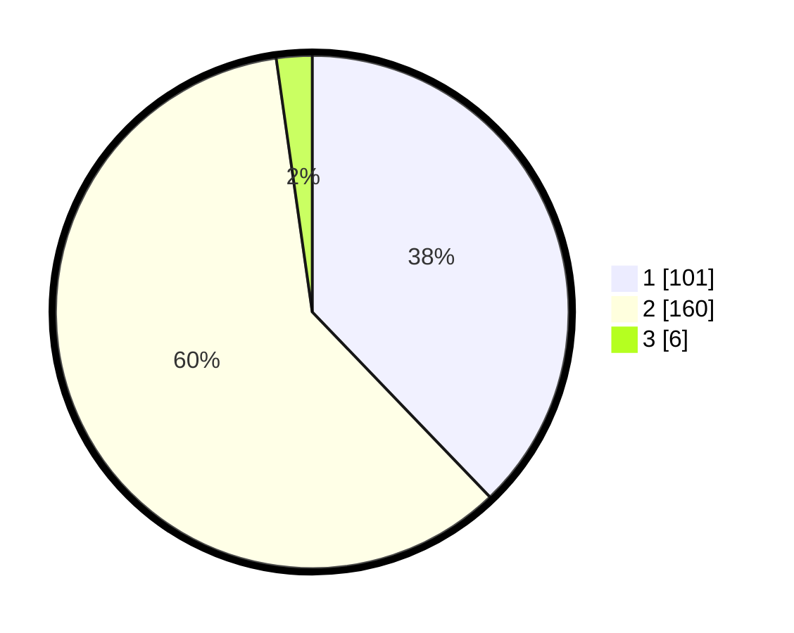

# Hasil

## Grafik

## Tabel

| No. | Nama Paslon    | Suara | Suara (raw) | Persentase |
|:--- |:-------------- | -----:| -----------:| ----------:|
| 1   | ANIES MUHAIMIN | 101   | [101][p-1]  | 37,83      |
| 2   | PRABOWO GIBRAN | 160   | [160][p-2]  | 59,93      |
| 3   | GANJAR MAHFUD  | 6     | [6][p-3]    | 2,25       |

[p-1]: https://github.com/gigit-pemilu/pemilu-2024-73-sulawesi-selatan/blob/main/pilpres/hitung-suara/sub/73-sulawesi-selatan/sub/17-luwu/sub/07-belopa/sub/2014-senga-selatan/sub/004-tps/sub/paslon-1.txt
[p-2]: https://github.com/gigit-pemilu/pemilu-2024-73-sulawesi-selatan/blob/main/pilpres/hitung-suara/sub/73-sulawesi-selatan/sub/17-luwu/sub/07-belopa/sub/2014-senga-selatan/sub/004-tps/sub/paslon-2.txt
[p-3]: https://github.com/gigit-pemilu/pemilu-2024-73-sulawesi-selatan/blob/main/pilpres/hitung-suara/sub/73-sulawesi-selatan/sub/17-luwu/sub/07-belopa/sub/2014-senga-selatan/sub/004-tps/sub/paslon-3.txt

## Foto C Plano

https://sirekap-obj-formc.kpu.go.id/0ac4/pemilu/ppwp/73/17/07/20/14/7317072014004-20240215-084102--39374ccb-acfe-4bb9-8733-b99a6bed5a2f.jpg

https://sirekap-obj-formc.kpu.go.id/0ac4/pemilu/ppwp/73/17/07/20/14/7317072014004-20240215-085908--1fd9b560-2d7c-46c7-ad5f-ac3045386d84.jpg

https://sirekap-obj-formc.kpu.go.id/0ac4/pemilu/ppwp/73/17/07/20/14/7317072014004-20240215-090010--0b5cabdb-81fd-4d2f-bdab-ac3b6bc4d686.jpg

## Metadata

| Key        | Value               |
| ---------- | ------------------- |
| Time Stamp | 2024-02-15 21:01:18 |

