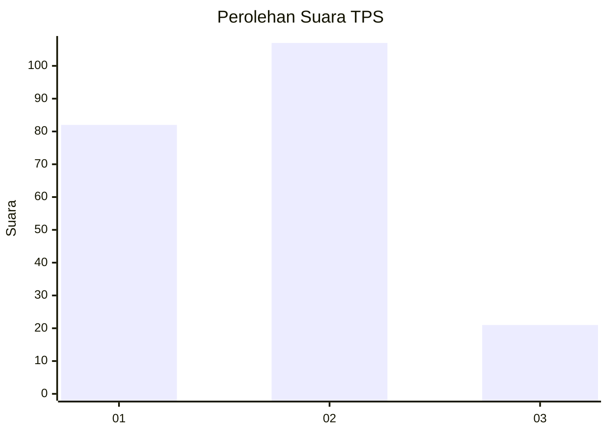
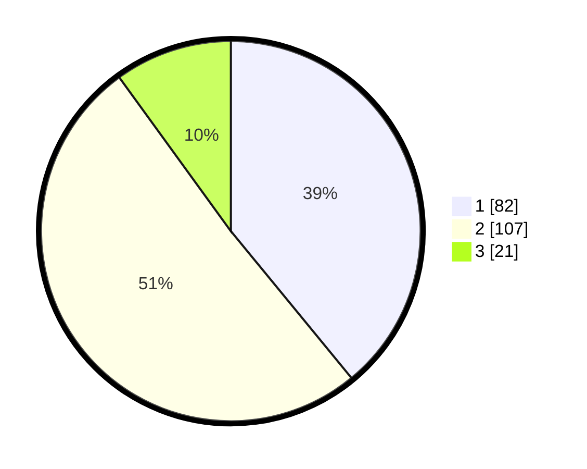

# Hasil

## Grafik

## Tabel

| No. | Nama Paslon    | Suara | Suara (raw) | Persentase |
|:--- |:-------------- | -----:| -----------:| ----------:|
| 1   | ANIES MUHAIMIN | 82    | [82][p-1]   | 39,05      |
| 2   | PRABOWO GIBRAN | 107   | [107][p-2]  | 50,95      |
| 3   | GANJAR MAHFUD  | 21    | [21][p-3]   | 10,00      |

[p-1]: https://github.com/gigit-pemilu/pemilu-2024-73-sulawesi-selatan/blob/main/pilpres/hitung-suara/sub/73-sulawesi-selatan/sub/17-luwu/sub/10-larompong-selatan/sub/1001-bone-pute/sub/005-tps/sub/paslon-1.txt
[p-2]: https://github.com/gigit-pemilu/pemilu-2024-73-sulawesi-selatan/blob/main/pilpres/hitung-suara/sub/73-sulawesi-selatan/sub/17-luwu/sub/10-larompong-selatan/sub/1001-bone-pute/sub/005-tps/sub/paslon-2.txt
[p-3]: https://github.com/gigit-pemilu/pemilu-2024-73-sulawesi-selatan/blob/main/pilpres/hitung-suara/sub/73-sulawesi-selatan/sub/17-luwu/sub/10-larompong-selatan/sub/1001-bone-pute/sub/005-tps/sub/paslon-3.txt

## Foto C Plano

https://sirekap-obj-formc.kpu.go.id/859d/pemilu/ppwp/73/17/10/10/01/7317101001005-20240215-073717--e476f961-0584-4c96-888b-0588c740c712.jpg

https://sirekap-obj-formc.kpu.go.id/859d/pemilu/ppwp/73/17/10/10/01/7317101001005-20240215-074210--d1684906-00a6-4b62-8a86-5488b3bbf2bf.jpg

https://sirekap-obj-formc.kpu.go.id/859d/pemilu/ppwp/73/17/10/10/01/7317101001005-20240215-074504--bc2caf57-ed1f-469a-99a1-8a2e1056c2be.jpg

## Metadata

| Key        | Value               |
| ---------- | ------------------- |
| Time Stamp | 2024-02-15 20:30:46 |

