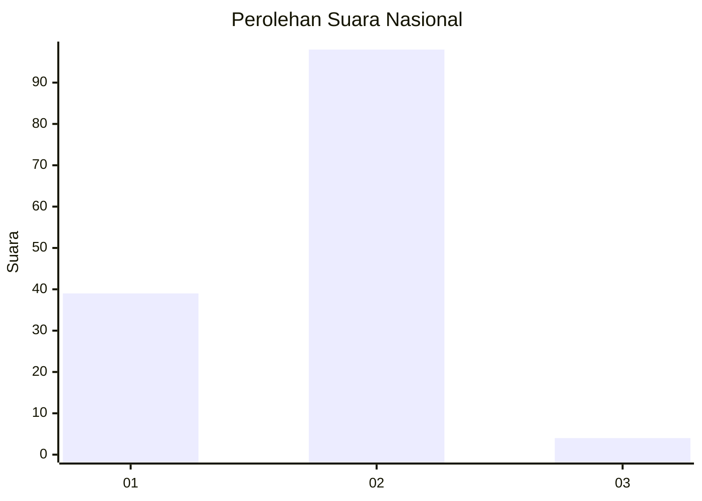
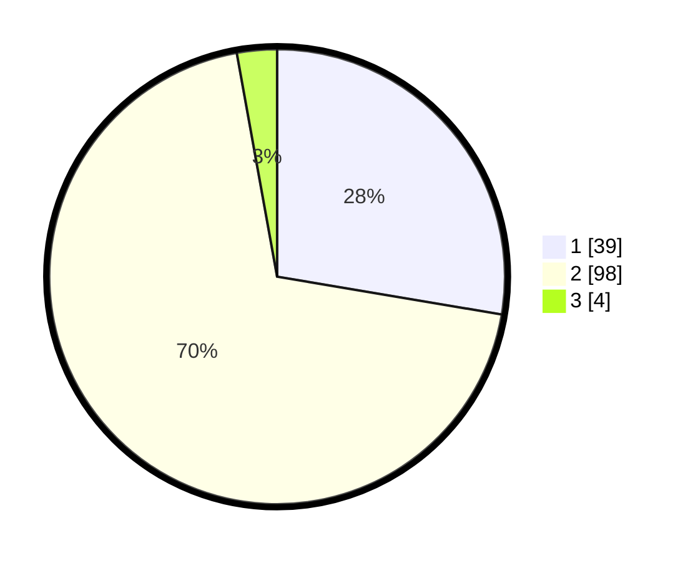

# Hasil

## Grafik

## Tabel

| No. | Nama Paslon    | Suara | Suara (raw) | Persentase |
|:--- |:-------------- | -----:| -----------:| ----------:|
| 1   | ANIES MUHAIMIN | 39    | [39][p-1]   | 27,66      |
| 2   | PRABOWO GIBRAN | 98    | [98][p-2]   | 69,50      |
| 3   | GANJAR MAHFUD  | 4     | [4][p-3]    | 2,84       |

[p-1]: https://github.com/gigit-pemilu/pemilu-2024/blob/main/pilpres/hitung-suara/sub/73-sulawesi-selatan/sub/17-luwu/sub/11-ponrang/sub/2016-buntu-nanna/sub/001-tps/sub/paslon-1.txt
[p-2]: https://github.com/gigit-pemilu/pemilu-2024/blob/main/pilpres/hitung-suara/sub/73-sulawesi-selatan/sub/17-luwu/sub/11-ponrang/sub/2016-buntu-nanna/sub/001-tps/sub/paslon-2.txt
[p-3]: https://github.com/gigit-pemilu/pemilu-2024/blob/main/pilpres/hitung-suara/sub/73-sulawesi-selatan/sub/17-luwu/sub/11-ponrang/sub/2016-buntu-nanna/sub/001-tps/sub/paslon-3.txt

## Foto C Plano

https://sirekap-obj-formc.kpu.go.id/de9d/pemilu/ppwp/73/17/11/20/16/7317112016001-20240215-043527--0fe8f57c-199f-40a1-a31b-9f8c05a3c743.jpg

https://sirekap-obj-formc.kpu.go.id/de9d/pemilu/ppwp/73/17/11/20/16/7317112016001-20240215-130407--ef232b57-1cbd-4b8f-a38c-3ef596f0a84f.jpg

https://sirekap-obj-formc.kpu.go.id/de9d/pemilu/ppwp/73/17/11/20/16/7317112016001-20240214-233121--2401e749-7662-4fc7-983c-264edb9d53af.jpg

## Metadata

| Key        | Value               |
| ---------- | ------------------- |
| Time Stamp | 2024-02-16 11:00:29 |

