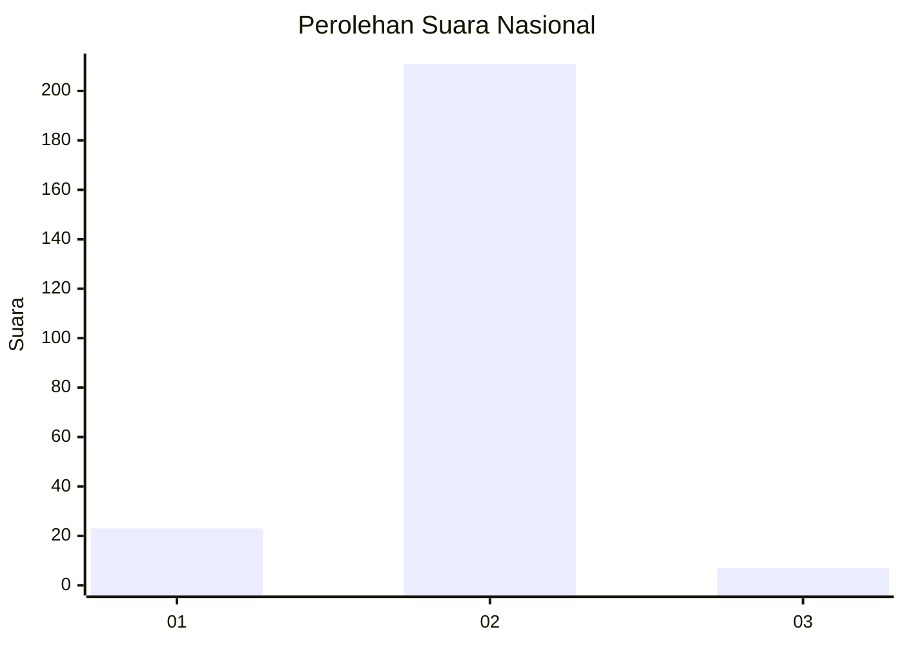
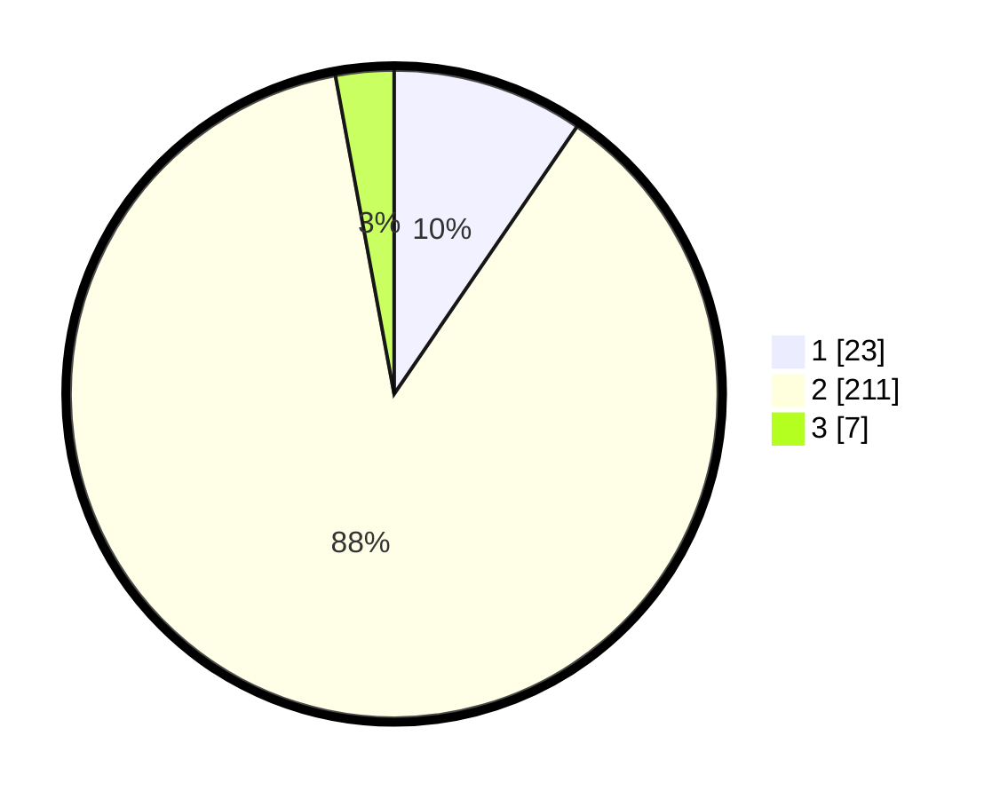

# Hasil

## Grafik

## Tabel

| No. | Nama Paslon    | Suara | Suara (raw) | Persentase |
|:--- |:-------------- | -----:| -----------:| ----------:|
| 1   | ANIES MUHAIMIN | 23    | [23][p-1]   | 9,54       |
| 2   | PRABOWO GIBRAN | 211   | [211][p-2]  | 87,55      |
| 3   | GANJAR MAHFUD  | 7     | [7][p-3]    | 2,90       |

[p-1]: https://github.com/gigit-pemilu/pemilu-2024/blob/main/pilpres/hitung-suara/sub/73-sulawesi-selatan/sub/17-luwu/sub/11-ponrang/sub/2016-buntu-nanna/sub/003-tps/sub/paslon-1.txt
[p-2]: https://github.com/gigit-pemilu/pemilu-2024/blob/main/pilpres/hitung-suara/sub/73-sulawesi-selatan/sub/17-luwu/sub/11-ponrang/sub/2016-buntu-nanna/sub/003-tps/sub/paslon-2.txt
[p-3]: https://github.com/gigit-pemilu/pemilu-2024/blob/main/pilpres/hitung-suara/sub/73-sulawesi-selatan/sub/17-luwu/sub/11-ponrang/sub/2016-buntu-nanna/sub/003-tps/sub/paslon-3.txt

## Foto C Plano

https://sirekap-obj-formc.kpu.go.id/ddac/pemilu/ppwp/73/17/11/20/16/7317112016003-20240215-082533--bfbe8ecb-4f78-4c4b-8bd4-e3afd9e3ed9c.jpg

https://sirekap-obj-formc.kpu.go.id/ddac/pemilu/ppwp/73/17/11/20/16/7317112016003-20240215-083307--59474f55-63b7-4ec0-b83d-b2d85fa7af7d.jpg

https://sirekap-obj-formc.kpu.go.id/ddac/pemilu/ppwp/73/17/11/20/16/7317112016003-20240215-083457--95f640dc-eb93-4f74-90c0-524dd8c7a3af.jpg

## Metadata

| Key        | Value               |
| ---------- | ------------------- |
| Time Stamp | 2024-02-16 12:51:22 |

