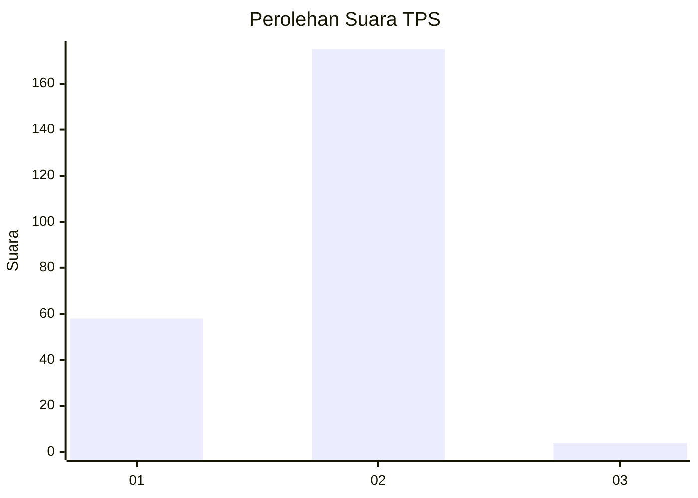
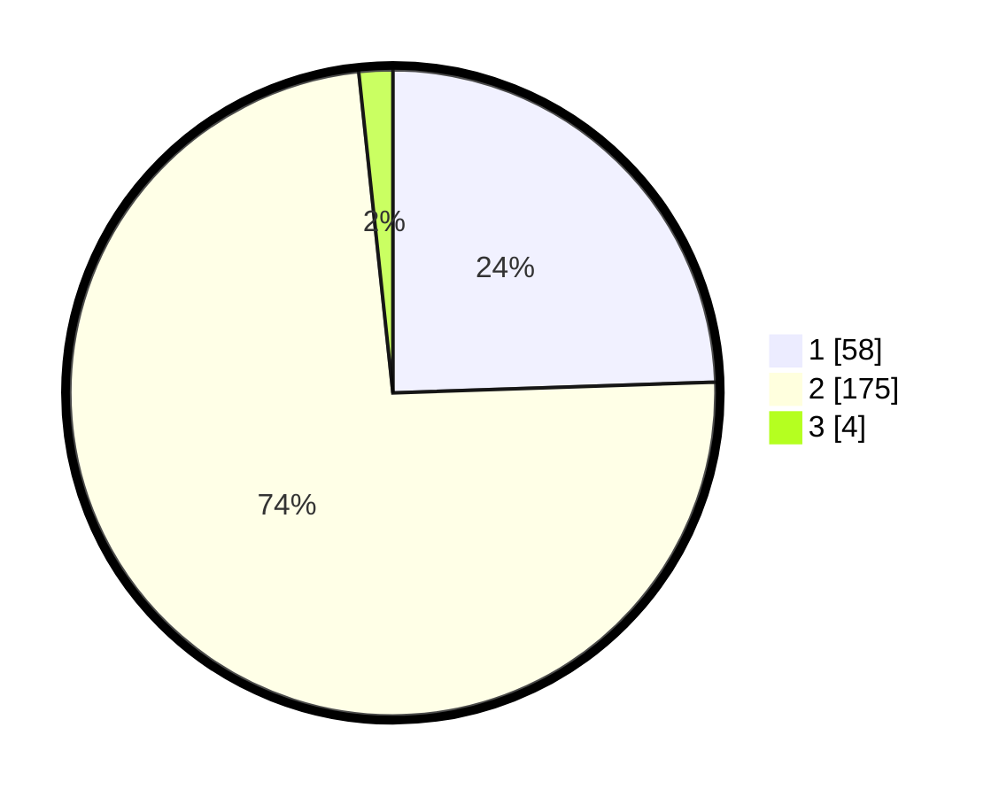

# Hasil

## Grafik

## Tabel

| No. | Nama Paslon    | Suara | Suara (raw) | Persentase |
|:--- |:-------------- | -----:| -----------:| ----------:|
| 1   | ANIES MUHAIMIN | 58    | [58][p-1]   | 24,47      |
| 2   | PRABOWO GIBRAN | 175   | [175][p-2]  | 73,84      |
| 3   | GANJAR MAHFUD  | 4     | [4][p-3]    | 1,69       |

[p-1]: https://github.com/gigit-pemilu/pemilu-2024-73-sulawesi-selatan/blob/main/pilpres/hitung-suara/sub/73-sulawesi-selatan/sub/17-luwu/sub/16-walenrang-utara/sub/1004-bosso/sub/005-tps/sub/paslon-1.txt
[p-2]: https://github.com/gigit-pemilu/pemilu-2024-73-sulawesi-selatan/blob/main/pilpres/hitung-suara/sub/73-sulawesi-selatan/sub/17-luwu/sub/16-walenrang-utara/sub/1004-bosso/sub/005-tps/sub/paslon-2.txt
[p-3]: https://github.com/gigit-pemilu/pemilu-2024-73-sulawesi-selatan/blob/main/pilpres/hitung-suara/sub/73-sulawesi-selatan/sub/17-luwu/sub/16-walenrang-utara/sub/1004-bosso/sub/005-tps/sub/paslon-3.txt

## Foto C Plano

https://sirekap-obj-formc.kpu.go.id/4022/pemilu/ppwp/73/17/16/10/04/7317161004005-20240215-102440--db230229-2f92-400e-8183-83710ac464df.jpg

https://sirekap-obj-formc.kpu.go.id/4022/pemilu/ppwp/73/17/16/10/04/7317161004005-20240215-103411--10dfad28-2f55-461f-97d9-feb3be92c0a2.jpg

https://sirekap-obj-formc.kpu.go.id/4022/pemilu/ppwp/73/17/16/10/04/7317161004005-20240215-103514--36dd40be-4761-4580-9102-5e5967cfe6ec.jpg

## Metadata

| Key        | Value               |
| ---------- | ------------------- |
| Time Stamp | 2024-02-15 15:00:29 |

