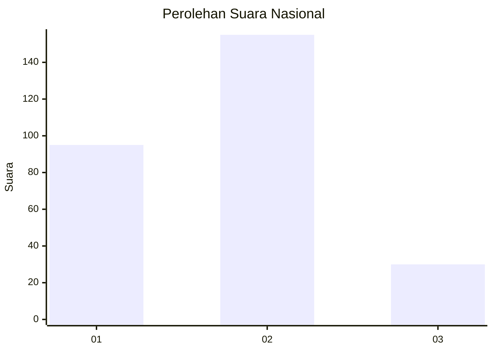
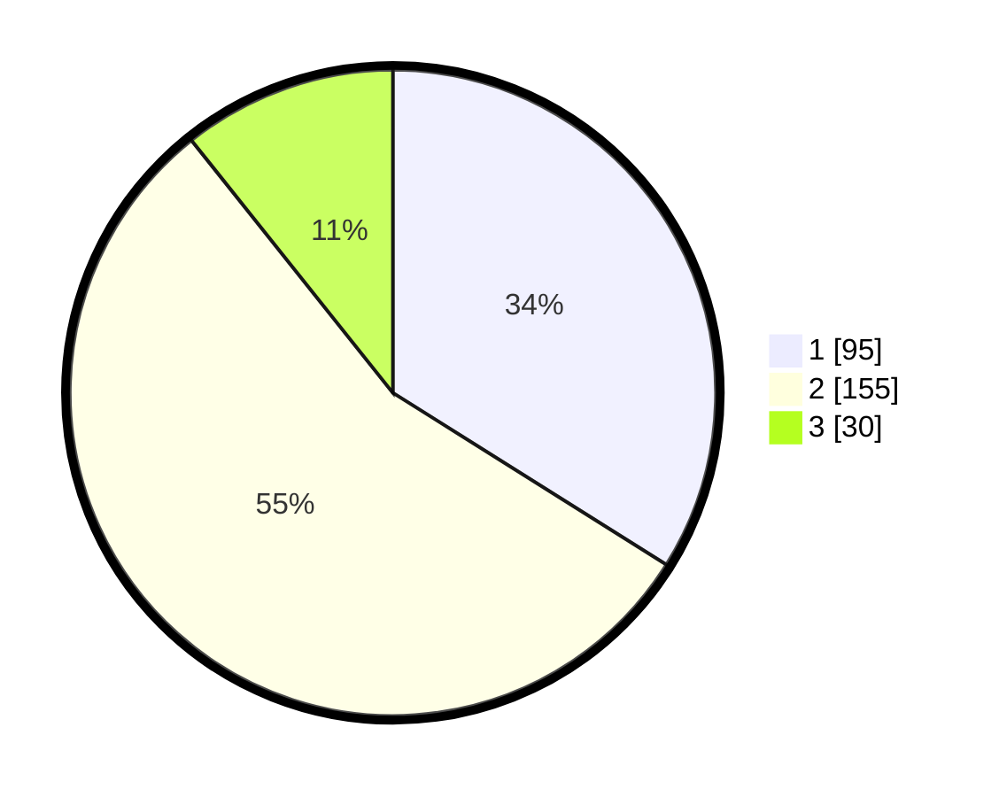

# Hasil

## Grafik

## Tabel

| No. | Nama Paslon    | Suara | Suara (raw) | Persentase |
|:--- |:-------------- | -----:| -----------:| ----------:|
| 1   | ANIES MUHAIMIN | 95    | [95][p-1]   | 33,93      |
| 2   | PRABOWO GIBRAN | 155   | [155][p-2]  | 55,36      |
| 3   | GANJAR MAHFUD  | 30    | [30][p-3]   | 10,71      |

[p-1]: https://github.com/gigit-pemilu/pemilu-2024/blob/main/pilpres/hitung-suara/sub/73-sulawesi-selatan/sub/17-luwu/sub/16-walenrang-utara/sub/2001-salutubu/sub/002-tps/sub/paslon-1.txt
[p-2]: https://github.com/gigit-pemilu/pemilu-2024/blob/main/pilpres/hitung-suara/sub/73-sulawesi-selatan/sub/17-luwu/sub/16-walenrang-utara/sub/2001-salutubu/sub/002-tps/sub/paslon-2.txt
[p-3]: https://github.com/gigit-pemilu/pemilu-2024/blob/main/pilpres/hitung-suara/sub/73-sulawesi-selatan/sub/17-luwu/sub/16-walenrang-utara/sub/2001-salutubu/sub/002-tps/sub/paslon-3.txt

## Foto C Plano

https://sirekap-obj-formc.kpu.go.id/daf9/pemilu/ppwp/73/17/16/20/01/7317162001002-20240215-112819--3fe35cd0-9986-44d3-8c4f-b28b7c9c21d8.jpg

https://sirekap-obj-formc.kpu.go.id/daf9/pemilu/ppwp/73/17/16/20/01/7317162001002-20240215-101326--7581f0a0-17f2-445e-a3ab-cff6e3103e8f.jpg

https://sirekap-obj-formc.kpu.go.id/daf9/pemilu/ppwp/73/17/16/20/01/7317162001002-20240215-113126--b3a719f7-546d-4525-83ca-5e0948dd4d93.jpg

## Metadata

| Key        | Value               |
| ---------- | ------------------- |
| Time Stamp | 2024-02-15 20:30:46 |

