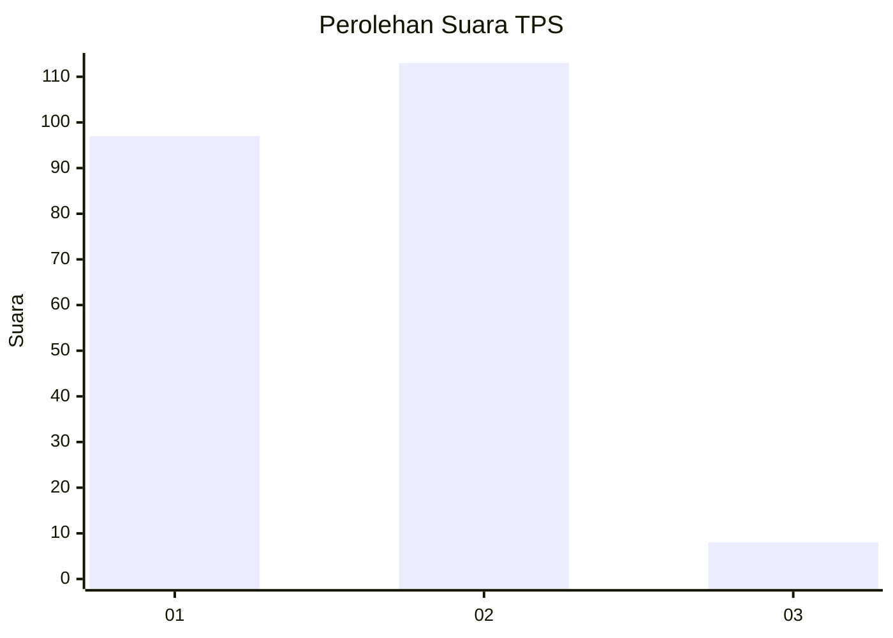
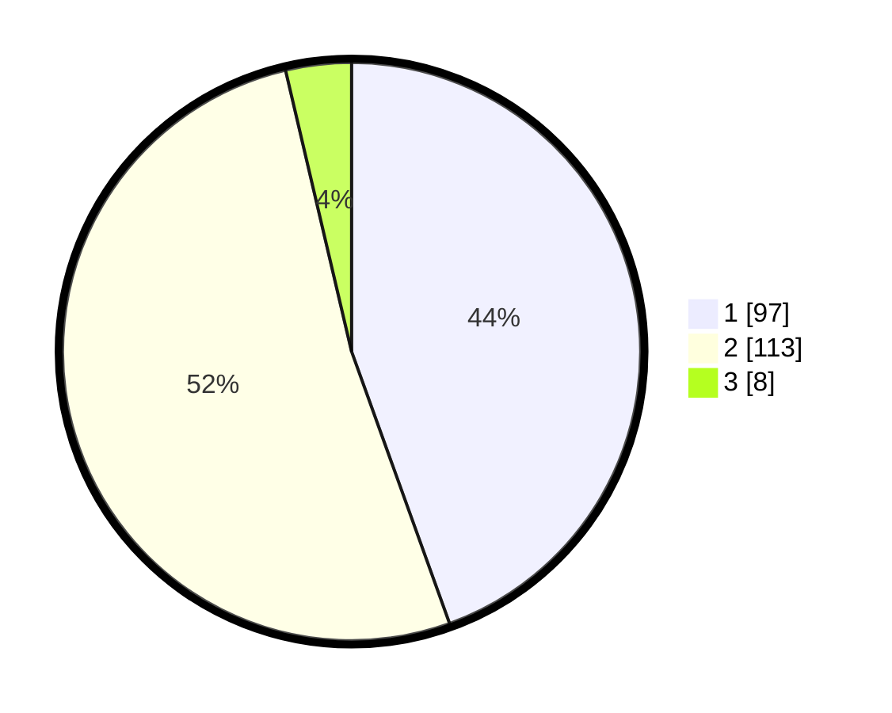

# Hasil

## Grafik

## Tabel

| No. | Nama Paslon    | Suara | Suara (raw) | Persentase |
|:--- |:-------------- | -----:| -----------:| ----------:|
| 1   | ANIES MUHAIMIN | 97    | [97][p-1]   | 44,50      |
| 2   | PRABOWO GIBRAN | 113   | [113][p-2]  | 51,83      |
| 3   | GANJAR MAHFUD  | 8     | [8][p-3]    | 3,67       |

[p-1]: https://github.com/gigit-pemilu/pemilu-2024-73-sulawesi-selatan/blob/main/pilpres/hitung-suara/sub/73-sulawesi-selatan/sub/17-luwu/sub/17-walenrang-timur/sub/2001-lamasi-pantai/sub/002-tps/sub/paslon-1.txt
[p-2]: https://github.com/gigit-pemilu/pemilu-2024-73-sulawesi-selatan/blob/main/pilpres/hitung-suara/sub/73-sulawesi-selatan/sub/17-luwu/sub/17-walenrang-timur/sub/2001-lamasi-pantai/sub/002-tps/sub/paslon-2.txt
[p-3]: https://github.com/gigit-pemilu/pemilu-2024-73-sulawesi-selatan/blob/main/pilpres/hitung-suara/sub/73-sulawesi-selatan/sub/17-luwu/sub/17-walenrang-timur/sub/2001-lamasi-pantai/sub/002-tps/sub/paslon-3.txt

## Foto C Plano

https://sirekap-obj-formc.kpu.go.id/3392/pemilu/ppwp/73/17/17/20/01/7317172001002-20240215-044818--22d1da01-bcd5-4406-afc0-dc3fda3a718f.jpg

https://sirekap-obj-formc.kpu.go.id/3392/pemilu/ppwp/73/17/17/20/01/7317172001002-20240215-044956--191e166a-6b3b-421c-833a-0d31cd4d6154.jpg

https://sirekap-obj-formc.kpu.go.id/3392/pemilu/ppwp/73/17/17/20/01/7317172001002-20240215-050224--fcd94ffe-f5e7-4e9f-ac67-476bf4fcd2b6.jpg

## Metadata

| Key        | Value               |
| ---------- | ------------------- |
| Time Stamp | 2024-02-15 22:40:13 |

