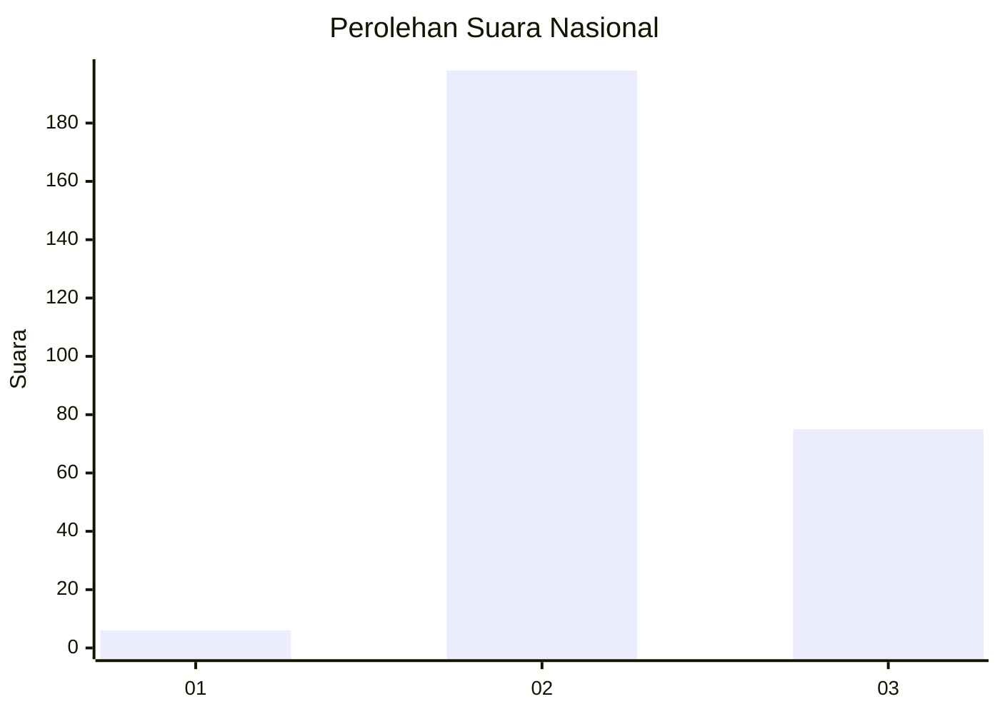
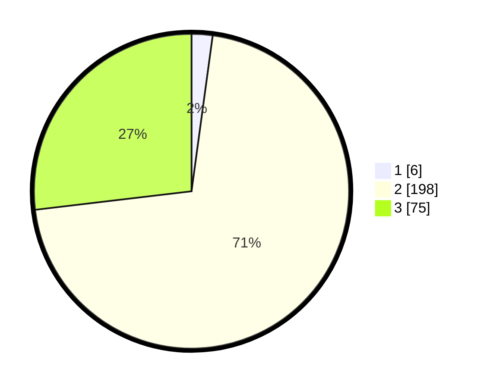

# Hasil

## Grafik

## Tabel

| No. | Nama Paslon    | Suara | Suara (raw) | Persentase |
|:--- |:-------------- | -----:| -----------:| ----------:|
| 1   | ANIES MUHAIMIN | 6     | [6][p-1]    | 2,15       |
| 2   | PRABOWO GIBRAN | 198   | [198][p-2]  | 70,97      |
| 3   | GANJAR MAHFUD  | 75    | [75][p-3]   | 26,88      |

[p-1]: https://github.com/gigit-pemilu/pemilu-2024/blob/main/pilpres/hitung-suara/sub/73-sulawesi-selatan/sub/17-luwu/sub/17-walenrang-timur/sub/2003-rantai-damai/sub/005-tps/sub/paslon-1.txt
[p-2]: https://github.com/gigit-pemilu/pemilu-2024/blob/main/pilpres/hitung-suara/sub/73-sulawesi-selatan/sub/17-luwu/sub/17-walenrang-timur/sub/2003-rantai-damai/sub/005-tps/sub/paslon-2.txt
[p-3]: https://github.com/gigit-pemilu/pemilu-2024/blob/main/pilpres/hitung-suara/sub/73-sulawesi-selatan/sub/17-luwu/sub/17-walenrang-timur/sub/2003-rantai-damai/sub/005-tps/sub/paslon-3.txt

## Foto C Plano

https://sirekap-obj-formc.kpu.go.id/bd87/pemilu/ppwp/73/17/17/20/03/7317172003005-20240215-074544--4822d0af-bf99-48a0-9f84-865c8dcd1886.jpg

https://sirekap-obj-formc.kpu.go.id/bd87/pemilu/ppwp/73/17/17/20/03/7317172003005-20240215-074732--6bc00a88-c970-494b-834d-27e2b33fc4e2.jpg

https://sirekap-obj-formc.kpu.go.id/bd87/pemilu/ppwp/73/17/17/20/03/7317172003005-20240215-074653--b80cdfd1-6dba-4921-9e3c-977ffac3f0b1.jpg

## Metadata

| Key        | Value               |
| ---------- | ------------------- |
| Time Stamp | 2024-02-17 18:00:00 |

