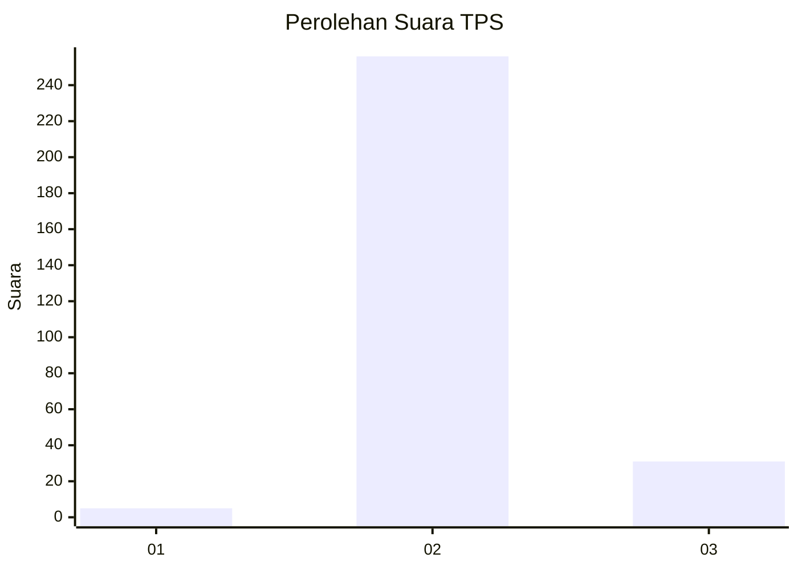
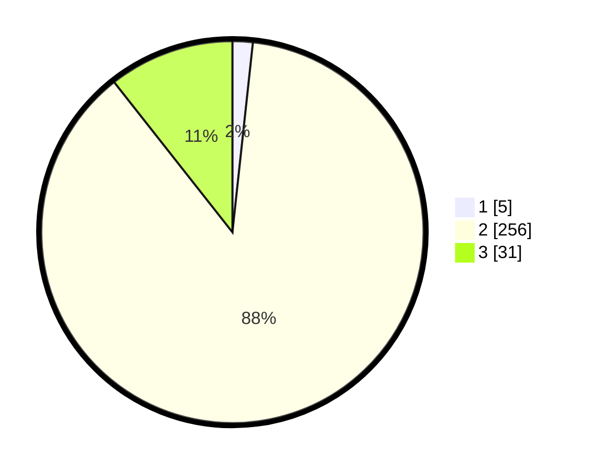

# Hasil

## Grafik

## Tabel

| No. | Nama Paslon    | Suara | Suara (raw) | Persentase |
|:--- |:-------------- | -----:| -----------:| ----------:|
| 1   | ANIES MUHAIMIN | 5     | [5][p-1]    | 1,71       |
| 2   | PRABOWO GIBRAN | 256   | [256][p-2]  | 87,67      |
| 3   | GANJAR MAHFUD  | 31    | [31][p-3]   | 10,62      |

[p-1]: https://github.com/gigit-pemilu/pemilu-2024-73-sulawesi-selatan/blob/main/pilpres/hitung-suara/sub/73-sulawesi-selatan/sub/17-luwu/sub/17-walenrang-timur/sub/2008-suka-damai/sub/005-tps/sub/paslon-1.txt
[p-2]: https://github.com/gigit-pemilu/pemilu-2024-73-sulawesi-selatan/blob/main/pilpres/hitung-suara/sub/73-sulawesi-selatan/sub/17-luwu/sub/17-walenrang-timur/sub/2008-suka-damai/sub/005-tps/sub/paslon-2.txt
[p-3]: https://github.com/gigit-pemilu/pemilu-2024-73-sulawesi-selatan/blob/main/pilpres/hitung-suara/sub/73-sulawesi-selatan/sub/17-luwu/sub/17-walenrang-timur/sub/2008-suka-damai/sub/005-tps/sub/paslon-3.txt

## Foto C Plano

https://sirekap-obj-formc.kpu.go.id/87b0/pemilu/ppwp/73/17/17/20/08/7317172008005-20240215-053849--e7b74c8b-7fc8-4b83-aa30-f3da379a291d.jpg

https://sirekap-obj-formc.kpu.go.id/87b0/pemilu/ppwp/73/17/17/20/08/7317172008005-20240215-062358--0fa12a37-5395-4bbb-8198-218c27dc2fa3.jpg

https://sirekap-obj-formc.kpu.go.id/87b0/pemilu/ppwp/73/17/17/20/08/7317172008005-20240215-062826--72683c2a-713b-4e7a-8c11-c2a18af03cdd.jpg

## Metadata

| Key        | Value               |
| ---------- | ------------------- |
| Time Stamp | 2024-02-24 22:31:28 |

