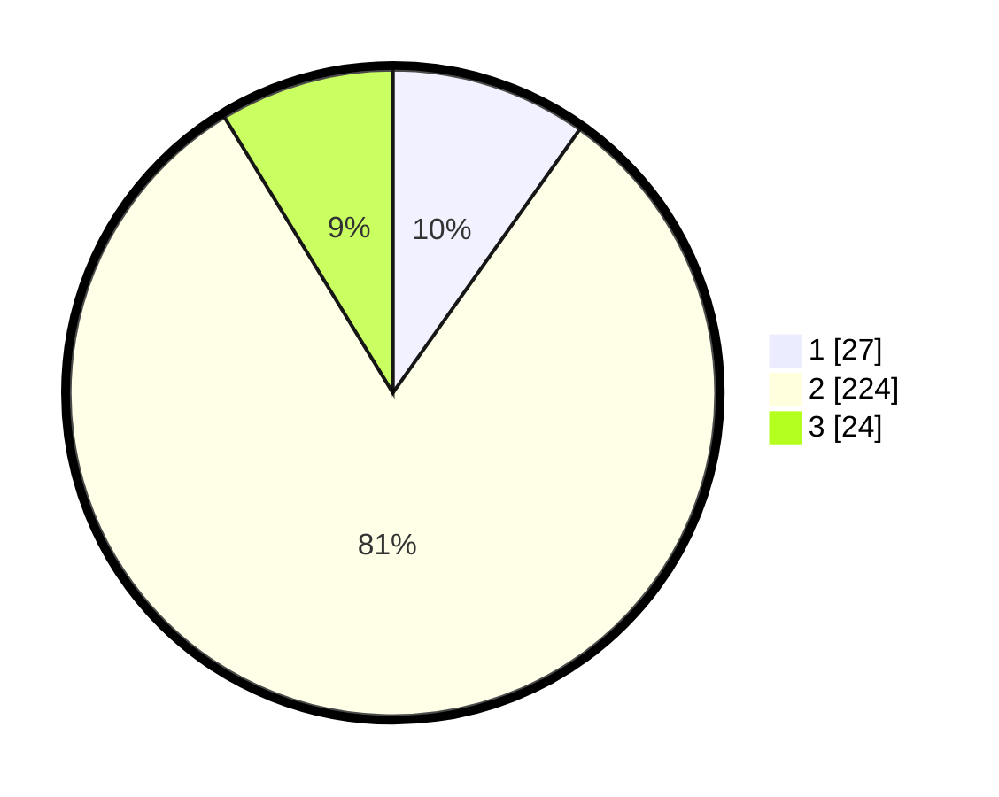

# Hasil

## Grafik

## Tabel

| No. | Nama Paslon    | Suara | Suara (raw) | Persentase |
|:--- |:-------------- | -----:| -----------:| ----------:|
| 1   | ANIES MUHAIMIN | 27    | [27][p-1]   | 9,82       |
| 2   | PRABOWO GIBRAN | 224   | [224][p-2]  | 81,45      |
| 3   | GANJAR MAHFUD  | 24    | [24][p-3]   | 8,73       |

[p-1]: https://github.com/gigit-pemilu/pemilu-2024-73-sulawesi-selatan/blob/main/pilpres/hitung-suara/sub/73-sulawesi-selatan/sub/17-luwu/sub/21-ponrang-selatan/sub/2007-paccerakkang/sub/001-tps/sub/paslon-1.txt
[p-2]: https://github.com/gigit-pemilu/pemilu-2024-73-sulawesi-selatan/blob/main/pilpres/hitung-suara/sub/73-sulawesi-selatan/sub/17-luwu/sub/21-ponrang-selatan/sub/2007-paccerakkang/sub/001-tps/sub/paslon-2.txt
[p-3]: https://github.com/gigit-pemilu/pemilu-2024-73-sulawesi-selatan/blob/main/pilpres/hitung-suara/sub/73-sulawesi-selatan/sub/17-luwu/sub/21-ponrang-selatan/sub/2007-paccerakkang/sub/001-tps/sub/paslon-3.txt

## Foto C Plano

https://sirekap-obj-formc.kpu.go.id/6427/pemilu/ppwp/73/17/21/20/07/7317212007001-20240215-141825--21cb3638-7320-4fb8-bc4e-e9062c0fe52c.jpg

https://sirekap-obj-formc.kpu.go.id/6427/pemilu/ppwp/73/17/21/20/07/7317212007001-20240215-132300--c1316acc-15d9-4075-a1b2-430c2a673a1b.jpg

https://sirekap-obj-formc.kpu.go.id/6427/pemilu/ppwp/73/17/21/20/07/7317212007001-20240215-141451--2cfb5575-0739-44d0-9745-6d43bc2d6cf2.jpg

## Metadata

| Key        | Value               |
| ---------- | ------------------- |
| Time Stamp | 2024-02-15 16:00:26 |

