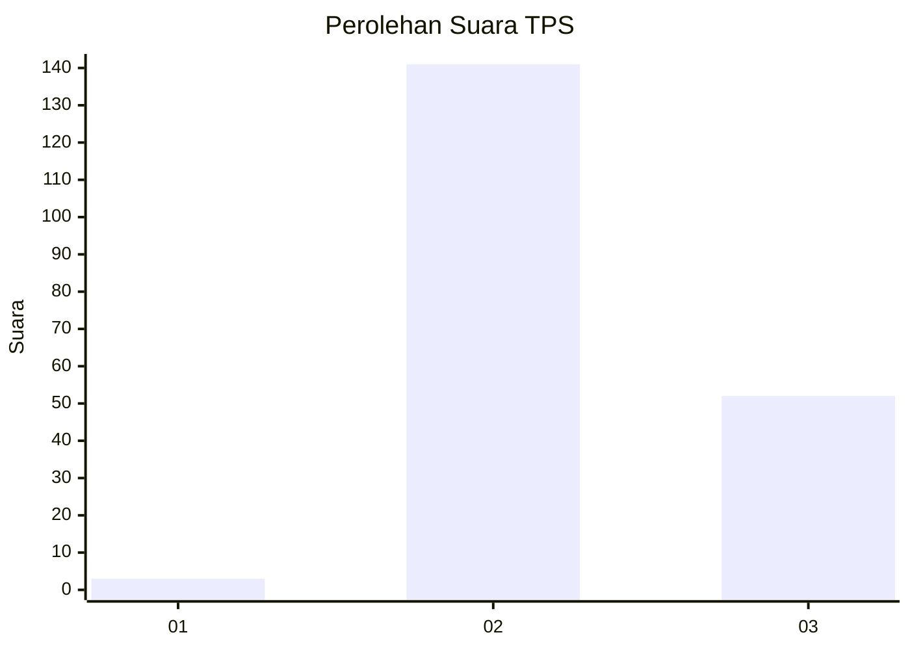
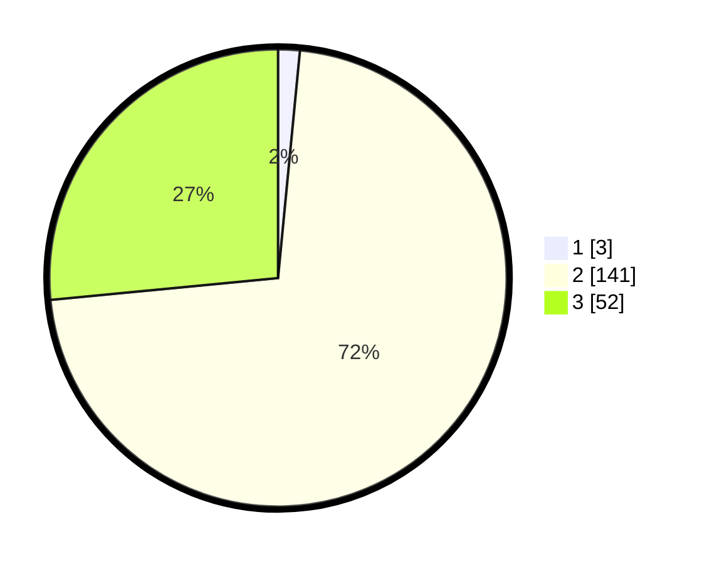

# Hasil

## Grafik

## Tabel

| No. | Nama Paslon    | Suara | Suara (raw) | Persentase |
|:--- |:-------------- | -----:| -----------:| ----------:|
| 1   | ANIES MUHAIMIN | 3     | [3][p-1]    | 1,53       |
| 2   | PRABOWO GIBRAN | 141   | [141][p-2]  | 71,94      |
| 3   | GANJAR MAHFUD  | 52    | [52][p-3]   | 26,53      |

[p-1]: https://github.com/gigit-pemilu/pemilu-2024-73-sulawesi-selatan/blob/main/pilpres/hitung-suara/sub/73-sulawesi-selatan/sub/18-tana-toraja/sub/29-makale-selatan/sub/1001-tiromanda/sub/001-tps/sub/paslon-1.txt
[p-2]: https://github.com/gigit-pemilu/pemilu-2024-73-sulawesi-selatan/blob/main/pilpres/hitung-suara/sub/73-sulawesi-selatan/sub/18-tana-toraja/sub/29-makale-selatan/sub/1001-tiromanda/sub/001-tps/sub/paslon-2.txt
[p-3]: https://github.com/gigit-pemilu/pemilu-2024-73-sulawesi-selatan/blob/main/pilpres/hitung-suara/sub/73-sulawesi-selatan/sub/18-tana-toraja/sub/29-makale-selatan/sub/1001-tiromanda/sub/001-tps/sub/paslon-3.txt

## Foto C Plano

https://sirekap-obj-formc.kpu.go.id/0d92/pemilu/ppwp/73/18/29/10/01/7318291001001-20240215-000953--cda5fbb6-aa29-451e-b202-69a1f457710e.jpg

https://sirekap-obj-formc.kpu.go.id/0d92/pemilu/ppwp/73/18/29/10/01/7318291001001-20240214-230855--d260ce70-ef9e-40a8-b54b-ad5e1b7d17e1.jpg

https://sirekap-obj-formc.kpu.go.id/0d92/pemilu/ppwp/73/18/29/10/01/7318291001001-20240214-194132--7c44c8d1-08a3-4ce9-ba2b-0925b203c0f4.jpg

## Metadata

| Key        | Value               |
| ---------- | ------------------- |
| Time Stamp | 2024-02-15 12:00:28 |

