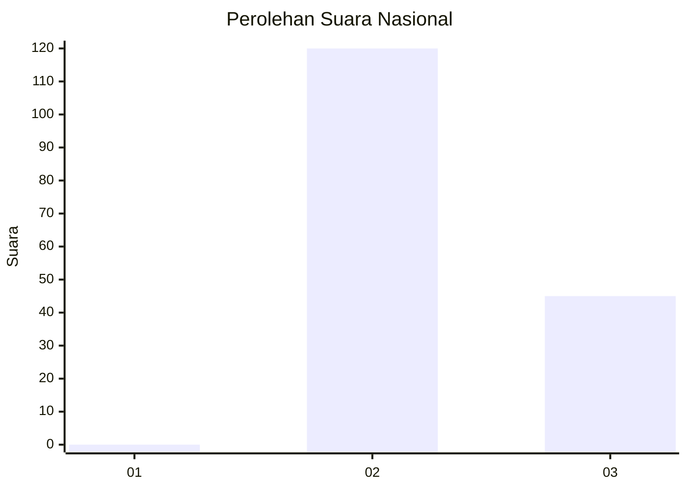
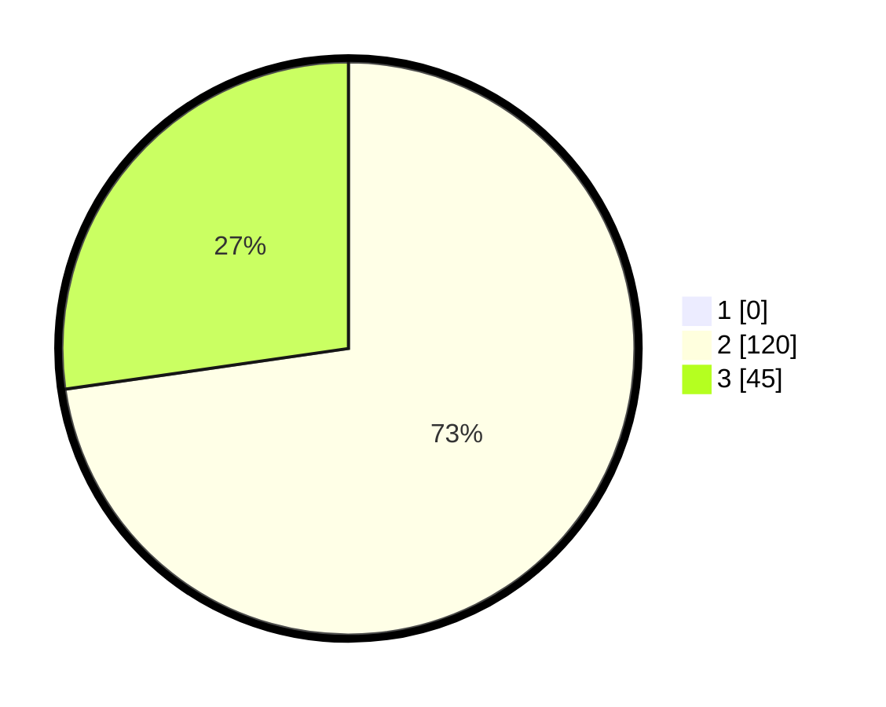

# Hasil

## Grafik

## Tabel

| No. | Nama Paslon    | Suara | Suara (raw) | Persentase |
|:--- |:-------------- | -----:| -----------:| ----------:|
| 1   | ANIES MUHAIMIN | 0     | [0][p-1]    | 0,00       |
| 2   | PRABOWO GIBRAN | 120   | [120][p-2]  | 72,73      |
| 3   | GANJAR MAHFUD  | 45    | [45][p-3]   | 27,27      |

[p-1]: https://github.com/gigit-pemilu/pemilu-2024/blob/main/pilpres/hitung-suara/sub/73-sulawesi-selatan/sub/18-tana-toraja/sub/29-makale-selatan/sub/1001-tiromanda/sub/002-tps/sub/paslon-1.txt
[p-2]: https://github.com/gigit-pemilu/pemilu-2024/blob/main/pilpres/hitung-suara/sub/73-sulawesi-selatan/sub/18-tana-toraja/sub/29-makale-selatan/sub/1001-tiromanda/sub/002-tps/sub/paslon-2.txt
[p-3]: https://github.com/gigit-pemilu/pemilu-2024/blob/main/pilpres/hitung-suara/sub/73-sulawesi-selatan/sub/18-tana-toraja/sub/29-makale-selatan/sub/1001-tiromanda/sub/002-tps/sub/paslon-3.txt

## Foto C Plano

https://sirekap-obj-formc.kpu.go.id/a47a/pemilu/ppwp/73/18/29/10/01/7318291001002-20240214-223736--5cbe2b7a-01a2-4fbc-bbd8-59f6c56fdb26.jpg

https://sirekap-obj-formc.kpu.go.id/a47a/pemilu/ppwp/73/18/29/10/01/7318291001002-20240214-224237--70aa6dce-4226-47ac-959d-a772deb15ef9.jpg

https://sirekap-obj-formc.kpu.go.id/a47a/pemilu/ppwp/73/18/29/10/01/7318291001002-20240214-224357--889b4bfa-4b89-4122-83bb-bbe51f7f7682.jpg

## Metadata

| Key        | Value               |
| ---------- | ------------------- |
| Time Stamp | 2024-02-15 15:00:29 |

