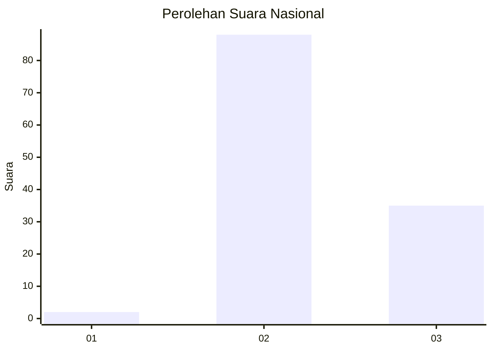
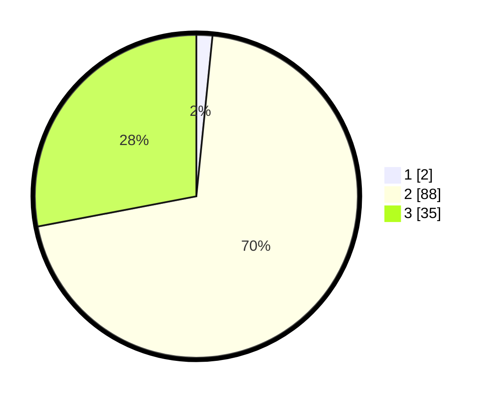

# Hasil

## Grafik

## Tabel

| No. | Nama Paslon    | Suara | Suara (raw) | Persentase |
|:--- |:-------------- | -----:| -----------:| ----------:|
| 1   | ANIES MUHAIMIN | 2     | [2][p-1]    | 1,60       |
| 2   | PRABOWO GIBRAN | 88    | [88][p-2]   | 70,40      |
| 3   | GANJAR MAHFUD  | 35    | [35][p-3]   | 28,00      |

[p-1]: https://github.com/gigit-pemilu/pemilu-2024/blob/main/pilpres/hitung-suara/sub/73-sulawesi-selatan/sub/18-tana-toraja/sub/29-makale-selatan/sub/2007-pa'buaran/sub/001-tps/sub/paslon-1.txt
[p-2]: https://github.com/gigit-pemilu/pemilu-2024/blob/main/pilpres/hitung-suara/sub/73-sulawesi-selatan/sub/18-tana-toraja/sub/29-makale-selatan/sub/2007-pa'buaran/sub/001-tps/sub/paslon-2.txt
[p-3]: https://github.com/gigit-pemilu/pemilu-2024/blob/main/pilpres/hitung-suara/sub/73-sulawesi-selatan/sub/18-tana-toraja/sub/29-makale-selatan/sub/2007-pa'buaran/sub/001-tps/sub/paslon-3.txt

## Foto C Plano

https://sirekap-obj-formc.kpu.go.id/af97/pemilu/ppwp/73/18/29/20/07/7318292007001-20240215-060840--143a387f-0eb4-43a4-9f74-46e831ab3913.jpg

https://sirekap-obj-formc.kpu.go.id/af97/pemilu/ppwp/73/18/29/20/07/7318292007001-20240215-013622--4320d878-c3ad-4fb7-bae1-9c9f2f9c8d46.jpg

https://sirekap-obj-formc.kpu.go.id/af97/pemilu/ppwp/73/18/29/20/07/7318292007001-20240215-013825--473726e8-f10a-4a9a-b24e-156c18419f17.jpg

## Metadata

| Key        | Value               |
| ---------- | ------------------- |
| Time Stamp | 2024-02-15 15:00:29 |

