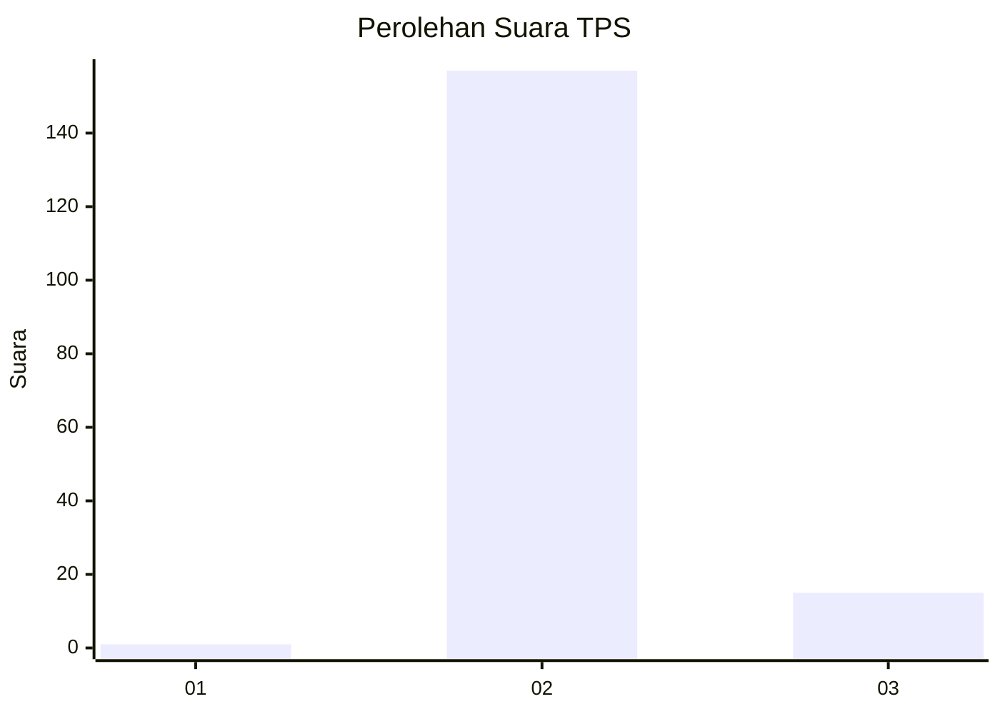
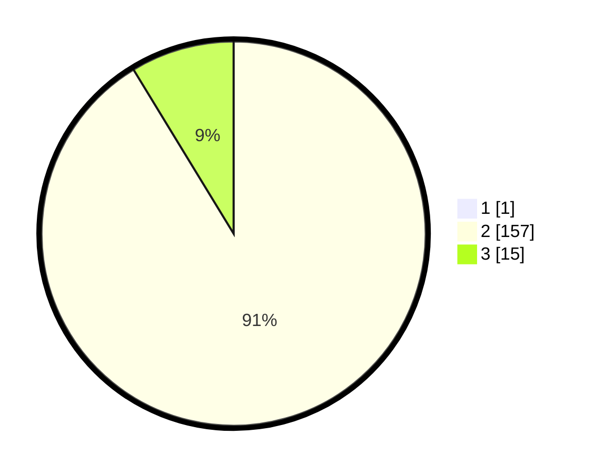

# Hasil

## Grafik

## Tabel

| No. | Nama Paslon    | Suara | Suara (raw) | Persentase |
|:--- |:-------------- | -----:| -----------:| ----------:|
| 1   | ANIES MUHAIMIN | 1     | [1][p-1]    | 0,58       |
| 2   | PRABOWO GIBRAN | 157   | [157][p-2]  | 90,75      |
| 3   | GANJAR MAHFUD  | 15    | [15][p-3]   | 8,67       |

[p-1]: https://github.com/gigit-pemilu/pemilu-2024-73-sulawesi-selatan/blob/main/pilpres/hitung-suara/sub/73-sulawesi-selatan/sub/18-tana-toraja/sub/29-makale-selatan/sub/2008-bo'ne-buntu-sisong/sub/006-tps/sub/paslon-1.txt
[p-2]: https://github.com/gigit-pemilu/pemilu-2024-73-sulawesi-selatan/blob/main/pilpres/hitung-suara/sub/73-sulawesi-selatan/sub/18-tana-toraja/sub/29-makale-selatan/sub/2008-bo'ne-buntu-sisong/sub/006-tps/sub/paslon-2.txt
[p-3]: https://github.com/gigit-pemilu/pemilu-2024-73-sulawesi-selatan/blob/main/pilpres/hitung-suara/sub/73-sulawesi-selatan/sub/18-tana-toraja/sub/29-makale-selatan/sub/2008-bo'ne-buntu-sisong/sub/006-tps/sub/paslon-3.txt

## Foto C Plano

https://sirekap-obj-formc.kpu.go.id/83c9/pemilu/ppwp/73/18/29/20/08/7318292008006-20240214-222345--ee019c3f-389a-4503-a3bf-436220b627f9.jpg

https://sirekap-obj-formc.kpu.go.id/83c9/pemilu/ppwp/73/18/29/20/08/7318292008006-20240214-223229--60761cde-0597-4cdc-a998-567f7e2a437d.jpg

https://sirekap-obj-formc.kpu.go.id/83c9/pemilu/ppwp/73/18/29/20/08/7318292008006-20240214-223608--8afcb5cf-96e6-499d-98e6-ac89b5c898b5.jpg

## Metadata

| Key        | Value               |
| ---------- | ------------------- |
| Time Stamp | 2024-02-15 15:00:29 |

