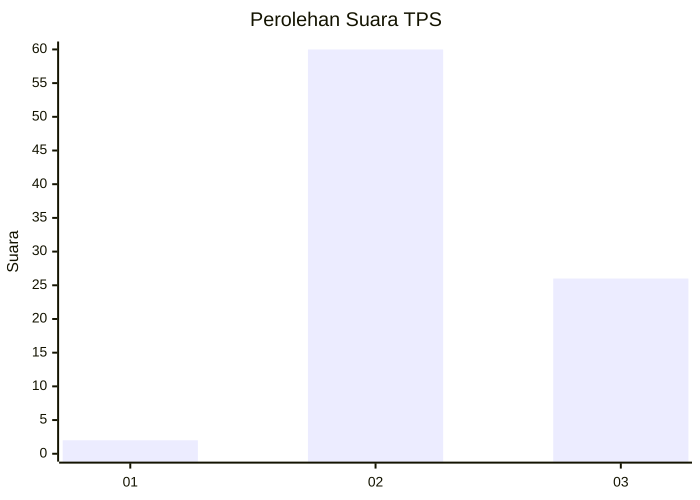
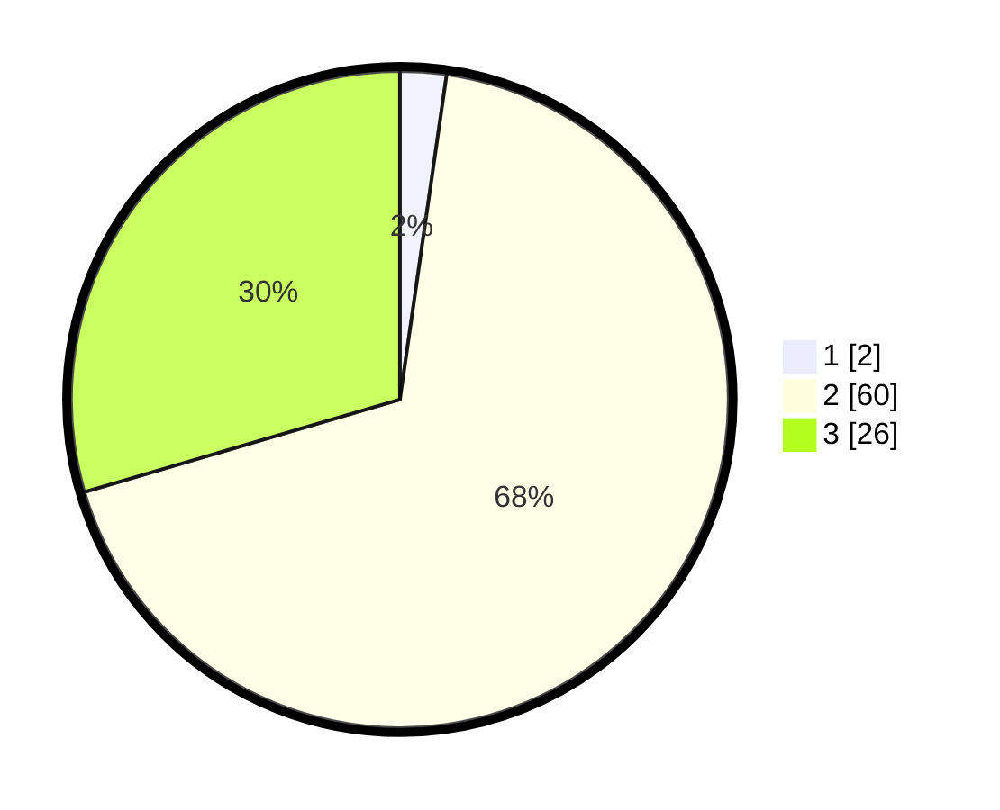

# Hasil

## Grafik

## Tabel

| No. | Nama Paslon    | Suara | Suara (raw) | Persentase |
|:--- |:-------------- | -----:| -----------:| ----------:|
| 1   | ANIES MUHAIMIN | 2     | [2][p-1]    | 2,27       |
| 2   | PRABOWO GIBRAN | 60    | [60][p-2]   | 68,18      |
| 3   | GANJAR MAHFUD  | 26    | [26][p-3]   | 29,55      |

[p-1]: https://github.com/gigit-pemilu/pemilu-2024-73-sulawesi-selatan/blob/main/pilpres/hitung-suara/sub/73-sulawesi-selatan/sub/18-tana-toraja/sub/31-masanda/sub/2004-pondingao'/sub/001-tps/sub/paslon-1.txt
[p-2]: https://github.com/gigit-pemilu/pemilu-2024-73-sulawesi-selatan/blob/main/pilpres/hitung-suara/sub/73-sulawesi-selatan/sub/18-tana-toraja/sub/31-masanda/sub/2004-pondingao'/sub/001-tps/sub/paslon-2.txt
[p-3]: https://github.com/gigit-pemilu/pemilu-2024-73-sulawesi-selatan/blob/main/pilpres/hitung-suara/sub/73-sulawesi-selatan/sub/18-tana-toraja/sub/31-masanda/sub/2004-pondingao'/sub/001-tps/sub/paslon-3.txt

## Foto C Plano

https://sirekap-obj-formc.kpu.go.id/0387/pemilu/ppwp/73/18/31/20/04/7318312004001-20240218-132707--c4d398b8-1c28-4c5a-8cd2-c2cc1cb177bf.jpg

https://sirekap-obj-formc.kpu.go.id/0387/pemilu/ppwp/73/18/31/20/04/7318312004001-20240215-104857--1d2801b1-ba76-4e53-a4e6-bac5eb40ba5e.jpg

https://sirekap-obj-formc.kpu.go.id/0387/pemilu/ppwp/73/18/31/20/04/7318312004001-20240215-103443--79d2a534-57d8-440f-bc1c-4a4bd1dc9197.jpg

## Metadata

| Key        | Value               |
| ---------- | ------------------- |
| Time Stamp | 2024-02-19 06:16:00 |

