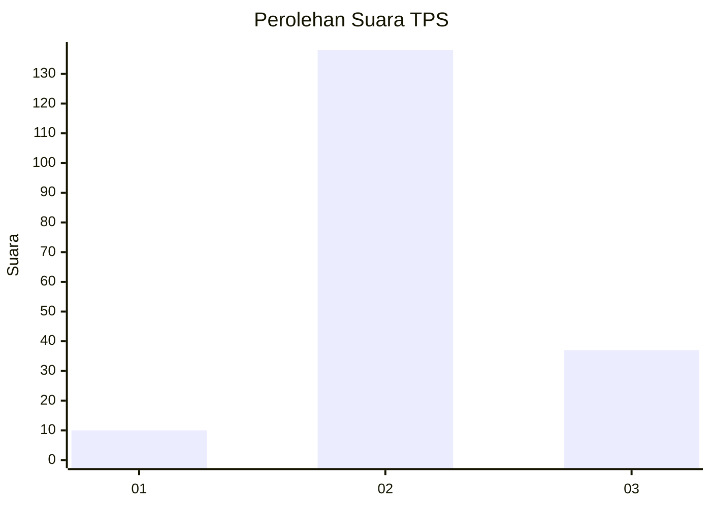

# Hasil

## Grafik

## Tabel

| No. | Nama Paslon    | Suara | Suara (raw) | Persentase |
|:--- |:-------------- | -----:| -----------:| ----------:|
| 1   | ANIES MUHAIMIN | 10    | [10][p-1]   | 5,41       |
| 2   | PRABOWO GIBRAN | 138   | [138][p-2]  | 74,59      |
| 3   | GANJAR MAHFUD  | 37    | [37][p-3]   | 20,00      |

[p-1]: https://github.com/gigit-pemilu/pemilu-2024-73-sulawesi-selatan/blob/main/pilpres/hitung-suara/sub/73-sulawesi-selatan/sub/18-tana-toraja/sub/35-malimbong-balepe/sub/1001-malimbong/sub/002-tps/sub/paslon-1.txt
[p-2]: https://github.com/gigit-pemilu/pemilu-2024-73-sulawesi-selatan/blob/main/pilpres/hitung-suara/sub/73-sulawesi-selatan/sub/18-tana-toraja/sub/35-malimbong-balepe/sub/1001-malimbong/sub/002-tps/sub/paslon-2.txt
[p-3]: https://github.com/gigit-pemilu/pemilu-2024-73-sulawesi-selatan/blob/main/pilpres/hitung-suara/sub/73-sulawesi-selatan/sub/18-tana-toraja/sub/35-malimbong-balepe/sub/1001-malimbong/sub/002-tps/sub/paslon-3.txt

## Foto C Plano

https://sirekap-obj-formc.kpu.go.id/eaf4/pemilu/ppwp/73/18/35/10/01/7318351001002-20240215-071443--fadb4c70-6c2a-470e-b678-6ceecd4e2e16.jpg

https://sirekap-obj-formc.kpu.go.id/eaf4/pemilu/ppwp/73/18/35/10/01/7318351001002-20240215-070850--96a63978-3989-47d0-aa5e-fe8d04576912.jpg

https://sirekap-obj-formc.kpu.go.id/eaf4/pemilu/ppwp/73/18/35/10/01/7318351001002-20240215-003611--c23b6d22-a47b-4f3e-85cd-8b71a6b7c45d.jpg

## Metadata

| Key        | Value               |
| ---------- | ------------------- |
| Time Stamp | 2024-02-15 21:01:18 |

