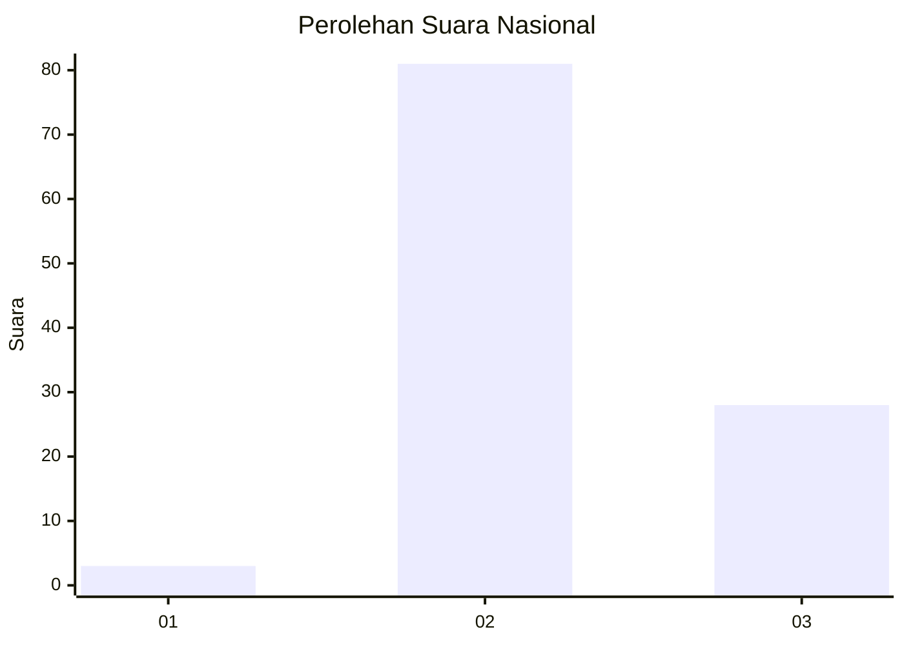
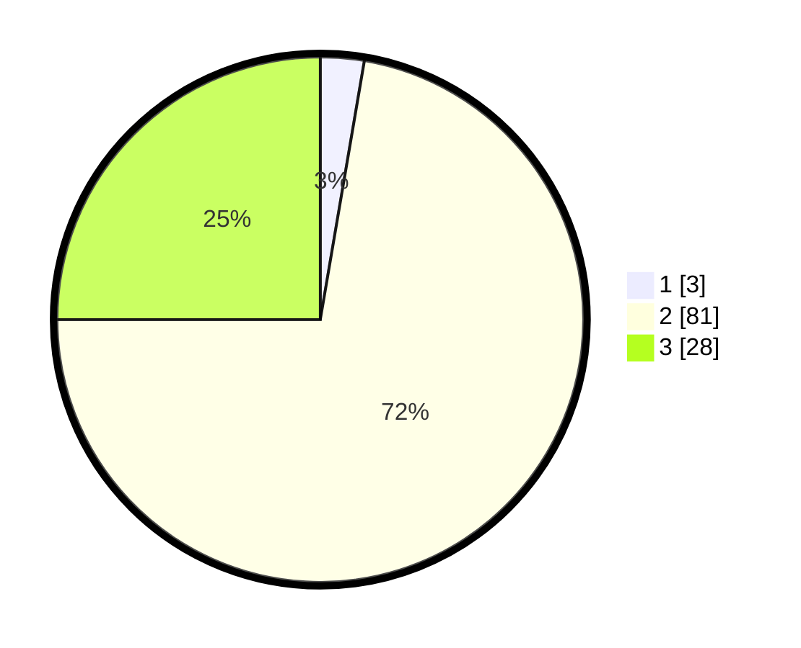

# Hasil

## Grafik

## Tabel

| No. | Nama Paslon    | Suara | Suara (raw) | Persentase |
|:--- |:-------------- | -----:| -----------:| ----------:|
| 1   | ANIES MUHAIMIN | 3     | [3][p-1]    | 2,68       |
| 2   | PRABOWO GIBRAN | 81    | [81][p-2]   | 72,32      |
| 3   | GANJAR MAHFUD  | 28    | [28][p-3]   | 25,00      |

[p-1]: https://github.com/gigit-pemilu/pemilu-2024/blob/main/pilpres/hitung-suara/sub/73-sulawesi-selatan/sub/18-tana-toraja/sub/35-malimbong-balepe/sub/1001-malimbong/sub/003-tps/sub/paslon-1.txt
[p-2]: https://github.com/gigit-pemilu/pemilu-2024/blob/main/pilpres/hitung-suara/sub/73-sulawesi-selatan/sub/18-tana-toraja/sub/35-malimbong-balepe/sub/1001-malimbong/sub/003-tps/sub/paslon-2.txt
[p-3]: https://github.com/gigit-pemilu/pemilu-2024/blob/main/pilpres/hitung-suara/sub/73-sulawesi-selatan/sub/18-tana-toraja/sub/35-malimbong-balepe/sub/1001-malimbong/sub/003-tps/sub/paslon-3.txt

## Foto C Plano

https://sirekap-obj-formc.kpu.go.id/8594/pemilu/ppwp/73/18/35/10/01/7318351001003-20240215-065041--c9edaa91-63d8-406e-91da-c54712b35ae9.jpg

https://sirekap-obj-formc.kpu.go.id/8594/pemilu/ppwp/73/18/35/10/01/7318351001003-20240215-065248--79a7e2f6-56f0-41a8-8429-eab2d2ed4abc.jpg

https://sirekap-obj-formc.kpu.go.id/8594/pemilu/ppwp/73/18/35/10/01/7318351001003-20240215-065437--7863081a-089f-459f-b83c-85a43209e71b.jpg

## Metadata

| Key        | Value               |
| ---------- | ------------------- |
| Time Stamp | 2024-02-15 15:00:29 |

