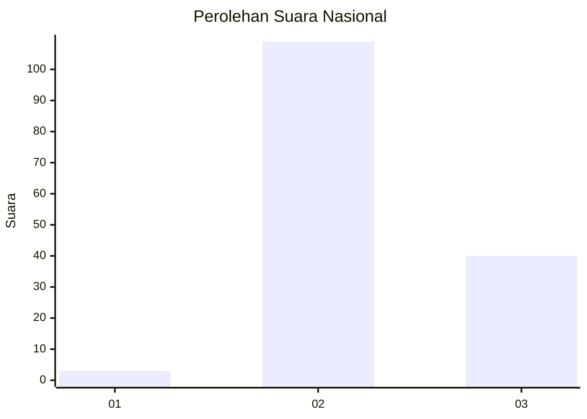
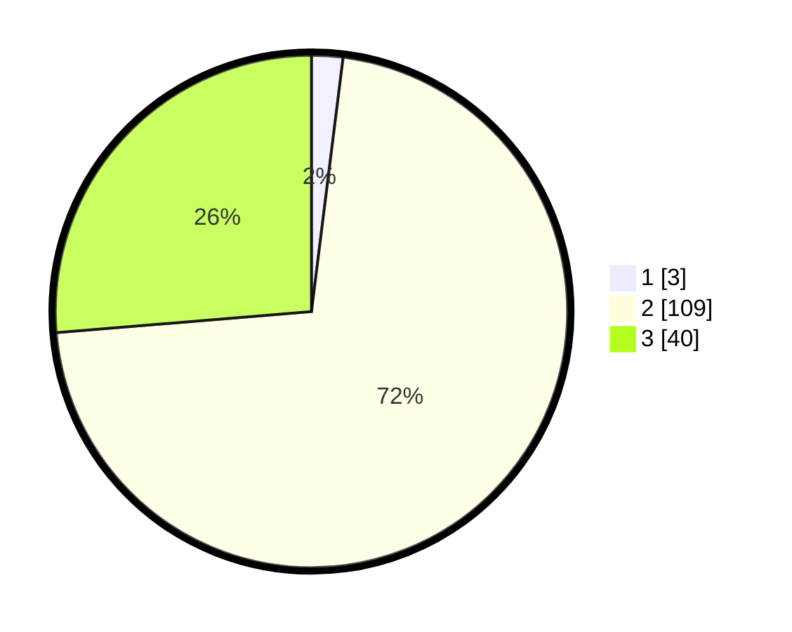

# Hasil

## Grafik

## Tabel

| No. | Nama Paslon    | Suara | Suara (raw) | Persentase |
|:--- |:-------------- | -----:| -----------:| ----------:|
| 1   | ANIES MUHAIMIN | 3     | [3][p-1]    | 1,97       |
| 2   | PRABOWO GIBRAN | 109   | [109][p-2]  | 71,71      |
| 3   | GANJAR MAHFUD  | 40    | [40][p-3]   | 26,32      |

[p-1]: https://github.com/gigit-pemilu/pemilu-2024/blob/main/pilpres/hitung-suara/sub/73-sulawesi-selatan/sub/18-tana-toraja/sub/35-malimbong-balepe/sub/1001-malimbong/sub/005-tps/sub/paslon-1.txt
[p-2]: https://github.com/gigit-pemilu/pemilu-2024/blob/main/pilpres/hitung-suara/sub/73-sulawesi-selatan/sub/18-tana-toraja/sub/35-malimbong-balepe/sub/1001-malimbong/sub/005-tps/sub/paslon-2.txt
[p-3]: https://github.com/gigit-pemilu/pemilu-2024/blob/main/pilpres/hitung-suara/sub/73-sulawesi-selatan/sub/18-tana-toraja/sub/35-malimbong-balepe/sub/1001-malimbong/sub/005-tps/sub/paslon-3.txt

## Foto C Plano

https://sirekap-obj-formc.kpu.go.id/a690/pemilu/ppwp/73/18/35/10/01/7318351001005-20240215-062835--778a4efd-2628-4d18-a329-a29bd99245ab.jpg

https://sirekap-obj-formc.kpu.go.id/a690/pemilu/ppwp/73/18/35/10/01/7318351001005-20240215-062527--1523d6c0-67b4-472a-863c-f3e83ba1308e.jpg

https://sirekap-obj-formc.kpu.go.id/a690/pemilu/ppwp/73/18/35/10/01/7318351001005-20240215-062926--b7c81da1-5104-4a08-90fb-88382006ccfc.jpg

## Metadata

| Key        | Value               |
| ---------- | ------------------- |
| Time Stamp | 2024-02-15 15:00:29 |

