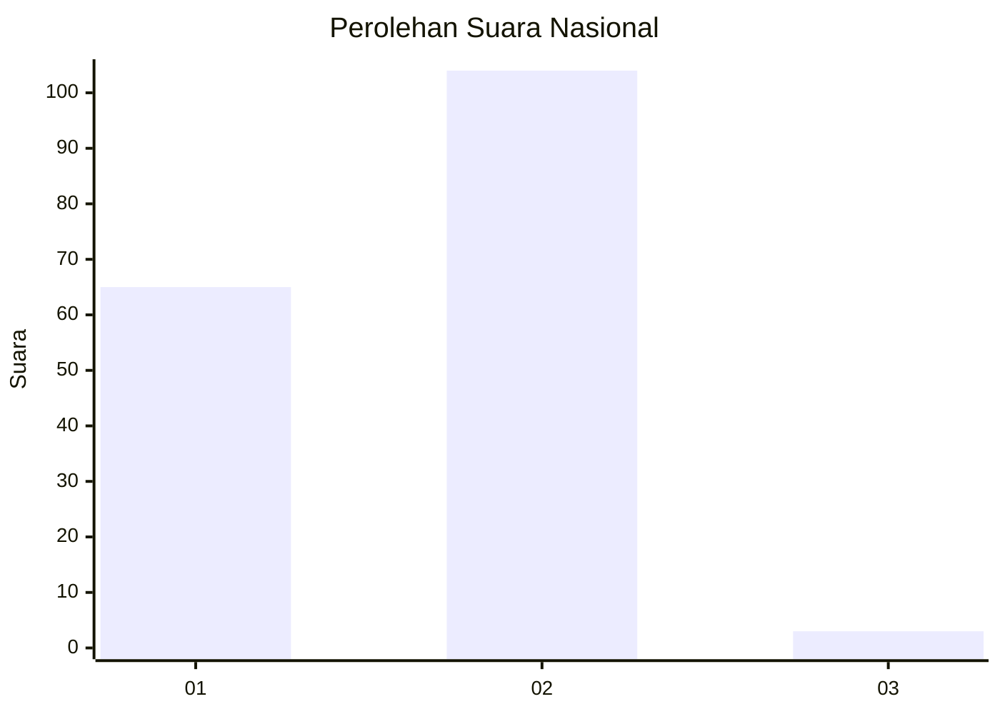
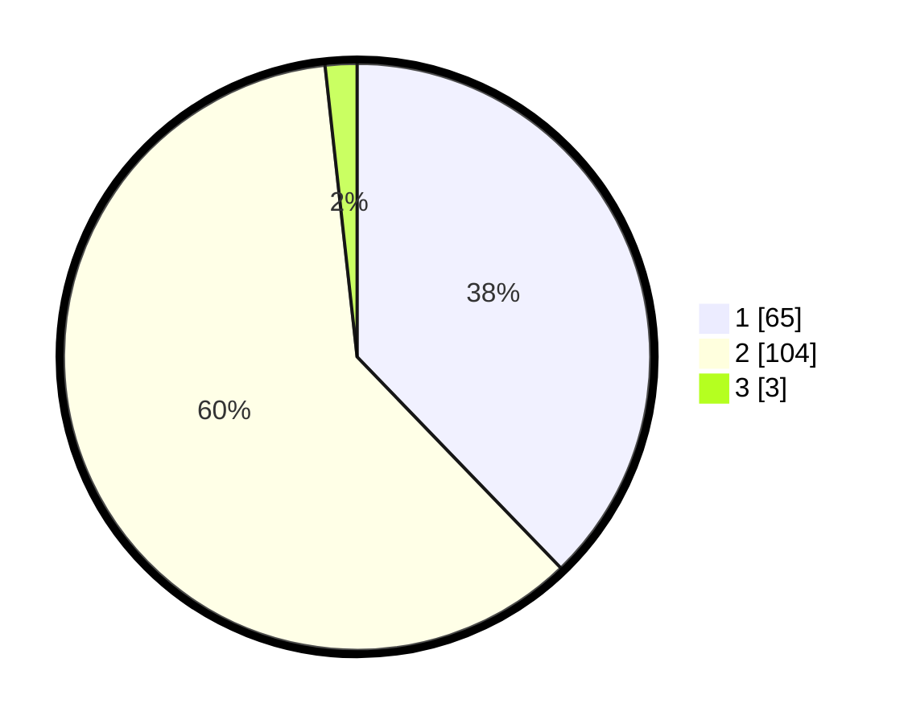

# Hasil

## Grafik

## Tabel

| No. | Nama Paslon    | Suara | Suara (raw) | Persentase |
|:--- |:-------------- | -----:| -----------:| ----------:|
| 1   | ANIES MUHAIMIN | 65    | [65][p-1]   | 37,79      |
| 2   | PRABOWO GIBRAN | 104   | [104][p-2]  | 60,47      |
| 3   | GANJAR MAHFUD  | 3     | [3][p-3]    | 1,74       |

[p-1]: https://github.com/gigit-pemilu/pemilu-2024/blob/main/pilpres/hitung-suara/sub/73-sulawesi-selatan/sub/22-luwu-utara/sub/04-sabbang/sub/1012-marobo/sub/007-tps/sub/paslon-1.txt
[p-2]: https://github.com/gigit-pemilu/pemilu-2024/blob/main/pilpres/hitung-suara/sub/73-sulawesi-selatan/sub/22-luwu-utara/sub/04-sabbang/sub/1012-marobo/sub/007-tps/sub/paslon-2.txt
[p-3]: https://github.com/gigit-pemilu/pemilu-2024/blob/main/pilpres/hitung-suara/sub/73-sulawesi-selatan/sub/22-luwu-utara/sub/04-sabbang/sub/1012-marobo/sub/007-tps/sub/paslon-3.txt

## Foto C Plano

https://sirekap-obj-formc.kpu.go.id/2022/pemilu/ppwp/73/22/04/10/12/7322041012007-20240214-222744--4d316dc7-aa6d-45a7-b135-649a84482c67.jpg

https://sirekap-obj-formc.kpu.go.id/2022/pemilu/ppwp/73/22/04/10/12/7322041012007-20240214-223013--39d24b51-ff0b-48e0-9b5e-55add9c33041.jpg

https://sirekap-obj-formc.kpu.go.id/2022/pemilu/ppwp/73/22/04/10/12/7322041012007-20240214-223155--2626878a-97be-4d8f-ad6d-a5be13b2c208.jpg

## Metadata

| Key        | Value               |
| ---------- | ------------------- |
| Time Stamp | 2024-02-15 21:01:18 |

