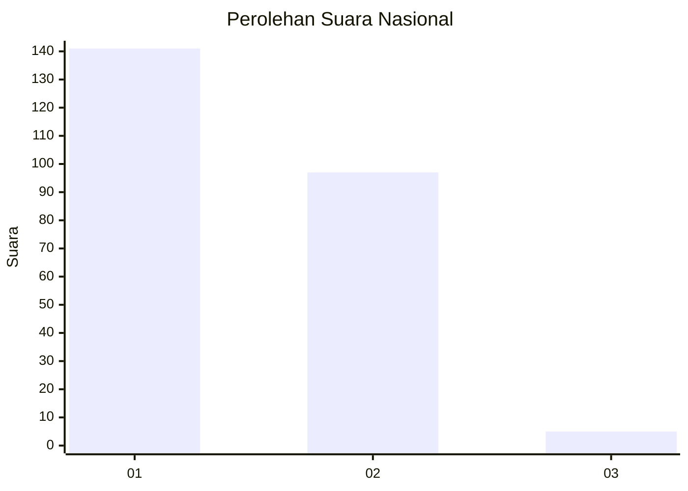
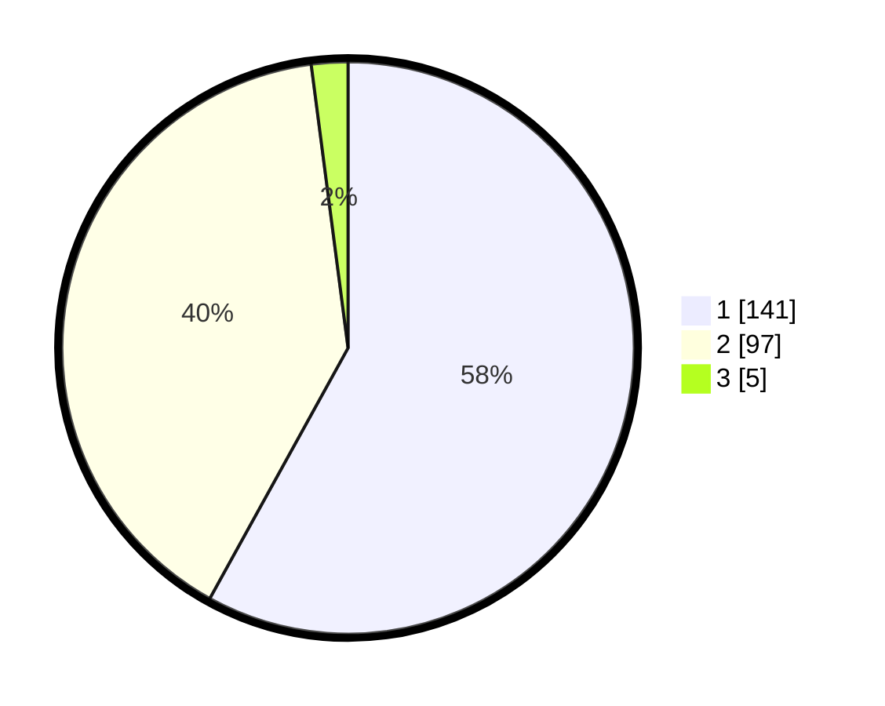

# Hasil

## Grafik

## Tabel

| No. | Nama Paslon    | Suara | Suara (raw) | Persentase |
|:--- |:-------------- | -----:| -----------:| ----------:|
| 1   | ANIES MUHAIMIN | 141   | [141][p-1]  | 58,02      |
| 2   | PRABOWO GIBRAN | 97    | [97][p-2]   | 39,92      |
| 3   | GANJAR MAHFUD  | 5     | [5][p-3]    | 2,06       |

[p-1]: https://github.com/gigit-pemilu/pemilu-2024/blob/main/pilpres/hitung-suara/sub/73-sulawesi-selatan/sub/24-luwu-timur/sub/04-malili/sub/2006-baruga/sub/008-tps/sub/paslon-1.txt
[p-2]: https://github.com/gigit-pemilu/pemilu-2024/blob/main/pilpres/hitung-suara/sub/73-sulawesi-selatan/sub/24-luwu-timur/sub/04-malili/sub/2006-baruga/sub/008-tps/sub/paslon-2.txt
[p-3]: https://github.com/gigit-pemilu/pemilu-2024/blob/main/pilpres/hitung-suara/sub/73-sulawesi-selatan/sub/24-luwu-timur/sub/04-malili/sub/2006-baruga/sub/008-tps/sub/paslon-3.txt

## Foto C Plano

https://sirekap-obj-formc.kpu.go.id/a720/pemilu/ppwp/73/24/04/20/06/7324042006008-20240214-214403--c8af5862-1f0c-41dc-b64c-84329341ca31.jpg

https://sirekap-obj-formc.kpu.go.id/a720/pemilu/ppwp/73/24/04/20/06/7324042006008-20240214-214419--f675dbfc-1e94-4475-b5fd-647452c07dfb.jpg

https://sirekap-obj-formc.kpu.go.id/a720/pemilu/ppwp/73/24/04/20/06/7324042006008-20240214-214435--bdd244dc-eef6-4d7c-a018-d3e0cec54510.jpg

## Metadata

| Key        | Value               |
| ---------- | ------------------- |
| Time Stamp | 2024-02-15 12:00:28 |

