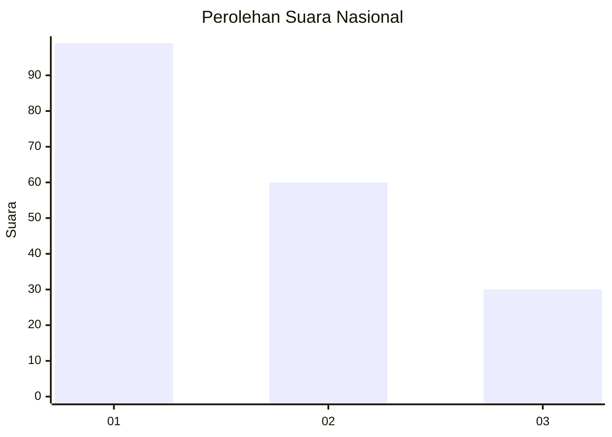
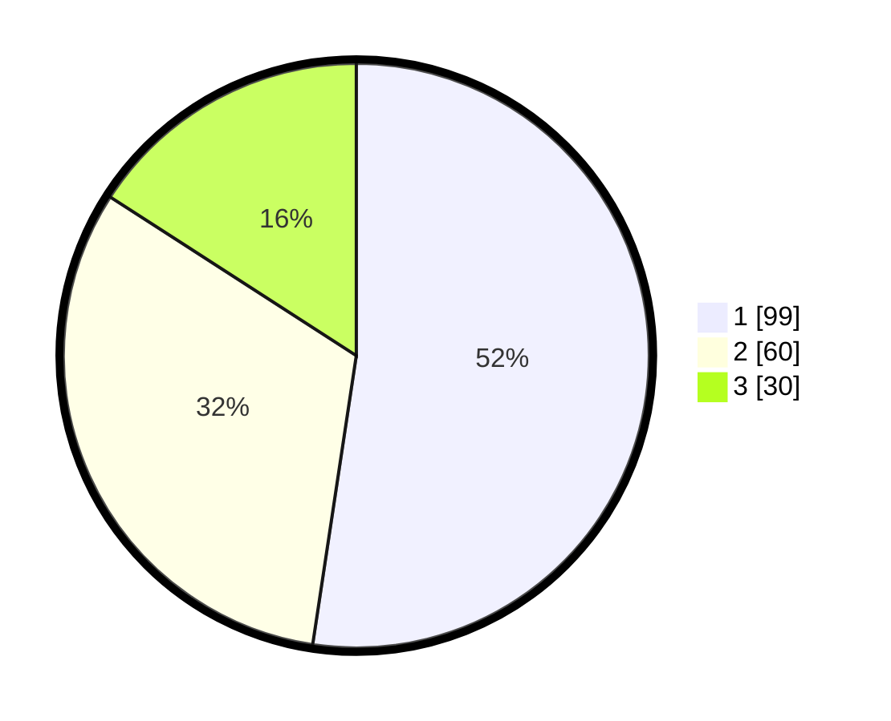

# Hasil

## Grafik

## Tabel

| No. | Nama Paslon    | Suara | Suara (raw) | Persentase |
|:--- |:-------------- | -----:| -----------:| ----------:|
| 1   | ANIES MUHAIMIN | 99    | [99][p-1]   | 52,38      |
| 2   | PRABOWO GIBRAN | 60    | [60][p-2]   | 31,75      |
| 3   | GANJAR MAHFUD  | 30    | [30][p-3]   | 15,87      |

[p-1]: https://github.com/gigit-pemilu/pemilu-2024/blob/main/pilpres/hitung-suara/sub/73-sulawesi-selatan/sub/24-luwu-timur/sub/07-burau/sub/2009-laro/sub/005-tps/sub/paslon-1.txt
[p-2]: https://github.com/gigit-pemilu/pemilu-2024/blob/main/pilpres/hitung-suara/sub/73-sulawesi-selatan/sub/24-luwu-timur/sub/07-burau/sub/2009-laro/sub/005-tps/sub/paslon-2.txt
[p-3]: https://github.com/gigit-pemilu/pemilu-2024/blob/main/pilpres/hitung-suara/sub/73-sulawesi-selatan/sub/24-luwu-timur/sub/07-burau/sub/2009-laro/sub/005-tps/sub/paslon-3.txt

## Foto C Plano

https://sirekap-obj-formc.kpu.go.id/c39c/pemilu/ppwp/73/24/07/20/09/7324072009005-20240214-214105--e390fb35-c0d2-4972-839c-f97dfd11db0b.jpg

https://sirekap-obj-formc.kpu.go.id/c39c/pemilu/ppwp/73/24/07/20/09/7324072009005-20240215-002334--53499abf-3977-4900-9a4a-f928c1f9cba7.jpg

https://sirekap-obj-formc.kpu.go.id/c39c/pemilu/ppwp/73/24/07/20/09/7324072009005-20240215-003014--e70bb755-8f98-4680-9665-5f774dbf208a.jpg

## Metadata

| Key        | Value               |
| ---------- | ------------------- |
| Time Stamp | 2024-02-16 12:51:22 |

