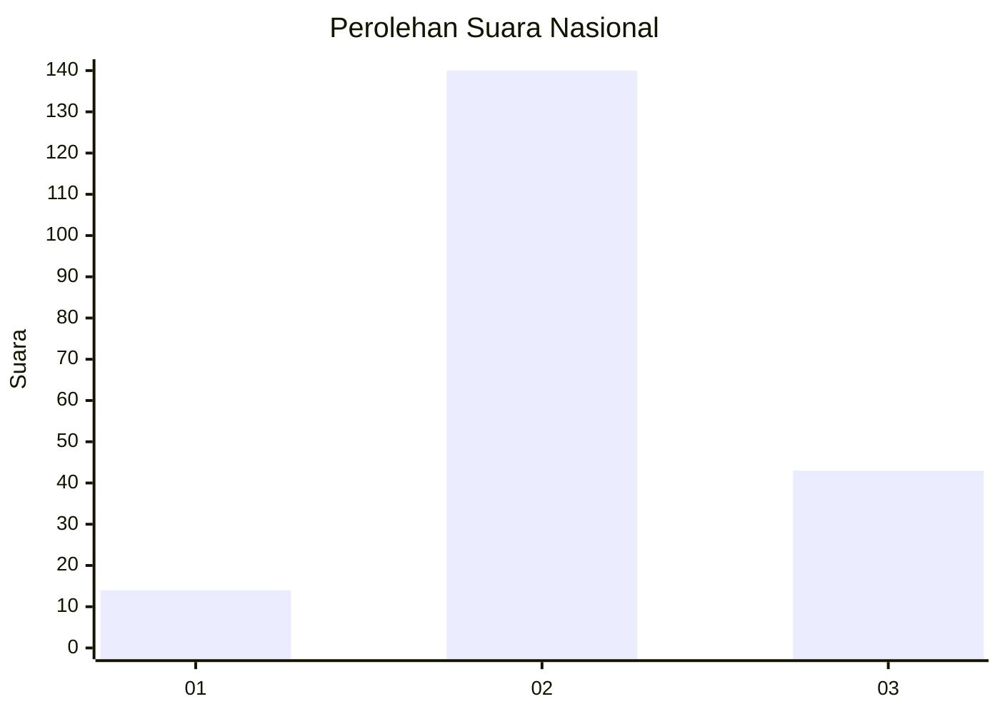

# Hasil

## Grafik

## Tabel

| No. | Nama Paslon    | Suara | Suara (raw) | Persentase |
|:--- |:-------------- | -----:| -----------:| ----------:|
| 1   | ANIES MUHAIMIN | 14    | [14][p-1]   | 7,11       |
| 2   | PRABOWO GIBRAN | 140   | [140][p-2]  | 71,07      |
| 3   | GANJAR MAHFUD  | 43    | [43][p-3]   | 21,83      |

[p-1]: https://github.com/gigit-pemilu/pemilu-2024/blob/main/pilpres/hitung-suara/sub/73-sulawesi-selatan/sub/24-luwu-timur/sub/09-tomoni-timur/sub/2002-cendana-hitam/sub/002-tps/sub/paslon-1.txt
[p-2]: https://github.com/gigit-pemilu/pemilu-2024/blob/main/pilpres/hitung-suara/sub/73-sulawesi-selatan/sub/24-luwu-timur/sub/09-tomoni-timur/sub/2002-cendana-hitam/sub/002-tps/sub/paslon-2.txt
[p-3]: https://github.com/gigit-pemilu/pemilu-2024/blob/main/pilpres/hitung-suara/sub/73-sulawesi-selatan/sub/24-luwu-timur/sub/09-tomoni-timur/sub/2002-cendana-hitam/sub/002-tps/sub/paslon-3.txt

## Foto C Plano

https://sirekap-obj-formc.kpu.go.id/f152/pemilu/ppwp/73/24/09/20/02/7324092002002-20240214-141600--bd3a612b-ea01-4ce6-a8e2-3df1c91a3151.jpg

https://sirekap-obj-formc.kpu.go.id/f152/pemilu/ppwp/73/24/09/20/02/7324092002002-20240214-141656--97fdbd7e-3369-4ca5-a564-453fa67c3181.jpg

https://sirekap-obj-formc.kpu.go.id/f152/pemilu/ppwp/73/24/09/20/02/7324092002002-20240214-141732--b41cc4f7-3835-41db-b38c-4059ce194e68.jpg

## Metadata

| Key        | Value               |
| ---------- | ------------------- |
| Time Stamp | 2024-02-14 21:46:01 |

