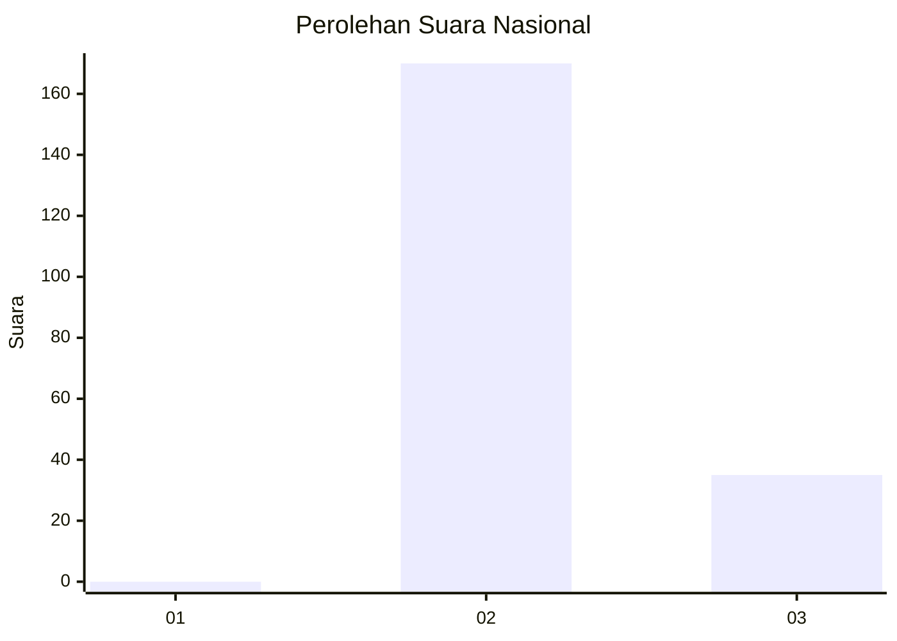
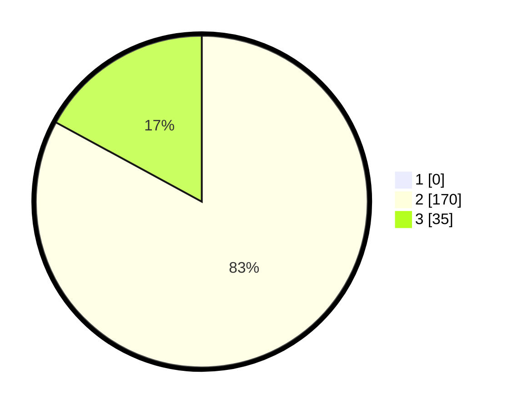

# Hasil

## Grafik

## Tabel

| No. | Nama Paslon    | Suara | Suara (raw) | Persentase |
|:--- |:-------------- | -----:| -----------:| ----------:|
| 1   | ANIES MUHAIMIN | 0     | [0][p-1]    | 0,00       |
| 2   | PRABOWO GIBRAN | 170   | [170][p-2]  | 82,93      |
| 3   | GANJAR MAHFUD  | 35    | [35][p-3]   | 17,07      |

[p-1]: https://github.com/gigit-pemilu/pemilu-2024/blob/main/pilpres/hitung-suara/sub/73-sulawesi-selatan/sub/26-toraja-utara/sub/03-nanggala/sub/1004-nanggala-sanpiak-salu/sub/001-tps/sub/paslon-1.txt
[p-2]: https://github.com/gigit-pemilu/pemilu-2024/blob/main/pilpres/hitung-suara/sub/73-sulawesi-selatan/sub/26-toraja-utara/sub/03-nanggala/sub/1004-nanggala-sanpiak-salu/sub/001-tps/sub/paslon-2.txt
[p-3]: https://github.com/gigit-pemilu/pemilu-2024/blob/main/pilpres/hitung-suara/sub/73-sulawesi-selatan/sub/26-toraja-utara/sub/03-nanggala/sub/1004-nanggala-sanpiak-salu/sub/001-tps/sub/paslon-3.txt

## Foto C Plano

https://sirekap-obj-formc.kpu.go.id/b28c/pemilu/ppwp/73/26/03/10/04/7326031004001-20240220-115726--864b43a9-7a9c-4b91-aaf5-93025ddca3fe.jpg

https://sirekap-obj-formc.kpu.go.id/b28c/pemilu/ppwp/73/26/03/10/04/7326031004001-20240220-115755--9a17d099-a98c-4d88-a0f0-fec0bd3f12d7.jpg

https://sirekap-obj-formc.kpu.go.id/b28c/pemilu/ppwp/73/26/03/10/04/7326031004001-20240220-115830--9f62f0b7-8db6-4d2d-8b53-4919cc686073.jpg

## Metadata

| Key        | Value               |
| ---------- | ------------------- |
| Time Stamp | 2024-02-21 13:00:00 |

