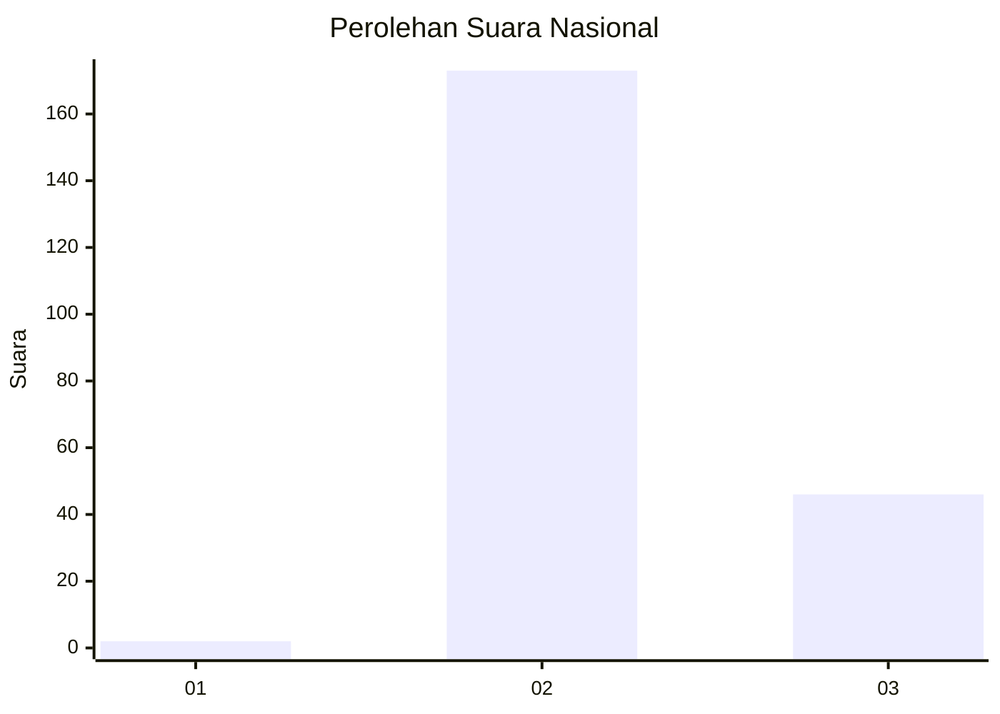
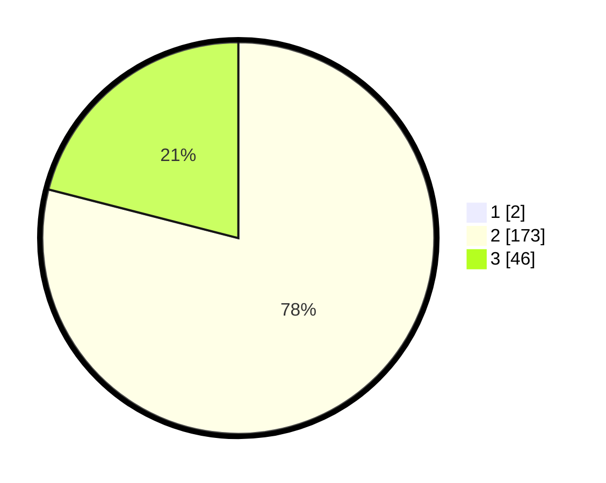

# Hasil

## Grafik

## Tabel

| No. | Nama Paslon    | Suara | Suara (raw) | Persentase |
|:--- |:-------------- | -----:| -----------:| ----------:|
| 1   | ANIES MUHAIMIN | 2     | [2][p-1]    | 0,90       |
| 2   | PRABOWO GIBRAN | 173   | [173][p-2]  | 78,28      |
| 3   | GANJAR MAHFUD  | 46    | [46][p-3]   | 20,81      |

[p-1]: https://github.com/gigit-pemilu/pemilu-2024/blob/main/pilpres/hitung-suara/sub/73-sulawesi-selatan/sub/26-toraja-utara/sub/03-nanggala/sub/2001-nanggala/sub/001-tps/sub/paslon-1.txt
[p-2]: https://github.com/gigit-pemilu/pemilu-2024/blob/main/pilpres/hitung-suara/sub/73-sulawesi-selatan/sub/26-toraja-utara/sub/03-nanggala/sub/2001-nanggala/sub/001-tps/sub/paslon-2.txt
[p-3]: https://github.com/gigit-pemilu/pemilu-2024/blob/main/pilpres/hitung-suara/sub/73-sulawesi-selatan/sub/26-toraja-utara/sub/03-nanggala/sub/2001-nanggala/sub/001-tps/sub/paslon-3.txt

## Foto C Plano

https://sirekap-obj-formc.kpu.go.id/21d6/pemilu/ppwp/73/26/03/20/01/7326032001001-20240214-222239--ef3f4cfa-0d49-4589-a9d7-d58b0461c2ff.jpg

https://sirekap-obj-formc.kpu.go.id/21d6/pemilu/ppwp/73/26/03/20/01/7326032001001-20240214-221649--6bce3f0e-e760-4d85-bf5e-8296efb4ea9b.jpg

https://sirekap-obj-formc.kpu.go.id/21d6/pemilu/ppwp/73/26/03/20/01/7326032001001-20240220-160709--0169f63f-0a2a-4b79-8b06-54eac5e11273.jpg

## Metadata

| Key        | Value               |
| ---------- | ------------------- |
| Time Stamp | 2024-02-20 17:00:00 |

