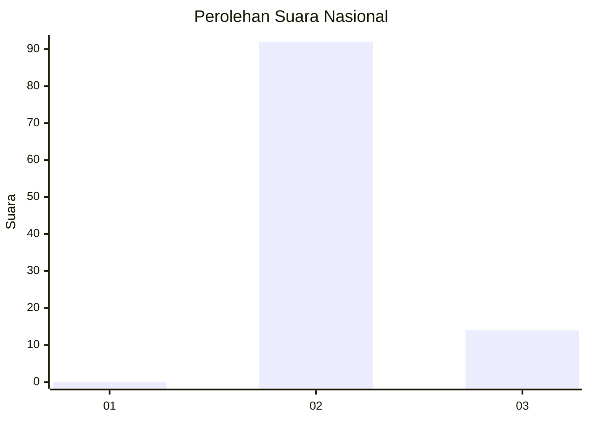
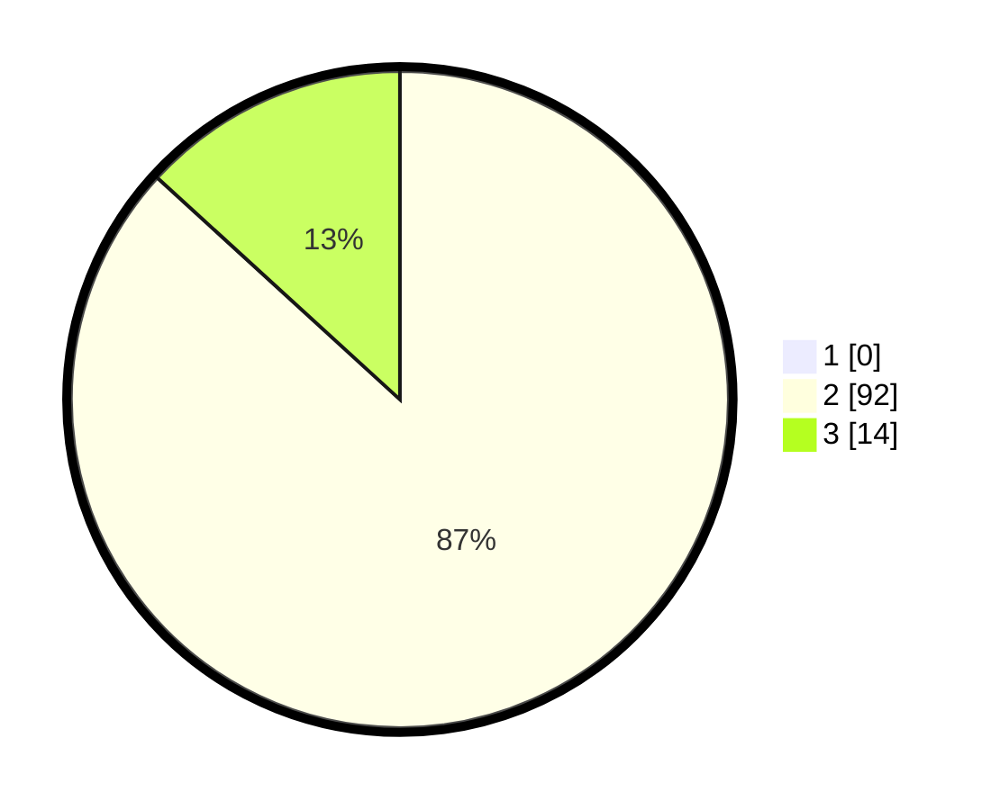

# Hasil

## Grafik

## Tabel

| No. | Nama Paslon    | Suara | Suara (raw) | Persentase |
|:--- |:-------------- | -----:| -----------:| ----------:|
| 1   | ANIES MUHAIMIN | 0     | [0][p-1]    | 0,00       |
| 2   | PRABOWO GIBRAN | 92    | [92][p-2]   | 86,79      |
| 3   | GANJAR MAHFUD  | 14    | [14][p-3]   | 13,21      |

[p-1]: https://github.com/gigit-pemilu/pemilu-2024/blob/main/pilpres/hitung-suara/sub/73-sulawesi-selatan/sub/26-toraja-utara/sub/03-nanggala/sub/2002-tandung-nanggala/sub/004-tps/sub/paslon-1.txt
[p-2]: https://github.com/gigit-pemilu/pemilu-2024/blob/main/pilpres/hitung-suara/sub/73-sulawesi-selatan/sub/26-toraja-utara/sub/03-nanggala/sub/2002-tandung-nanggala/sub/004-tps/sub/paslon-2.txt
[p-3]: https://github.com/gigit-pemilu/pemilu-2024/blob/main/pilpres/hitung-suara/sub/73-sulawesi-selatan/sub/26-toraja-utara/sub/03-nanggala/sub/2002-tandung-nanggala/sub/004-tps/sub/paslon-3.txt

## Foto C Plano

https://sirekap-obj-formc.kpu.go.id/cbe4/pemilu/ppwp/73/26/03/20/02/7326032002004-20240214-191637--43478b28-8e0d-4368-a7cb-54fd80654919.jpg

https://sirekap-obj-formc.kpu.go.id/cbe4/pemilu/ppwp/73/26/03/20/02/7326032002004-20240214-200254--f5d561ff-cc2a-4a63-ba1e-b60e0842c58c.jpg

https://sirekap-obj-formc.kpu.go.id/cbe4/pemilu/ppwp/73/26/03/20/02/7326032002004-20240214-192822--bc7e3d98-fe4d-435a-999f-fd9b39b93c14.jpg

## Metadata

| Key        | Value               |
| ---------- | ------------------- |
| Time Stamp | 2024-02-15 00:41:44 |

