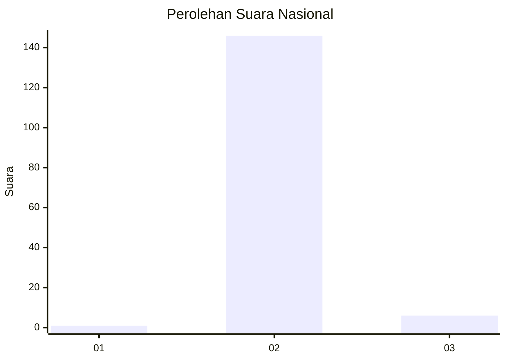
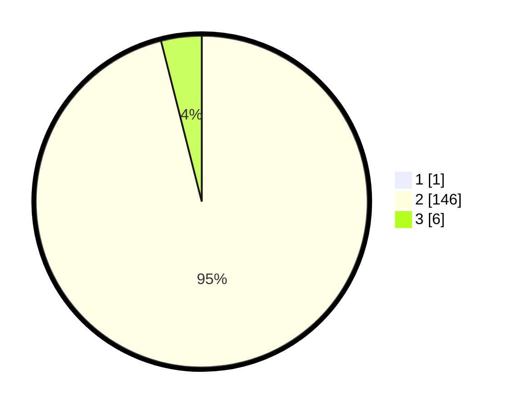

# Hasil

## Grafik

## Tabel

| No. | Nama Paslon    | Suara | Suara (raw) | Persentase |
|:--- |:-------------- | -----:| -----------:| ----------:|
| 1   | ANIES MUHAIMIN | 1     | [1][p-1]    | 0,65       |
| 2   | PRABOWO GIBRAN | 146   | [146][p-2]  | 95,42      |
| 3   | GANJAR MAHFUD  | 6     | [6][p-3]    | 3,92       |

[p-1]: https://github.com/gigit-pemilu/pemilu-2024/blob/main/pilpres/hitung-suara/sub/73-sulawesi-selatan/sub/26-toraja-utara/sub/03-nanggala/sub/2003-lili'kira'/sub/004-tps/sub/paslon-1.txt
[p-2]: https://github.com/gigit-pemilu/pemilu-2024/blob/main/pilpres/hitung-suara/sub/73-sulawesi-selatan/sub/26-toraja-utara/sub/03-nanggala/sub/2003-lili'kira'/sub/004-tps/sub/paslon-2.txt
[p-3]: https://github.com/gigit-pemilu/pemilu-2024/blob/main/pilpres/hitung-suara/sub/73-sulawesi-selatan/sub/26-toraja-utara/sub/03-nanggala/sub/2003-lili'kira'/sub/004-tps/sub/paslon-3.txt

## Foto C Plano

https://sirekap-obj-formc.kpu.go.id/affd/pemilu/ppwp/73/26/03/20/03/7326032003004-20240214-230547--00ea3a2d-15c7-4839-87d9-a021220c82ea.jpg

https://sirekap-obj-formc.kpu.go.id/affd/pemilu/ppwp/73/26/03/20/03/7326032003004-20240214-230727--6afa3a2f-a0eb-49ee-b3d8-eb15fb429c0c.jpg

https://sirekap-obj-formc.kpu.go.id/affd/pemilu/ppwp/73/26/03/20/03/7326032003004-20240214-230927--9db66518-61a3-4c8e-a6e5-8fe905e5775a.jpg

## Metadata

| Key        | Value               |
| ---------- | ------------------- |
| Time Stamp | 2024-02-15 19:30:26 |

