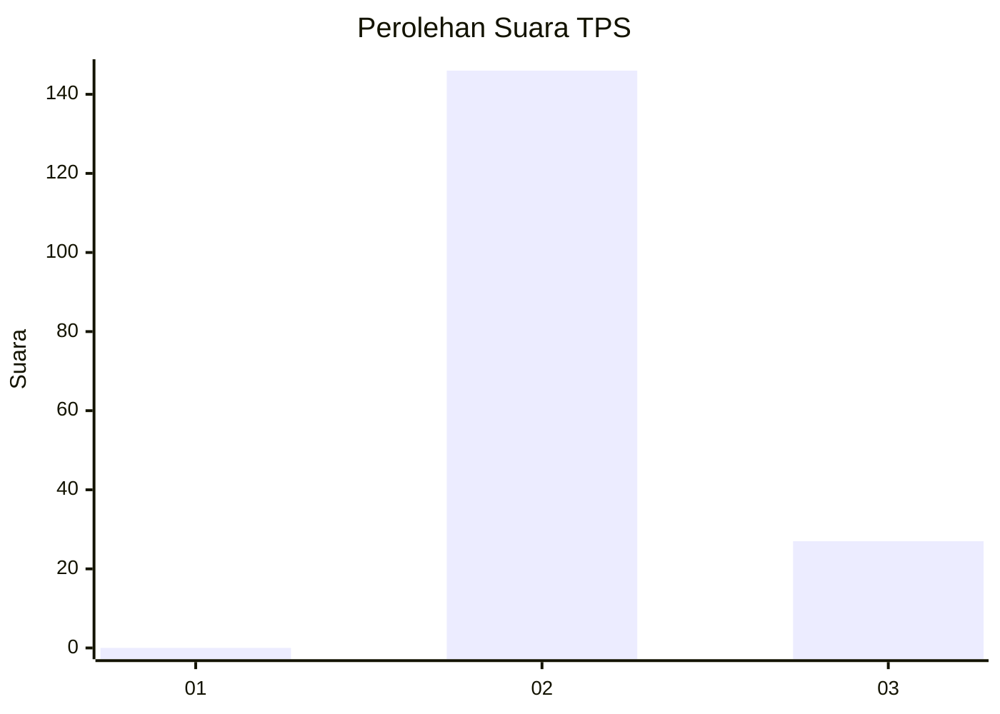
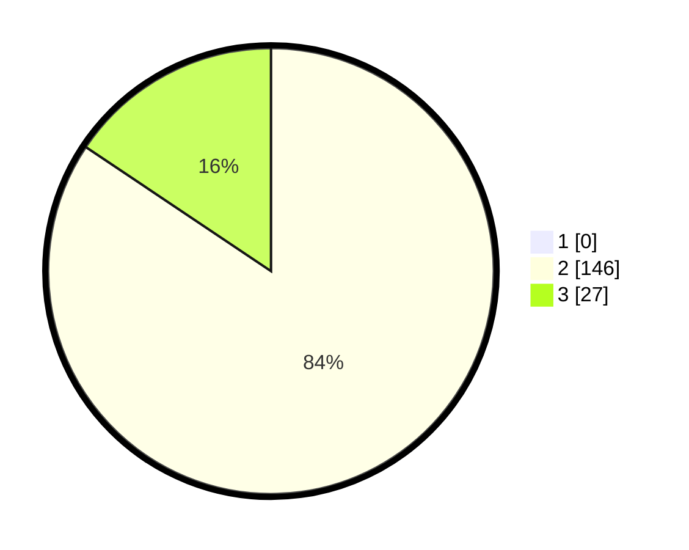

# Hasil

## Grafik

## Tabel

| No. | Nama Paslon    | Suara | Suara (raw) | Persentase |
|:--- |:-------------- | -----:| -----------:| ----------:|
| 1   | ANIES MUHAIMIN | 0     | [0][p-1]    | 0,00       |
| 2   | PRABOWO GIBRAN | 146   | [146][p-2]  | 84,39      |
| 3   | GANJAR MAHFUD  | 27    | [27][p-3]   | 15,61      |

[p-1]: https://github.com/gigit-pemilu/pemilu-2024-73-sulawesi-selatan/blob/main/pilpres/hitung-suara/sub/73-sulawesi-selatan/sub/26-toraja-utara/sub/04-rindingallo/sub/1002-pangala'/sub/001-tps/sub/paslon-1.txt
[p-2]: https://github.com/gigit-pemilu/pemilu-2024-73-sulawesi-selatan/blob/main/pilpres/hitung-suara/sub/73-sulawesi-selatan/sub/26-toraja-utara/sub/04-rindingallo/sub/1002-pangala'/sub/001-tps/sub/paslon-2.txt
[p-3]: https://github.com/gigit-pemilu/pemilu-2024-73-sulawesi-selatan/blob/main/pilpres/hitung-suara/sub/73-sulawesi-selatan/sub/26-toraja-utara/sub/04-rindingallo/sub/1002-pangala'/sub/001-tps/sub/paslon-3.txt

## Foto C Plano

https://sirekap-obj-formc.kpu.go.id/c02d/pemilu/ppwp/73/26/04/10/02/7326041002001-20240215-002003--b06e01e3-9791-4635-9cf1-da51989540d3.jpg

https://sirekap-obj-formc.kpu.go.id/c02d/pemilu/ppwp/73/26/04/10/02/7326041002001-20240215-002035--1f157e48-e098-4b85-8a58-6991c0603b99.jpg

https://sirekap-obj-formc.kpu.go.id/c02d/pemilu/ppwp/73/26/04/10/02/7326041002001-20240215-002115--649ed265-f532-4b40-872c-b3bde1e15e1a.jpg

## Metadata

| Key        | Value               |
| ---------- | ------------------- |
| Time Stamp | 2024-02-15 15:00:29 |

