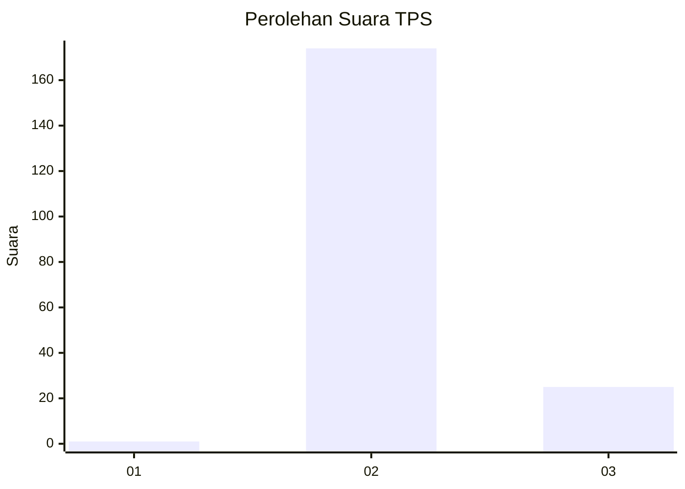
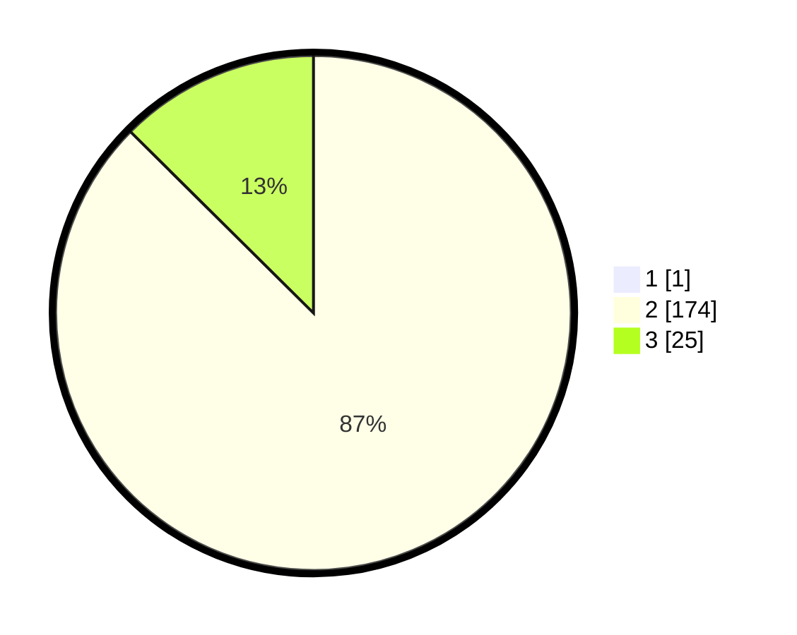

# Hasil

## Grafik

## Tabel

| No. | Nama Paslon    | Suara | Suara (raw) | Persentase |
|:--- |:-------------- | -----:| -----------:| ----------:|
| 1   | ANIES MUHAIMIN | 1     | [1][p-1]    | 0,50       |
| 2   | PRABOWO GIBRAN | 174   | [174][p-2]  | 87,00      |
| 3   | GANJAR MAHFUD  | 25    | [25][p-3]   | 12,50      |

[p-1]: https://github.com/gigit-pemilu/pemilu-2024-73-sulawesi-selatan/blob/main/pilpres/hitung-suara/sub/73-sulawesi-selatan/sub/26-toraja-utara/sub/12-dende'-piongan-napo/sub/2002-dende'/sub/001-tps/sub/paslon-1.txt
[p-2]: https://github.com/gigit-pemilu/pemilu-2024-73-sulawesi-selatan/blob/main/pilpres/hitung-suara/sub/73-sulawesi-selatan/sub/26-toraja-utara/sub/12-dende'-piongan-napo/sub/2002-dende'/sub/001-tps/sub/paslon-2.txt
[p-3]: https://github.com/gigit-pemilu/pemilu-2024-73-sulawesi-selatan/blob/main/pilpres/hitung-suara/sub/73-sulawesi-selatan/sub/26-toraja-utara/sub/12-dende'-piongan-napo/sub/2002-dende'/sub/001-tps/sub/paslon-3.txt

## Foto C Plano

https://sirekap-obj-formc.kpu.go.id/8cda/pemilu/ppwp/73/26/12/20/02/7326122002001-20240216-152302--d8a81280-2941-4272-affc-b5d462ced8ed.jpg

https://sirekap-obj-formc.kpu.go.id/8cda/pemilu/ppwp/73/26/12/20/02/7326122002001-20240217-120350--e5f87665-f70d-4d1d-aebb-a5c16fbc3a4d.jpg

https://sirekap-obj-formc.kpu.go.id/8cda/pemilu/ppwp/73/26/12/20/02/7326122002001-20240214-200515--b1f32230-09a6-42ef-8d5d-ba5d5ec417b9.jpg

## Metadata

| Key        | Value               |
| ---------- | ------------------- |
| Time Stamp | 2024-02-21 22:00:00 |

