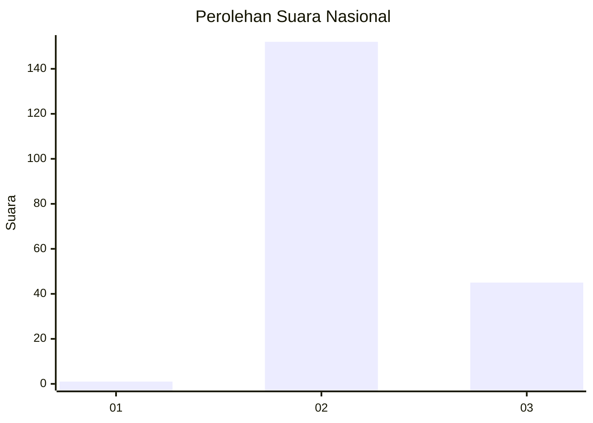
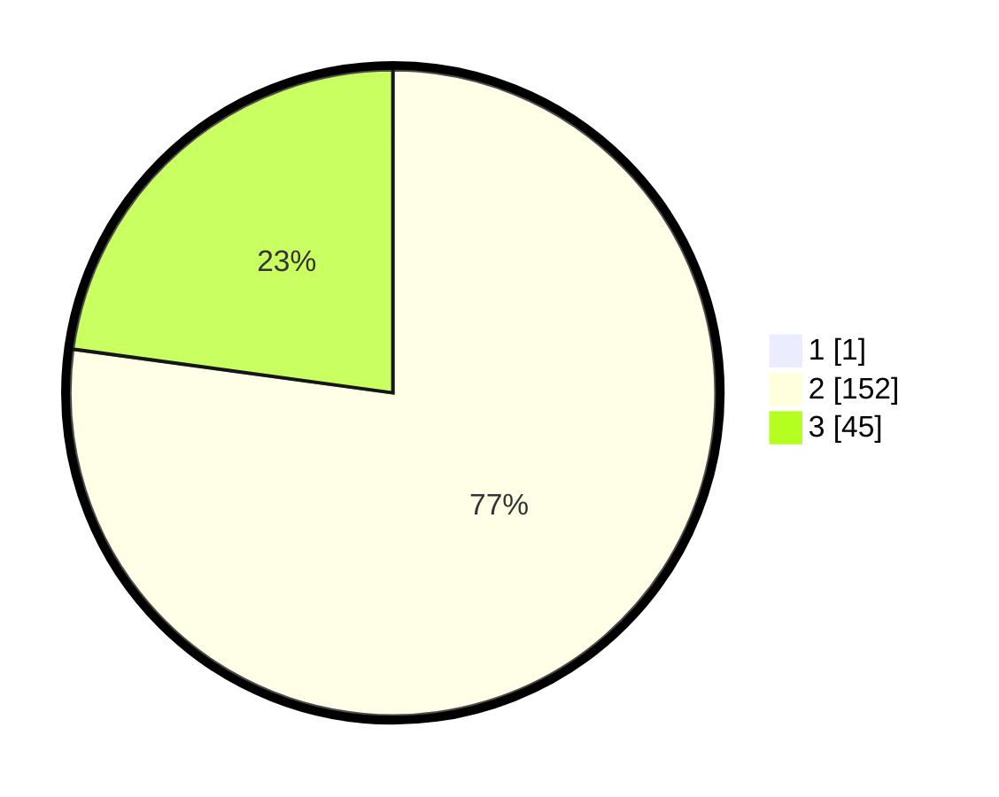

# Hasil

## Grafik

## Tabel

| No. | Nama Paslon    | Suara | Suara (raw) | Persentase |
|:--- |:-------------- | -----:| -----------:| ----------:|
| 1   | ANIES MUHAIMIN | 1     | [1][p-1]    | 0,51       |
| 2   | PRABOWO GIBRAN | 152   | [152][p-2]  | 76,77      |
| 3   | GANJAR MAHFUD  | 45    | [45][p-3]   | 22,73      |

[p-1]: https://github.com/gigit-pemilu/pemilu-2024/blob/main/pilpres/hitung-suara/sub/73-sulawesi-selatan/sub/26-toraja-utara/sub/13-buntu-pepasan/sub/1002-sapan/sub/003-tps/sub/paslon-1.txt
[p-2]: https://github.com/gigit-pemilu/pemilu-2024/blob/main/pilpres/hitung-suara/sub/73-sulawesi-selatan/sub/26-toraja-utara/sub/13-buntu-pepasan/sub/1002-sapan/sub/003-tps/sub/paslon-2.txt
[p-3]: https://github.com/gigit-pemilu/pemilu-2024/blob/main/pilpres/hitung-suara/sub/73-sulawesi-selatan/sub/26-toraja-utara/sub/13-buntu-pepasan/sub/1002-sapan/sub/003-tps/sub/paslon-3.txt

## Foto C Plano

https://sirekap-obj-formc.kpu.go.id/7974/pemilu/ppwp/73/26/13/10/02/7326131002003-20240221-221451--cc721d17-cde5-4b6f-a84d-39a03e373e95.jpg

https://sirekap-obj-formc.kpu.go.id/7974/pemilu/ppwp/73/26/13/10/02/7326131002003-20240221-213507--6dae73d2-1805-4506-b671-5aae21b04da9.jpg

https://sirekap-obj-formc.kpu.go.id/7974/pemilu/ppwp/73/26/13/10/02/7326131002003-20240221-213627--e448e67a-9f62-43aa-8817-36ca0c614a5e.jpg

## Metadata

| Key        | Value               |
| ---------- | ------------------- |
| Time Stamp | 2024-02-21 23:00:00 |

