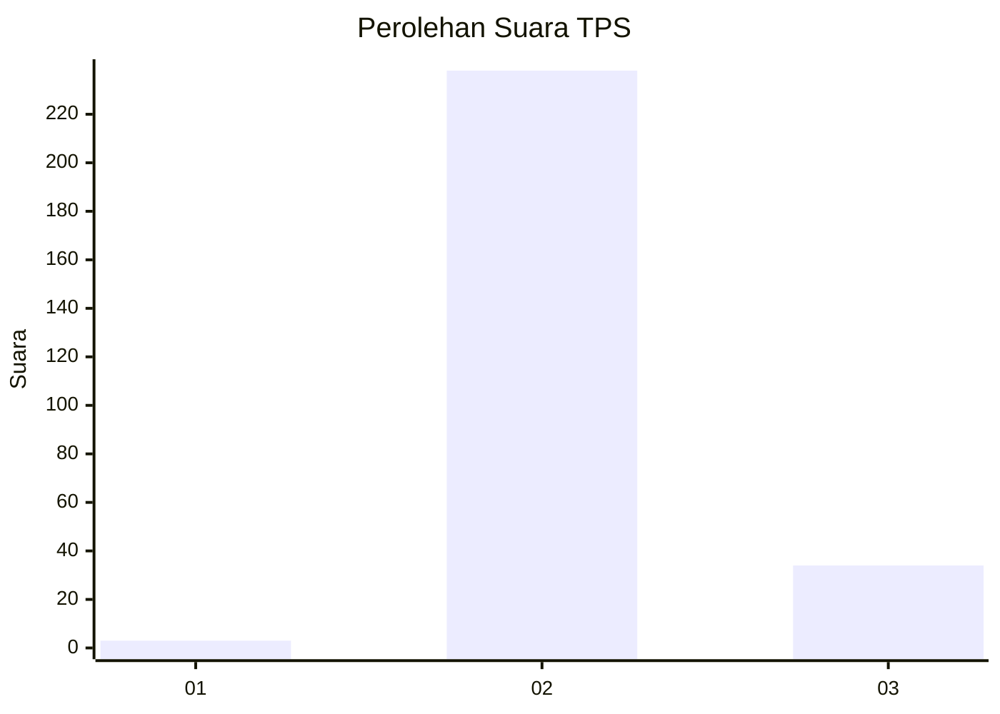
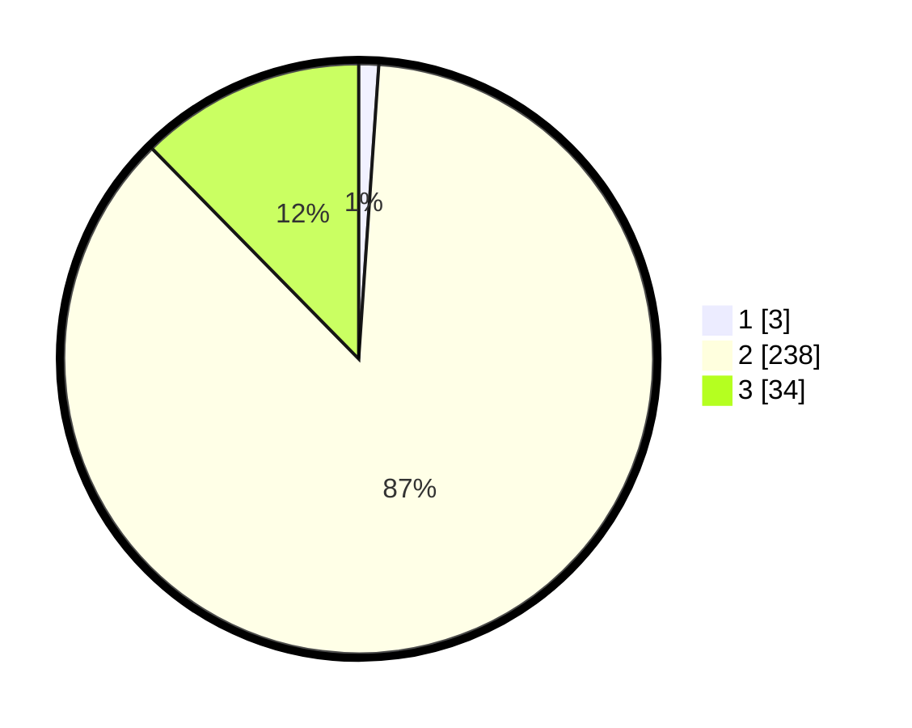

# Hasil

## Grafik

## Tabel

| No. | Nama Paslon    | Suara | Suara (raw) | Persentase |
|:--- |:-------------- | -----:| -----------:| ----------:|
| 1   | ANIES MUHAIMIN | 3     | [3][p-1]    | 1,09       |
| 2   | PRABOWO GIBRAN | 238   | [238][p-2]  | 86,55      |
| 3   | GANJAR MAHFUD  | 34    | [34][p-3]   | 12,36      |

[p-1]: https://github.com/gigit-pemilu/pemilu-2024-73-sulawesi-selatan/blob/main/pilpres/hitung-suara/sub/73-sulawesi-selatan/sub/26-toraja-utara/sub/16-tondon/sub/2001-tondon-langi'/sub/004-tps/sub/paslon-1.txt
[p-2]: https://github.com/gigit-pemilu/pemilu-2024-73-sulawesi-selatan/blob/main/pilpres/hitung-suara/sub/73-sulawesi-selatan/sub/26-toraja-utara/sub/16-tondon/sub/2001-tondon-langi'/sub/004-tps/sub/paslon-2.txt
[p-3]: https://github.com/gigit-pemilu/pemilu-2024-73-sulawesi-selatan/blob/main/pilpres/hitung-suara/sub/73-sulawesi-selatan/sub/26-toraja-utara/sub/16-tondon/sub/2001-tondon-langi'/sub/004-tps/sub/paslon-3.txt

## Foto C Plano

https://sirekap-obj-formc.kpu.go.id/79ea/pemilu/ppwp/73/26/16/20/01/7326162001004-20240214-141607--7a8c11c3-f594-447e-8e54-95610c69cdbe.jpg

https://sirekap-obj-formc.kpu.go.id/79ea/pemilu/ppwp/73/26/16/20/01/7326162001004-20240214-141644--96cfceee-56cf-4b6f-b18f-4f0695151a90.jpg

https://sirekap-obj-formc.kpu.go.id/79ea/pemilu/ppwp/73/26/16/20/01/7326162001004-20240214-141722--64fdda51-0804-4002-9505-552d70bf87fc.jpg

## Metadata

| Key        | Value               |
| ---------- | ------------------- |
| Time Stamp | 2024-02-15 18:00:26 |

