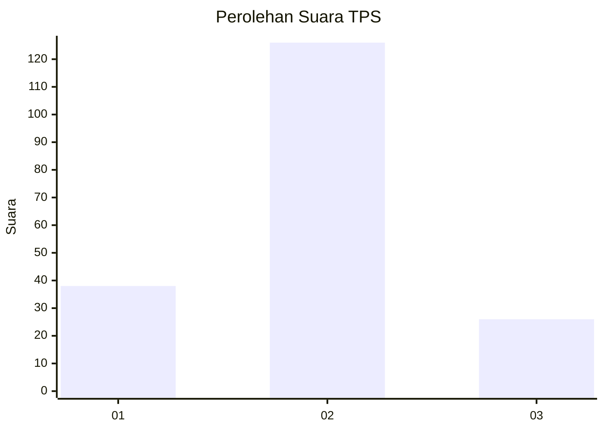
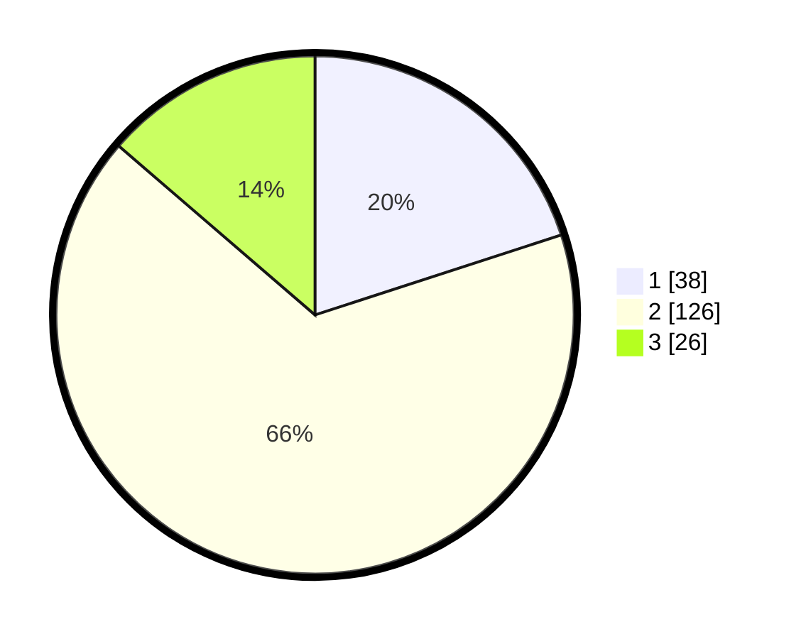

# Hasil

## Grafik

## Tabel

| No. | Nama Paslon    | Suara | Suara (raw) | Persentase |
|:--- |:-------------- | -----:| -----------:| ----------:|
| 1   | ANIES MUHAIMIN | 38    | [38][p-1]   | 20,00      |
| 2   | PRABOWO GIBRAN | 126   | [126][p-2]  | 66,32      |
| 3   | GANJAR MAHFUD  | 26    | [26][p-3]   | 13,68      |

[p-1]: https://github.com/gigit-pemilu/pemilu-2024-73-sulawesi-selatan/blob/main/pilpres/hitung-suara/sub/73-sulawesi-selatan/sub/26-toraja-utara/sub/18-rantebua/sub/1002-bokin/sub/003-tps/sub/paslon-1.txt
[p-2]: https://github.com/gigit-pemilu/pemilu-2024-73-sulawesi-selatan/blob/main/pilpres/hitung-suara/sub/73-sulawesi-selatan/sub/26-toraja-utara/sub/18-rantebua/sub/1002-bokin/sub/003-tps/sub/paslon-2.txt
[p-3]: https://github.com/gigit-pemilu/pemilu-2024-73-sulawesi-selatan/blob/main/pilpres/hitung-suara/sub/73-sulawesi-selatan/sub/26-toraja-utara/sub/18-rantebua/sub/1002-bokin/sub/003-tps/sub/paslon-3.txt

## Foto C Plano

https://sirekap-obj-formc.kpu.go.id/3f97/pemilu/ppwp/73/26/18/10/02/7326181002003-20240214-140958--9b8e44cc-3c92-435e-8b26-a3242e6d2698.jpg

https://sirekap-obj-formc.kpu.go.id/3f97/pemilu/ppwp/73/26/18/10/02/7326181002003-20240214-141226--0841e0e4-7701-4489-a460-a2b9afffa0df.jpg

https://sirekap-obj-formc.kpu.go.id/3f97/pemilu/ppwp/73/26/18/10/02/7326181002003-20240215-002638--aec06739-6af2-42c0-82cc-6df694dbe04c.jpg

## Metadata

| Key        | Value               |
| ---------- | ------------------- |
| Time Stamp | 2024-02-15 04:00:24 |

