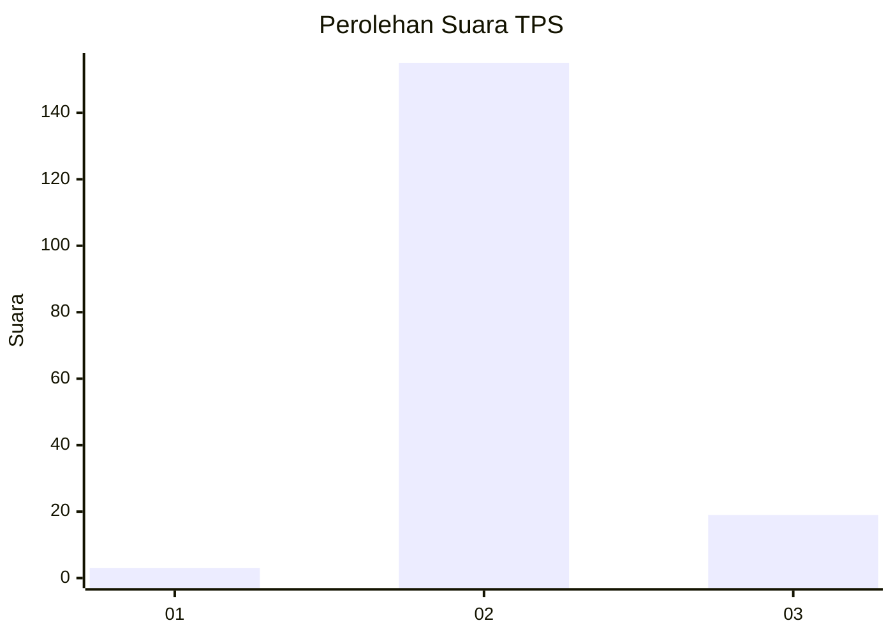
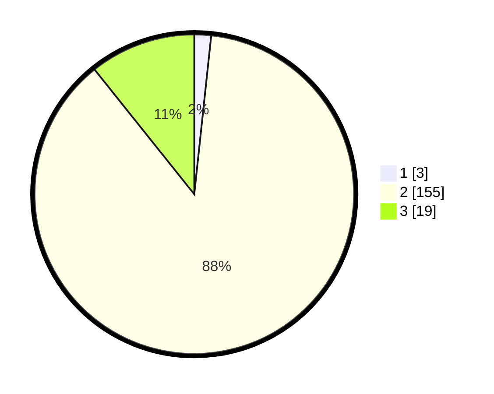

# Hasil

## Grafik

## Tabel

| No. | Nama Paslon    | Suara | Suara (raw) | Persentase |
|:--- |:-------------- | -----:| -----------:| ----------:|
| 1   | ANIES MUHAIMIN | 3     | [3][p-1]    | 1,69       |
| 2   | PRABOWO GIBRAN | 155   | [155][p-2]  | 87,57      |
| 3   | GANJAR MAHFUD  | 19    | [19][p-3]   | 10,73      |

[p-1]: https://github.com/gigit-pemilu/pemilu-2024-73-sulawesi-selatan/blob/main/pilpres/hitung-suara/sub/73-sulawesi-selatan/sub/26-toraja-utara/sub/19-sesean-suloara/sub/2001-suloara'/sub/004-tps/sub/paslon-1.txt
[p-2]: https://github.com/gigit-pemilu/pemilu-2024-73-sulawesi-selatan/blob/main/pilpres/hitung-suara/sub/73-sulawesi-selatan/sub/26-toraja-utara/sub/19-sesean-suloara/sub/2001-suloara'/sub/004-tps/sub/paslon-2.txt
[p-3]: https://github.com/gigit-pemilu/pemilu-2024-73-sulawesi-selatan/blob/main/pilpres/hitung-suara/sub/73-sulawesi-selatan/sub/26-toraja-utara/sub/19-sesean-suloara/sub/2001-suloara'/sub/004-tps/sub/paslon-3.txt

## Foto C Plano

https://sirekap-obj-formc.kpu.go.id/c2bf/pemilu/ppwp/73/26/19/20/01/7326192001004-20240215-064950--f5071816-3e00-4066-bd46-160bd2d87ddb.jpg

https://sirekap-obj-formc.kpu.go.id/c2bf/pemilu/ppwp/73/26/19/20/01/7326192001004-20240215-022601--3f3fd52b-0bfc-41fa-88cc-63cb3bbe3be5.jpg

https://sirekap-obj-formc.kpu.go.id/c2bf/pemilu/ppwp/73/26/19/20/01/7326192001004-20240215-022653--ddf668d7-12db-4f4f-bf85-cbd284df9266.jpg

## Metadata

| Key        | Value               |
| ---------- | ------------------- |
| Time Stamp | 2024-02-15 19:30:26 |

