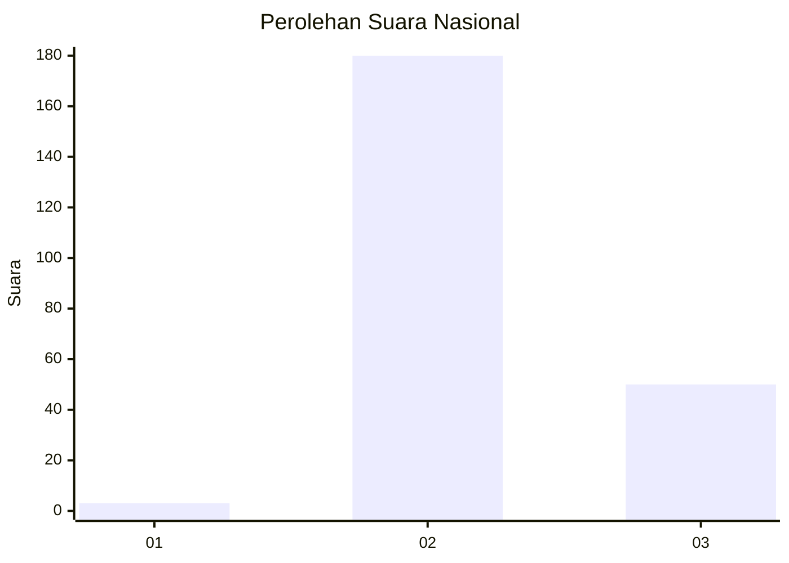

# Hasil

## Grafik

## Tabel

| No. | Nama Paslon    | Suara | Suara (raw) | Persentase |
|:--- |:-------------- | -----:| -----------:| ----------:|
| 1   | ANIES MUHAIMIN | 3     | [3][p-1]    | 1,29       |
| 2   | PRABOWO GIBRAN | 180   | [180][p-2]  | 77,25      |
| 3   | GANJAR MAHFUD  | 50    | [50][p-3]   | 21,46      |

[p-1]: https://github.com/gigit-pemilu/pemilu-2024/blob/main/pilpres/hitung-suara/sub/73-sulawesi-selatan/sub/26-toraja-utara/sub/20-kapala-pitu/sub/2002-sikuku'/sub/001-tps/sub/paslon-1.txt
[p-2]: https://github.com/gigit-pemilu/pemilu-2024/blob/main/pilpres/hitung-suara/sub/73-sulawesi-selatan/sub/26-toraja-utara/sub/20-kapala-pitu/sub/2002-sikuku'/sub/001-tps/sub/paslon-2.txt
[p-3]: https://github.com/gigit-pemilu/pemilu-2024/blob/main/pilpres/hitung-suara/sub/73-sulawesi-selatan/sub/26-toraja-utara/sub/20-kapala-pitu/sub/2002-sikuku'/sub/001-tps/sub/paslon-3.txt

## Foto C Plano

https://sirekap-obj-formc.kpu.go.id/4902/pemilu/ppwp/73/26/20/20/02/7326202002001-20240216-150900--b507f199-e8db-4157-9fd1-f2eb8f7b9bc4.jpg

https://sirekap-obj-formc.kpu.go.id/4902/pemilu/ppwp/73/26/20/20/02/7326202002001-20240215-063901--6333e724-2163-4ec6-9adf-6b018ba0963b.jpg

https://sirekap-obj-formc.kpu.go.id/4902/pemilu/ppwp/73/26/20/20/02/7326202002001-20240215-064456--36885837-3fb6-4028-aadd-640f01265cc3.jpg

## Metadata

| Key        | Value               |
| ---------- | ------------------- |
| Time Stamp | 2024-02-16 16:25:10 |

