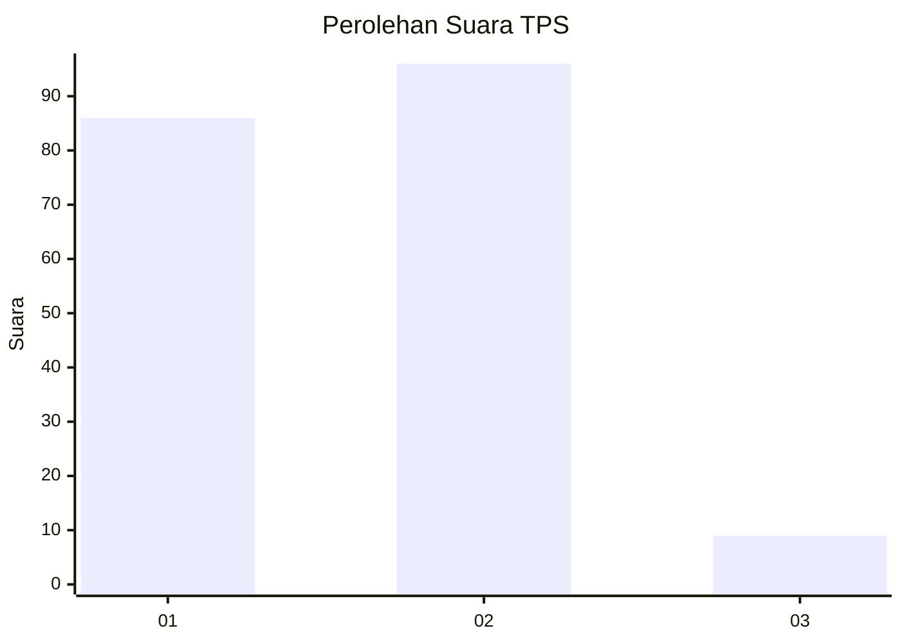
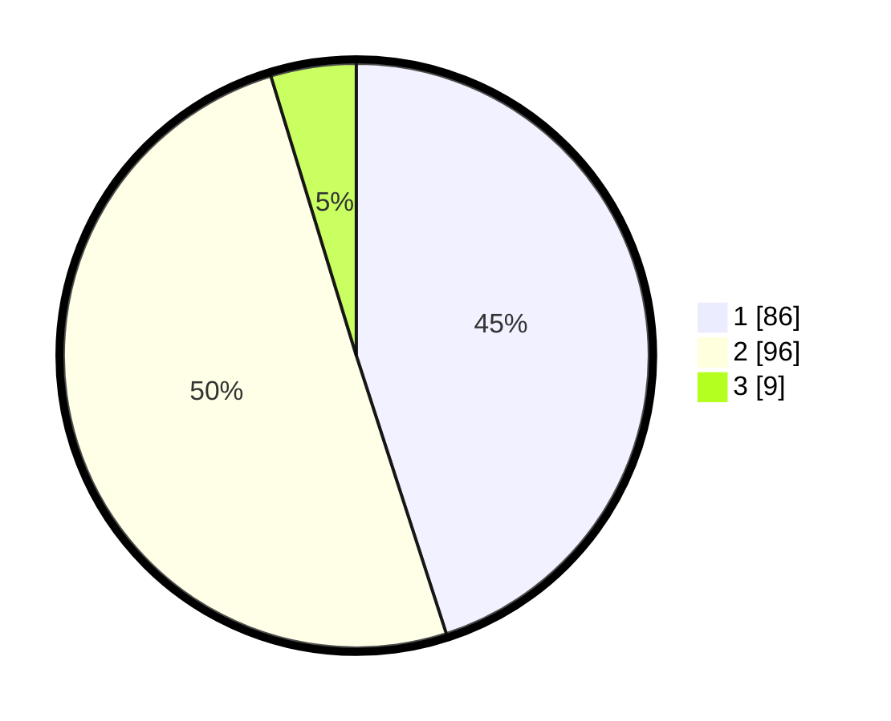

# Hasil

## Grafik

## Tabel

| No. | Nama Paslon    | Suara | Suara (raw) | Persentase |
|:--- |:-------------- | -----:| -----------:| ----------:|
| 1   | ANIES MUHAIMIN | 86    | [86][p-1]   | 45,03      |
| 2   | PRABOWO GIBRAN | 96    | [96][p-2]   | 50,26      |
| 3   | GANJAR MAHFUD  | 9     | [9][p-3]    | 4,71       |

[p-1]: https://github.com/gigit-pemilu/pemilu-2024-73-sulawesi-selatan/blob/main/pilpres/hitung-suara/sub/73-sulawesi-selatan/sub/71-kota-makassar/sub/01-mariso/sub/1001-bontorannu/sub/001-tps/sub/paslon-1.txt
[p-2]: https://github.com/gigit-pemilu/pemilu-2024-73-sulawesi-selatan/blob/main/pilpres/hitung-suara/sub/73-sulawesi-selatan/sub/71-kota-makassar/sub/01-mariso/sub/1001-bontorannu/sub/001-tps/sub/paslon-2.txt
[p-3]: https://github.com/gigit-pemilu/pemilu-2024-73-sulawesi-selatan/blob/main/pilpres/hitung-suara/sub/73-sulawesi-selatan/sub/71-kota-makassar/sub/01-mariso/sub/1001-bontorannu/sub/001-tps/sub/paslon-3.txt

## Foto C Plano

https://sirekap-obj-formc.kpu.go.id/137c/pemilu/ppwp/73/71/01/10/01/7371011001001-20240219-130908--27c5d7df-c5af-4071-a44f-4537e9a71dde.jpg

https://sirekap-obj-formc.kpu.go.id/137c/pemilu/ppwp/73/71/01/10/01/7371011001001-20240219-130937--8bee7e8e-dd84-4eaf-8c4c-a0da8853fb6f.jpg

https://sirekap-obj-formc.kpu.go.id/137c/pemilu/ppwp/73/71/01/10/01/7371011001001-20240219-131115--ea6bdbb6-3c72-4764-9015-6e439d619acb.jpg

## Metadata

| Key        | Value               |
| ---------- | ------------------- |
| Time Stamp | 2024-02-20 15:00:00 |

