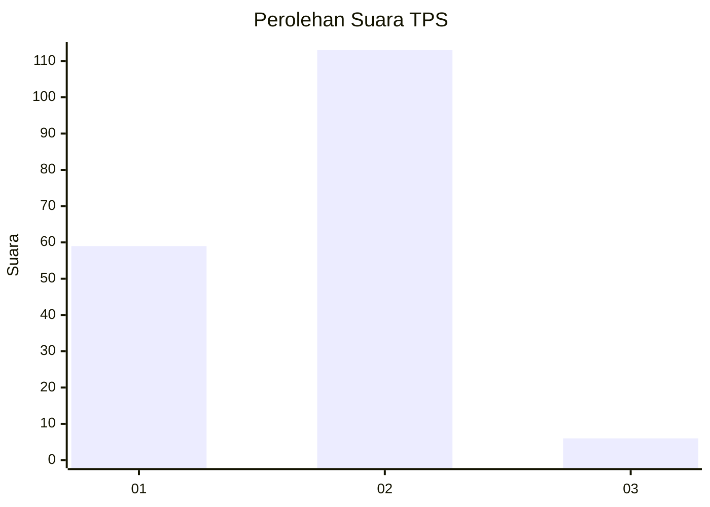
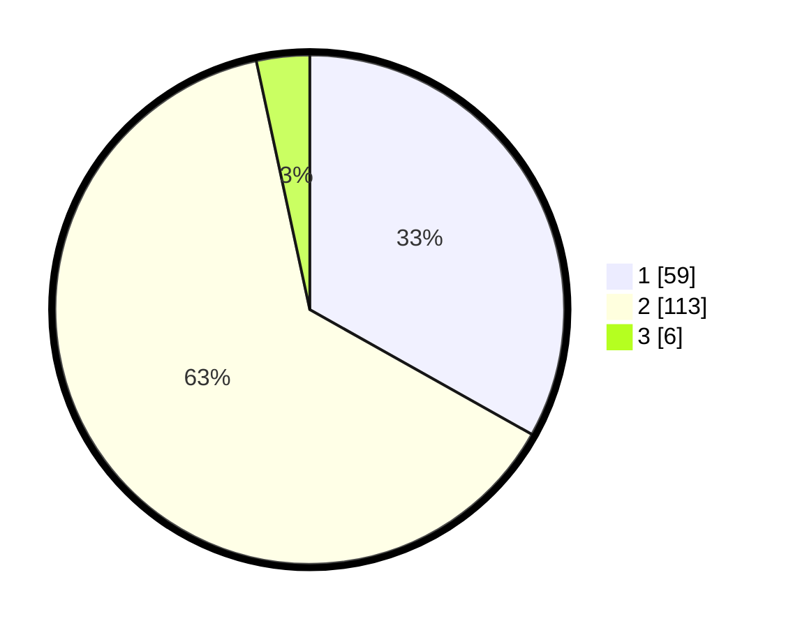

# Hasil

## Grafik

## Tabel

| No. | Nama Paslon    | Suara | Suara (raw) | Persentase |
|:--- |:-------------- | -----:| -----------:| ----------:|
| 1   | ANIES MUHAIMIN | 59    | [59][p-1]   | 33,15      |
| 2   | PRABOWO GIBRAN | 113   | [113][p-2]  | 63,48      |
| 3   | GANJAR MAHFUD  | 6     | [6][p-3]    | 3,37       |

[p-1]: https://github.com/gigit-pemilu/pemilu-2024-73-sulawesi-selatan/blob/main/pilpres/hitung-suara/sub/73-sulawesi-selatan/sub/71-kota-makassar/sub/01-mariso/sub/1001-bontorannu/sub/005-tps/sub/paslon-1.txt
[p-2]: https://github.com/gigit-pemilu/pemilu-2024-73-sulawesi-selatan/blob/main/pilpres/hitung-suara/sub/73-sulawesi-selatan/sub/71-kota-makassar/sub/01-mariso/sub/1001-bontorannu/sub/005-tps/sub/paslon-2.txt
[p-3]: https://github.com/gigit-pemilu/pemilu-2024-73-sulawesi-selatan/blob/main/pilpres/hitung-suara/sub/73-sulawesi-selatan/sub/71-kota-makassar/sub/01-mariso/sub/1001-bontorannu/sub/005-tps/sub/paslon-3.txt

## Foto C Plano

https://sirekap-obj-formc.kpu.go.id/f931/pemilu/ppwp/73/71/01/10/01/7371011001005-20240221-125706--ebbbf3b5-fb4f-4c75-8743-d5573f762116.jpg

https://sirekap-obj-formc.kpu.go.id/f931/pemilu/ppwp/73/71/01/10/01/7371011001005-20240221-125741--f6a1771c-3374-47d7-b909-ea6416bec0ac.jpg

https://sirekap-obj-formc.kpu.go.id/f931/pemilu/ppwp/73/71/01/10/01/7371011001005-20240221-125810--7a8a72eb-7359-4313-b2a9-a45d35e7eae8.jpg

## Metadata

| Key        | Value               |
| ---------- | ------------------- |
| Time Stamp | 2024-02-21 13:00:00 |

## DATA PEMILIH TETAP

Jumlah pemilih dalam DPT: **358**.
 * L: **219**.
 * P: **354**.

## DATA PENGGUNA HAK PILIH

Jumlah pengguna hak pilih dalam DPT: **693**.
 * L: **83**.
 * P: **98**.

Jumlah pengguna hak pilih dalam DPTb: **3**.
 * L: **2**.
 * P: **2**.

Jumlah pengguna hak pilih dalam DPK: **2**.
 * L: **1**.
 * P: **2**.

Jumlah pengguna hak pilih: **486**.
 * L: **80**.
 * P: **409**.

## JUMLAH SUARA SAH DAN TIDAK SAH

JUMLAH SELURUH SUARA SAH: **178**.

JUMLAH SUARA TIDAK SAH: **8**.

JUMLAH SELURUH SUARA SAH DAN SUARA TIDAK SAH: **186**.

