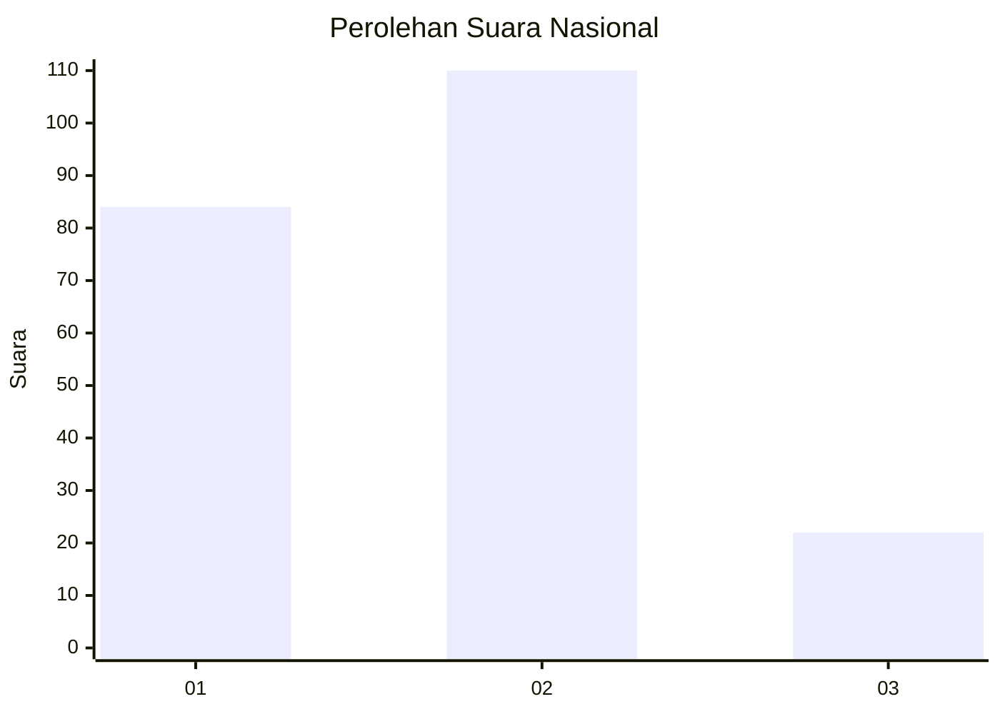
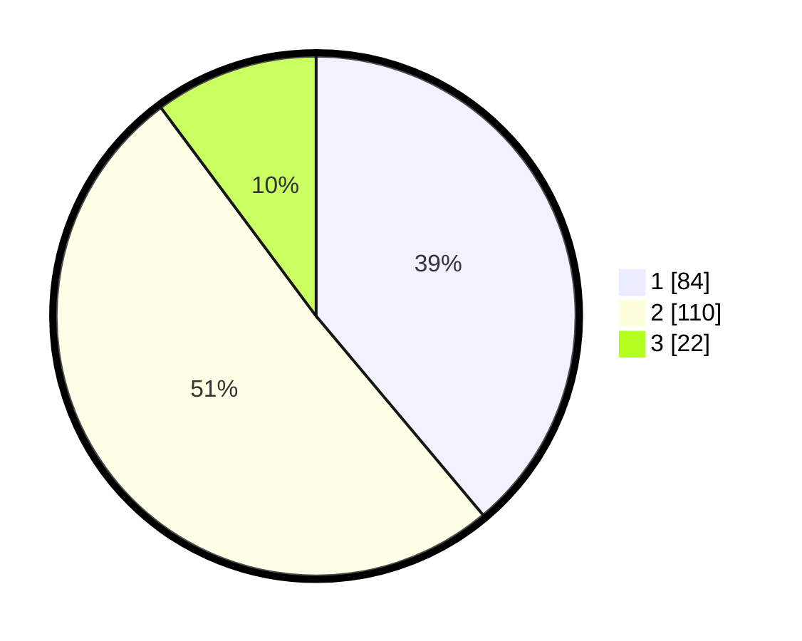

# Hasil

## Grafik

## Tabel

| No. | Nama Paslon    | Suara | Suara (raw) | Persentase |
|:--- |:-------------- | -----:| -----------:| ----------:|
| 1   | ANIES MUHAIMIN | 84    | [84][p-1]   | 38,89      |
| 2   | PRABOWO GIBRAN | 110   | [110][p-2]  | 50,93      |
| 3   | GANJAR MAHFUD  | 22    | [22][p-3]   | 10,19      |

[p-1]: https://github.com/gigit-pemilu/pemilu-2024/blob/main/pilpres/hitung-suara/sub/73-sulawesi-selatan/sub/71-kota-makassar/sub/01-mariso/sub/1003-kunjung-mae/sub/004-tps/sub/paslon-1.txt
[p-2]: https://github.com/gigit-pemilu/pemilu-2024/blob/main/pilpres/hitung-suara/sub/73-sulawesi-selatan/sub/71-kota-makassar/sub/01-mariso/sub/1003-kunjung-mae/sub/004-tps/sub/paslon-2.txt
[p-3]: https://github.com/gigit-pemilu/pemilu-2024/blob/main/pilpres/hitung-suara/sub/73-sulawesi-selatan/sub/71-kota-makassar/sub/01-mariso/sub/1003-kunjung-mae/sub/004-tps/sub/paslon-3.txt

## Foto C Plano

https://sirekap-obj-formc.kpu.go.id/b523/pemilu/ppwp/73/71/01/10/03/7371011003004-20240220-141011--fbde1bce-e154-423d-b2fc-daf2162f37f3.jpg

https://sirekap-obj-formc.kpu.go.id/b523/pemilu/ppwp/73/71/01/10/03/7371011003004-20240220-135318--e935210d-3fc2-4cbd-92cb-b6ca1d43c9b7.jpg

https://sirekap-obj-formc.kpu.go.id/b523/pemilu/ppwp/73/71/01/10/03/7371011003004-20240220-140419--8f700e1f-9100-4160-a439-9b303eccf837.jpg

## Metadata

| Key        | Value               |
| ---------- | ------------------- |
| Time Stamp | 2024-02-20 15:00:00 |

## DATA PEMILIH TETAP

Jumlah pemilih dalam DPT: **234**.
 * L: **688**.
 * P: **82**.

## DATA PENGGUNA HAK PILIH

Jumlah pengguna hak pilih dalam DPT: **204**.
 * L: **80**.
 * P: **856**.

Jumlah pengguna hak pilih dalam DPTb: **44**.
 * L: **4**.
 * P: **4**.

Jumlah pengguna hak pilih dalam DPK: **44**.
 * L: **555**.
 * P: **24**.

Jumlah pengguna hak pilih: **244**.
 * L: **545**.
 * P: **102**.

## JUMLAH SUARA SAH DAN TIDAK SAH

JUMLAH SELURUH SUARA SAH: **216**.

JUMLAH SUARA TIDAK SAH: **1**.

JUMLAH SELURUH SUARA SAH DAN SUARA TIDAK SAH: **217**.

