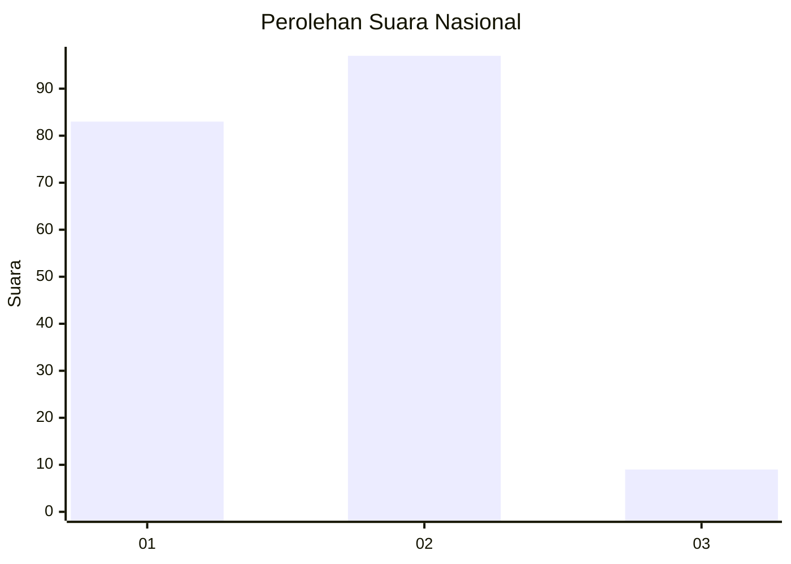
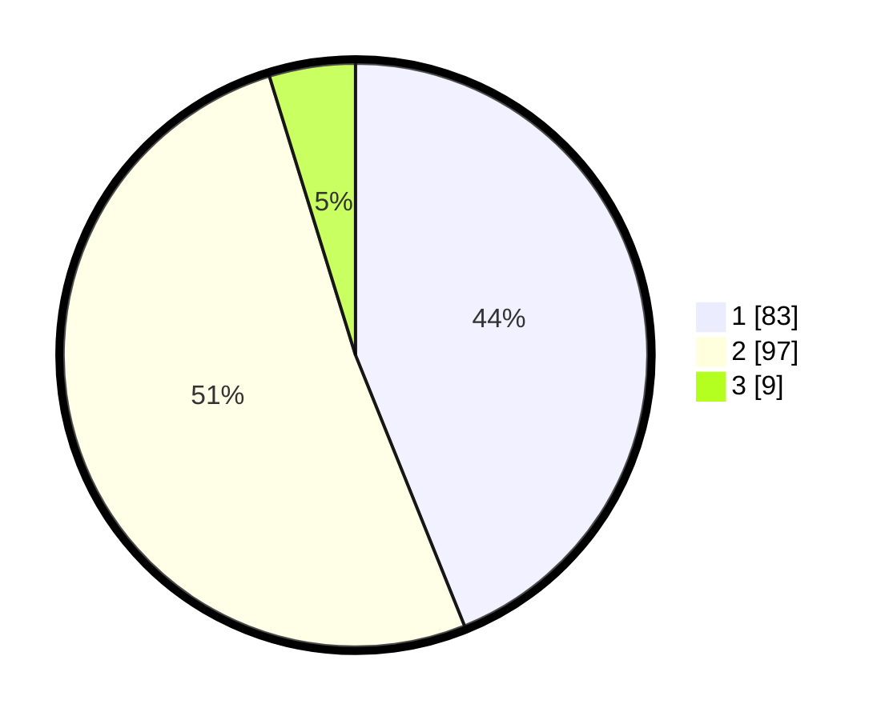

# Hasil

## Grafik

## Tabel

| No. | Nama Paslon    | Suara | Suara (raw) | Persentase |
|:--- |:-------------- | -----:| -----------:| ----------:|
| 1   | ANIES MUHAIMIN | 83    | [83][p-1]   | 43,92      |
| 2   | PRABOWO GIBRAN | 97    | [97][p-2]   | 51,32      |
| 3   | GANJAR MAHFUD  | 9     | [9][p-3]    | 4,76       |

[p-1]: https://github.com/gigit-pemilu/pemilu-2024/blob/main/pilpres/hitung-suara/sub/73-sulawesi-selatan/sub/71-kota-makassar/sub/01-mariso/sub/1004-lette/sub/002-tps/sub/paslon-1.txt
[p-2]: https://github.com/gigit-pemilu/pemilu-2024/blob/main/pilpres/hitung-suara/sub/73-sulawesi-selatan/sub/71-kota-makassar/sub/01-mariso/sub/1004-lette/sub/002-tps/sub/paslon-2.txt
[p-3]: https://github.com/gigit-pemilu/pemilu-2024/blob/main/pilpres/hitung-suara/sub/73-sulawesi-selatan/sub/71-kota-makassar/sub/01-mariso/sub/1004-lette/sub/002-tps/sub/paslon-3.txt

## Foto C Plano

https://sirekap-obj-formc.kpu.go.id/7c7d/pemilu/ppwp/73/71/01/10/04/7371011004002-20240221-104216--6b69ed13-be69-4694-ad05-3ee0c12fb7f4.jpg

https://sirekap-obj-formc.kpu.go.id/7c7d/pemilu/ppwp/73/71/01/10/04/7371011004002-20240221-104239--00b12149-e34a-4a8c-ba53-7005ace8ae2e.jpg

https://sirekap-obj-formc.kpu.go.id/7c7d/pemilu/ppwp/73/71/01/10/04/7371011004002-20240221-104454--04bf01ae-c7c0-4a2a-8ce4-de54988b02f7.jpg

## Metadata

| Key        | Value               |
| ---------- | ------------------- |
| Time Stamp | 2024-02-21 11:00:00 |

## DATA PEMILIH TETAP

Jumlah pemilih dalam DPT: **257**.
 * L: **225**.
 * P: **532**.

## DATA PENGGUNA HAK PILIH

Jumlah pengguna hak pilih dalam DPT: **499**.
 * L: **92**.
 * P: **102**.

Jumlah pengguna hak pilih dalam DPTb: **204**.
 * L: **700**.
 * P: **0**.

Jumlah pengguna hak pilih dalam DPK: **6**.
 * L: **0**.
 * P: **8**.

Jumlah pengguna hak pilih: **206**.
 * L: **97**.
 * P: **4**.

## JUMLAH SUARA SAH DAN TIDAK SAH

JUMLAH SELURUH SUARA SAH: **245**.

JUMLAH SUARA TIDAK SAH: **5**.

JUMLAH SELURUH SUARA SAH DAN SUARA TIDAK SAH: **207**.

