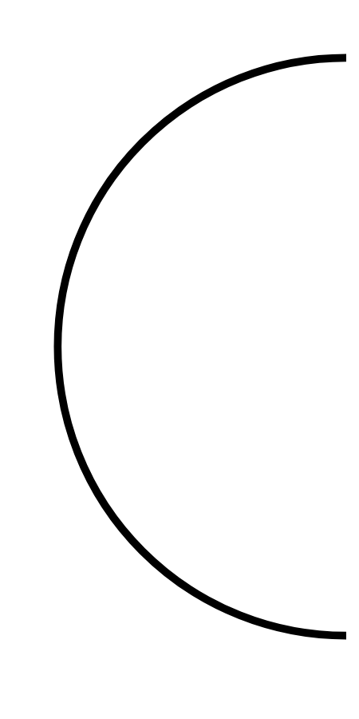

# Hasil

## Grafik

```mermaid
xychart-beta
    title "Perolehan Suara Nasional"
    x-axis []
    y-axis "Suara" 0 --> 0
    bar []
```



## Tabel

| No. | Nama Paslon | Suara | Suara (raw) | Persentase |
|:--- |:----------- | -----:| -----------:| ----------:|


[p-1]: https://github.com/gigit-pemilu/pemilu-2024/blob/main/pilpres/hitung-suara/sub/73-sulawesi-selatan/sub/71-kota-makassar/sub/01-mariso/sub/1004-lette/sub/021-tps/sub/paslon-1.txt
[p-2]: https://github.com/gigit-pemilu/pemilu-2024/blob/main/pilpres/hitung-suara/sub/73-sulawesi-selatan/sub/71-kota-makassar/sub/01-mariso/sub/1004-lette/sub/021-tps/sub/paslon-2.txt
[p-3]: https://github.com/gigit-pemilu/pemilu-2024/blob/main/pilpres/hitung-suara/sub/73-sulawesi-selatan/sub/71-kota-makassar/sub/01-mariso/sub/1004-lette/sub/021-tps/sub/paslon-3.txt

## Foto C Plano

https://sirekap-obj-formc.kpu.go.id/f92f/pemilu/ppwp/73/71/01/10/04/7371011004021-20240221-134726--89c6d956-6962-43ff-b672-61b589289fa0.jpg

https://sirekap-obj-formc.kpu.go.id/f92f/pemilu/ppwp/73/71/01/10/04/7371011004021-20240221-135601--1a188cf6-0080-4a67-8e3c-7f7e3d64e4b1.jpg

https://sirekap-obj-formc.kpu.go.id/f92f/pemilu/ppwp/73/71/01/10/04/7371011004021-20240221-135228--edcc9307-fe44-4892-a73f-e3e032d7cbaa.jpg


## Metadata

| Key        | Value               |
| ---------- | ------------------- |
| Time Stamp | 2024-02-21 14:00:00 |


## DATA PEMILIH TETAP

Jumlah pemilih dalam DPT: **259**.
 * L: **124**.
 * P: **135**.

## DATA PENGGUNA HAK PILIH

Jumlah pengguna hak pilih dalam DPT: **133**.
 * L: **889**.
 * P: **198**.

Jumlah pengguna hak pilih dalam DPTb: **888**.
 * L: **88**.
 * P: **852**.

Jumlah pengguna hak pilih dalam DPK: **8**.
 * L: **880**.
 * P: **880**.

Jumlah pengguna hak pilih: **197**.
 * L: **89**.
 * P: **198**.

## JUMLAH SUARA SAH DAN TIDAK SAH

JUMLAH SELURUH SUARA SAH: **194**.

JUMLAH SUARA TIDAK SAH: **503**.

JUMLAH SELURUH SUARA SAH DAN SUARA TIDAK SAH: **197**.


